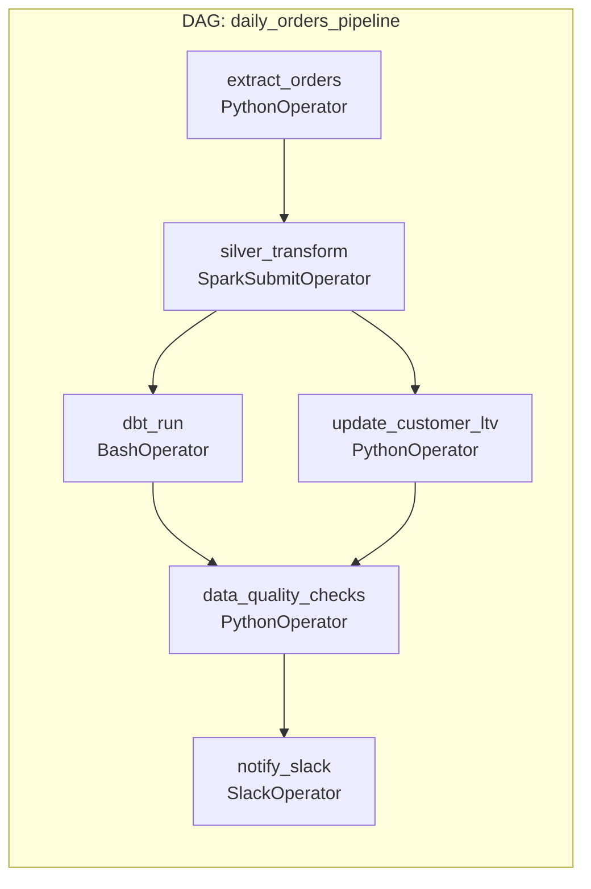

## What Airflow Is

Apache Airflow is a workflow orchestration platform. You define pipelines as DAGs (Directed Acyclic Graphs) in Python — each node is a task, each edge is a dependency. Airflow schedules those DAGs, executes the tasks in dependency order, retries on failure, tracks history, and surfaces the status through a web UI.

Airflow doesn't move data itself. It's the coordinator that tells other systems (Spark, dbt, Python scripts, SQL queries, APIs) when to run and in what order. Almost every data engineering pipeline you design will need an orchestrator — Airflow is the most widely deployed one.

---

## Core Concepts



**DAG (Directed Acyclic Graph):** The pipeline definition. Acyclic means no circular dependencies — a task cannot depend on its own output. Defined in Python as a context manager or a `@dag` decorator.

**Task:** A single unit of work within a DAG. Each task runs a specific operator.

**Operator:** The template that defines what a task does. Airflow ships with dozens:

| Operator | What it does |
|---------|-------------|
| `PythonOperator` | Runs a Python function |
| `BashOperator` | Runs a shell command |
| `SparkSubmitOperator` | Submits a Spark job |
| `BigQueryInsertJobOperator` | Runs a BigQuery SQL query |
| `S3ToRedshiftOperator` | Loads S3 data into Redshift |
| `DbtRunOperator` | Runs dbt models |
| `HttpSensor` | Waits until an HTTP endpoint returns 200 |
| `ExternalTaskSensor` | Waits for a task in another DAG to complete |

---

## Writing a DAG

```python
from airflow import DAG
from airflow.operators.python import PythonOperator
from airflow.operators.bash import BashOperator
from airflow.utils.dates import days_ago
from datetime import timedelta

# Default args apply to every task in the DAG
default_args = {
    "owner": "data-engineering",
    "retries": 3,
    "retry_delay": timedelta(minutes=5),
    "retry_exponential_backoff": True,   # 5min, 10min, 20min
    "email_on_failure": True,
    "email": ["data-oncall@company.com"],
    "depends_on_past": False,            # don't block on previous run's success
}

with DAG(
    dag_id="daily_orders_pipeline",
    description="Extract, transform, and load daily order data",
    schedule_interval="0 1 * * *",   # 01:00 UTC every day
    start_date=days_ago(1),
    default_args=default_args,
    catchup=True,                    # backfill missed runs
    max_active_runs=1,               # prevent concurrent runs
    tags=["orders", "daily"],
) as dag:

    extract = PythonOperator(
        task_id="extract_orders",
        python_callable=extract_orders,
        op_kwargs={"execution_date": "{{ ds }}"},
        execution_timeout=timedelta(hours=1),
        sla=timedelta(hours=2),      # alert if not done in 2 hours
    )

    transform = BashOperator(
        task_id="spark_silver_transform",
        bash_command="spark-submit --master yarn gs://scripts/silver_transform.py {{ ds }}",
        env={"EXECUTION_DATE": "{{ ds }}"},
    )

    dbt_run = BashOperator(
        task_id="dbt_gold_models",
        bash_command="cd /opt/dbt && dbt run --models tag:daily --vars '{\"run_date\": \"{{ ds }}\"}'",
    )

    quality = PythonOperator(
        task_id="data_quality_checks",
        python_callable=run_quality_checks,
        op_kwargs={"date": "{{ ds }}"},
    )

    # Dependency chain
    extract >> transform >> dbt_run >> quality
```

**`{{ ds }}`** is an Airflow template variable — it resolves to the execution date in `YYYY-MM-DD` format. This is how tasks know *which* date they're processing during backfills.

---

## Scheduling and Execution Dates

Airflow's scheduling model is offset by one interval from the calendar:

```
Schedule: daily at 01:00 UTC
Execution date 2024-03-15 runs on 2024-03-16 at 01:00 UTC

This means: the run for "March 15" processes data from March 15,
but the DAG run itself starts on March 16.
```

This "one day behind" model means `{{ ds }}` (execution date) correctly refers to yesterday's data when you run daily. It's confusing at first but intentional — Airflow runs after the data for the interval has landed.

**Common schedule expressions:**

| Cron | Meaning |
|------|---------|
| `0 1 * * *` | Daily at 01:00 UTC |
| `0 */6 * * *` | Every 6 hours |
| `30 2 * * 1` | Every Monday at 02:30 UTC |
| `@daily` | Shorthand for `0 0 * * *` |
| `None` | Manual trigger only |

---

## Catchup and Backfill

**`catchup=True`** tells Airflow to run all DAG instances between `start_date` and now if they weren't executed. This is how you backfill automatically after an outage:

```
DAG start_date: 2024-01-01
Airflow scheduler was down 2024-03-10 to 2024-03-13

With catchup=True:
→ Airflow queues runs for March 10, 11, 12, 13 automatically
→ They execute in order (max_active_runs=1 enforces serial execution)

With catchup=False:
→ Airflow skips the missed dates
→ Manual backfill required
```

**Manual backfill via CLI:**

```bash
# Backfill a specific date range
airflow dags backfill daily_orders_pipeline \
    --start-date 2024-03-10 \
    --end-date 2024-03-13

# Re-run specific tasks in a range (e.g., only the dbt step)
airflow tasks clear daily_orders_pipeline \
    --task-regex "dbt_gold_models" \
    --start-date 2024-03-10 \
    --end-date 2024-03-13
```

---

## XCom — Passing Data Between Tasks

**XCom** (Cross-Communication) lets tasks share small values — a file path, a record count, a status flag:

```python
def extract_orders(ti, execution_date, **kwargs):
    # ... extraction logic ...
    record_count = len(records)
    output_path = f"s3://datalake/bronze/orders/{execution_date}/"

    # Push values to XCom
    ti.xcom_push(key="record_count", value=record_count)
    ti.xcom_push(key="output_path", value=output_path)

def validate_extract(ti, **kwargs):
    # Pull from upstream task
    record_count = ti.xcom_pull(task_ids="extract_orders", key="record_count")
    output_path = ti.xcom_pull(task_ids="extract_orders", key="output_path")

    if record_count < 1000:
        raise ValueError(f"Too few records: {record_count}")
    return output_path
```

> **XCom is for metadata, not data.** XCom values are stored in Airflow's metadata database. Never push DataFrames, large result sets, or file contents through XCom. Pass file paths, counts, and status flags — the actual data stays in S3 or a database.

---

## Sensors — Waiting for External Conditions

Sensors are operators that wait for a condition to be true before proceeding:

```python
from airflow.sensors.s3_key_sensor import S3KeySensor
from airflow.sensors.external_task import ExternalTaskSensor

# Wait for a file to land in S3 before processing
wait_for_export = S3KeySensor(
    task_id="wait_for_crm_export",
    bucket_name="datalake",
    bucket_key="raw/crm/{{ ds }}/export_complete.flag",
    poke_interval=300,   # check every 5 minutes
    timeout=3600,        # fail if file doesn't appear within 1 hour
    mode="reschedule",   # release the worker slot while waiting (vs "poke" which holds it)
)

# Wait for an upstream DAG to complete
wait_for_upstream = ExternalTaskSensor(
    task_id="wait_for_silver_pipeline",
    external_dag_id="silver_orders_pipeline",
    external_task_id="silver_transform",
    execution_delta=timedelta(hours=0),
    timeout=7200,
)
```

**`mode="reschedule"` vs `mode="poke"`:**

- `poke`: the sensor holds a worker slot while waiting — wastes a worker for potentially hours
- `reschedule`: the sensor releases its worker slot between checks and reclaims one only to check — far more resource-efficient for long waits

Use `reschedule` for sensors that wait longer than a few minutes.

---

## Connections and Variables

Airflow stores credentials and configuration centrally, not in DAG code:

```python
from airflow.hooks.base import BaseHook

# Retrieve connection (stored in Airflow UI → Admin → Connections)
conn = BaseHook.get_connection("postgres_prod")
engine = create_engine(
    f"postgresql://{conn.login}:{conn.password}@{conn.host}:{conn.port}/{conn.schema}"
)

# Retrieve variables (stored in Airflow UI → Admin → Variables)
from airflow.models import Variable
s3_bucket = Variable.get("datalake_bucket")
alert_email = Variable.get("alert_email", default_var="team@company.com")
```

Never hardcode credentials in a DAG file. Connections and Variables are encrypted in the Airflow metadata DB and managed separately from code.

---

## Task Groups and Dynamic DAGs

**Task groups** logically group related tasks in the UI — useful for DAGs with many tasks:

```python
from airflow.utils.task_group import TaskGroup

with TaskGroup("silver_transforms") as silver_group:
    orders_silver = SparkSubmitOperator(task_id="orders", ...)
    products_silver = SparkSubmitOperator(task_id="products", ...)
    customers_silver = SparkSubmitOperator(task_id="customers", ...)

extract >> silver_group >> dbt_run
```

**Dynamic task generation** — create tasks from a list at DAG parse time:

```python
TABLES = ["orders", "products", "customers", "inventory"]

for table in TABLES:
    PythonOperator(
        task_id=f"extract_{table}",
        python_callable=extract_table,
        op_kwargs={"table_name": table},
    )
```

---

## Common Interview Questions

**"What is an Airflow DAG and how does it differ from a pipeline?"**

A DAG is the code definition of a pipeline — the tasks, their dependencies, the schedule, and the retry behaviour. The actual pipeline execution happens on the workers; the DAG is the blueprint. Directed means dependencies flow in one direction. Acyclic means no circular dependencies — a task cannot transitively depend on itself.

**"What is the difference between `catchup=True` and `catchup=False`?"**

With `catchup=True`, Airflow queues and runs all DAG instances between `start_date` and now that weren't executed. This enables automatic backfill after an outage. With `catchup=False`, Airflow only runs the current interval — missed dates are skipped. Use `catchup=True` for pipelines where historical completeness matters; `catchup=False` for pipelines that only care about current state (e.g., refreshing a dashboard).

**"How do you pass data between tasks in Airflow?"**

Use XCom for small metadata values — file paths, record counts, status codes. Tasks push values with `ti.xcom_push` and pull with `ti.xcom_pull`. Never push large data through XCom — it's stored in the Airflow metadata DB and will degrade performance. Large data should stay in shared storage (S3, GCS) and only its path should be passed via XCom.

**"What is the difference between poke and reschedule mode for sensors?"**

In `poke` mode, the sensor holds a worker slot and loops, checking the condition every `poke_interval` seconds. In `reschedule` mode, the sensor releases its worker slot between checks — freeing it for other tasks — and reclaims one only to poll. Use `reschedule` for sensors that wait longer than a few minutes to avoid tying up workers.

---

## Key Takeaways

- Airflow orchestrates — it doesn't move data itself; it tells other systems (Spark, dbt, SQL, APIs) when to run and in what order
- `{{ ds }}` and other template variables make DAGs date-parameterized — essential for correct backfills
- `catchup=True` enables automatic backfill after outages; `max_active_runs=1` ensures serial execution
- XCom is for metadata only (paths, counts, flags) — never push DataFrames or large results through XCom
- Sensors with `mode="reschedule"` are resource-efficient — always prefer reschedule over poke for long waits
- Credentials belong in Connections and Variables, never hardcoded in DAG files
- SLAs, retries, and exponential backoff belong on every production task — fail loudly and recover automatically
