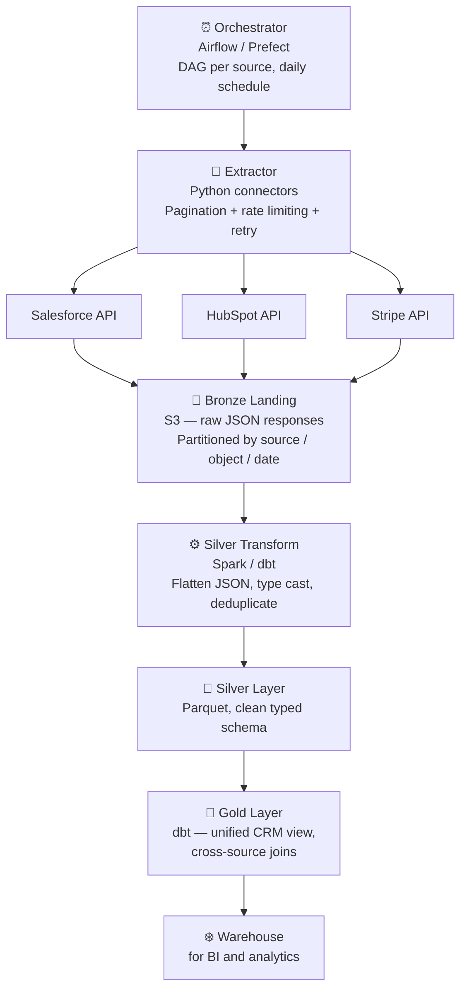

## The Problem

> "Design a pipeline that ingests data from third-party REST APIs — specifically a CRM API (Salesforce), a marketing platform (HubSpot), and a payment processor (Stripe). Data should be available in the warehouse daily. Each API has rate limits and returns paginated responses."

API ingestion is a bread-and-butter data engineering task. Unlike CDC or streaming, it's pull-based, schedule-driven, and dominated by the quirks of third-party systems you don't control.

---

## Step 1 — Requirements and Clarifications

**Questions to ask:**

- What objects from each API? *(Salesforce: Accounts, Contacts, Opportunities, Activities. HubSpot: Companies, Contacts, Deals. Stripe: Customers, Charges, Subscriptions, Invoices)*
- What latency is acceptable? *(Daily — data available by 6 AM for business review)*
- Full refresh or incremental? *(Incremental where APIs support it; full refresh for small reference tables)*
- How do we handle API rate limits? *(Each API has different limits — Stripe: 100 req/sec, Salesforce: 150 req/15 min, HubSpot: 100 req/10 sec)*
- What volume? *(Salesforce: ~500K Accounts, 2M Contacts. Stripe: 10M Charges. HubSpot: 200K Deals)*
- How are API credentials managed? *(Secrets manager — not hardcoded)*

---

## Step 2 — Architecture Overview



---

## Step 3 — Layer-by-Layer Design

### Orchestration

One Airflow DAG per source system, running on a daily schedule at staggered times to avoid simultaneous API hammering:

```
00:00 — Stripe extract DAG starts
01:00 — Salesforce extract DAG starts
02:00 — HubSpot extract DAG starts
03:30 — Silver transform DAG starts (depends on all three extracts completing)
05:00 — Gold / dbt DAG starts (depends on Silver)
05:30 — Data available in warehouse
```

Each DAG has:
1. Extract task (per object)
2. Validate task (schema check, row count check)
3. Land task (write to Bronze S3)

### Extractor — Handling the Three Hard Problems

**Problem 1: Pagination**

Most REST APIs return paginated responses. Three common pagination patterns:

| Pattern | How it works | Example |
|---------|-------------|---------|
| Cursor-based | Response includes a `next_cursor` token | Stripe, Hubspot |
| Offset-based | `?page=1&per_page=100` | Older APIs |
| Link header | Response header contains `Link: <url>; rel="next"` | GitHub |

```python
def extract_stripe_charges(start_date: str, end_date: str) -> list:
    """Cursor-based pagination with rate limit handling."""
    charges = []
    params = {
        "created[gte]": to_unix(start_date),
        "created[lt]":  to_unix(end_date),
        "limit": 100,        # max per page
    }

    while True:
        response = stripe_client.charges.list(**params)
        charges.extend(response["data"])

        if not response["has_more"]:
            break

        # next page: use last item's ID as cursor
        params["starting_after"] = response["data"][-1]["id"]
        time.sleep(0.01)  # 100 req/sec limit → 10ms sleep

    return charges
```

**Problem 2: Rate Limiting**

Every API enforces rate limits. Hitting them mid-extract leaves you with partial data.

```python
import time
from functools import wraps

def rate_limited(max_per_second):
    """Decorator to enforce rate limiting."""
    min_interval = 1.0 / max_per_second
    last_called = [0.0]

    def decorator(func):
        @wraps(func)
        def wrapper(*args, **kwargs):
            elapsed = time.time() - last_called[0]
            wait = min_interval - elapsed
            if wait > 0:
                time.sleep(wait)
            result = func(*args, **kwargs)
            last_called[0] = time.time()
            return result
        return wrapper
    return decorator

@rate_limited(max_per_second=90)  # Stripe: 100/sec, use 90 for headroom
def call_stripe_api(endpoint, params):
    return requests.get(endpoint, params=params, headers=auth_headers)
```

For Salesforce's harder limit (150 requests per 15 minutes), use a token bucket or a shared semaphore across parallel workers.

**Problem 3: Retries and Transient Failures**

APIs return 429 (rate limit) and 5xx (server errors) transiently. Retry with exponential backoff:

```python
from tenacity import retry, stop_after_attempt, wait_exponential, retry_if_exception_type
import requests

@retry(
    retry=retry_if_exception_type((requests.exceptions.ConnectionError,
                                   requests.exceptions.Timeout)),
    stop=stop_after_attempt(5),
    wait=wait_exponential(multiplier=1, min=4, max=60)
)
def fetch_with_retry(url, headers, params):
    response = requests.get(url, headers=headers, params=params, timeout=30)
    if response.status_code == 429:
        retry_after = int(response.headers.get("Retry-After", 60))
        time.sleep(retry_after)
        raise requests.exceptions.ConnectionError("Rate limited")
    response.raise_for_status()
    return response.json()
```

### Incremental vs Full Refresh

Not all objects should be extracted the same way:

| Object | Strategy | Reason |
|--------|---------|--------|
| Stripe Charges | Incremental by `created` date | Immutable after creation; only new records needed |
| Salesforce Opportunities | Incremental by `LastModifiedDate` | Updated frequently; use `SystemModstamp` |
| Salesforce Accounts | Full refresh | Small volume (~500K); `LastModifiedDate` unreliable for deletes |
| HubSpot Deals | Incremental by `updatedAt` | API supports date filters |
| Exchange rates | Full refresh | Reference table, ~200 rows |

**Incremental state management:**

```python
# Store the high-water mark in Airflow Variables or a state table
def get_last_extracted(source: str, object: str) -> str:
    return Variable.get(f"{source}_{object}_last_extracted",
                        default_var="2020-01-01T00:00:00Z")

def set_last_extracted(source: str, object: str, timestamp: str):
    Variable.set(f"{source}_{object}_last_extracted", timestamp)

# In the DAG task:
last_run = get_last_extracted("stripe", "charges")
charges = extract_stripe_charges(start_date=last_run, end_date=now())
land_to_bronze(charges, source="stripe", object="charges", date=today())
set_last_extracted("stripe", "charges", now())
```

### Bronze Landing

Raw JSON responses land exactly as returned by the API. No transformation:

```
s3://datalake/bronze/api/
  source=stripe/
    object=charges/
      extracted_date=2024-03-15/
        charges_20240315_000000.json.gz
  source=salesforce/
    object=opportunities/
      extracted_date=2024-03-15/
        opportunities_20240315_010000.json.gz
```

**Why preserve raw JSON?** API responses change over time. New fields appear, nested structures shift. By landing the raw response, you can always re-derive the Silver transform from the original data — even if the Silver schema is wrong.

### Silver Transform

Flatten, cast, and deduplicate:

```sql
-- Silver transform for Stripe charges (dbt model)
WITH raw AS (
  SELECT
    JSON_VALUE(data, '$.id')                          AS charge_id,
    CAST(JSON_VALUE(data, '$.amount') AS INT64) / 100 AS amount_usd,  -- Stripe stores cents
    JSON_VALUE(data, '$.currency')                    AS currency,
    JSON_VALUE(data, '$.status')                      AS status,
    JSON_VALUE(data, '$.customer')                    AS customer_id,
    TIMESTAMP_SECONDS(CAST(JSON_VALUE(data, '$.created') AS INT64)) AS created_at,
    extracted_date
  FROM {{ source('bronze', 'stripe_charges') }}
),
deduped AS (
  -- Keep the most recent extraction of each charge
  SELECT *,
    ROW_NUMBER() OVER (PARTITION BY charge_id ORDER BY extracted_date DESC) AS rn
  FROM raw
)
SELECT * EXCEPT (rn) FROM deduped WHERE rn = 1
```

### Gold Layer — Unified CRM View

The real value of multi-source API ingestion is cross-system joins. The gold layer builds a unified customer view:

```sql
-- Unified customer 360 view
SELECT
  s.customer_id          AS stripe_customer_id,
  sf.account_id          AS salesforce_account_id,
  hs.company_id          AS hubspot_company_id,
  COALESCE(sf.name, hs.company_name) AS company_name,
  sf.industry,
  sf.account_owner,
  SUM(s.amount_usd) FILTER (WHERE s.status = 'succeeded') AS lifetime_revenue,
  COUNT(DISTINCT s.charge_id)                              AS total_charges,
  MAX(s.created_at)                                        AS last_charge_date,
  COUNT(hs.deal_id) FILTER (WHERE hs.deal_stage = 'Closed Won') AS won_deals
FROM silver_stripe_customers s
LEFT JOIN silver_salesforce_accounts sf  ON s.email = sf.billing_email
LEFT JOIN silver_hubspot_companies   hs  ON s.email = hs.primary_email
LEFT JOIN silver_stripe_charges sc       ON s.customer_id = sc.customer_id
LEFT JOIN silver_hubspot_deals hs_d      ON hs.company_id = hs_d.company_id
GROUP BY 1, 2, 3, 4, 5, 6
```

The join key (email) works because Stripe, Salesforce, and HubSpot all store the same email address — the one stable identifier across systems.

---

## Step 4 — Failure Handling and Validation

**Row count validation:**

```python
def validate_extract(object_name: str, records: list, min_expected: int):
    if len(records) < min_expected:
        raise ValueError(
            f"{object_name}: extracted {len(records)} records, "
            f"expected at least {min_expected}. API may be down or returning partial data."
        )
```

**Schema drift detection:**

```python
def detect_schema_drift(new_data: dict, expected_schema: set):
    actual_keys = set(new_data.keys())
    new_keys = actual_keys - expected_schema
    missing_keys = expected_schema - actual_keys
    if new_keys:
        alert(f"New fields detected: {new_keys} — update Silver schema")
    if missing_keys:
        alert(f"Missing fields: {missing_keys} — API may have changed")
```

**Idempotent Bronze writes:** Use the extraction date as part of the S3 key. Re-running an extraction for the same date overwrites the previous file — same key, same data. Silver deduplicates, so double-writes don't double-count.

**Partial extract recovery:** If an extract job fails halfway through paginating Stripe Charges, the job fails with no data written (atomic write — write to temp path, rename on success). On retry, the full extract runs again from the same watermark.

---

## Common Interview Questions

**"How do you handle API rate limits?"**

Rate-limit each extractor below the published limit with a safety margin (e.g., 90% of limit). Use exponential backoff with `Retry-After` header on 429s. For very tight limits (Salesforce: 150 req/15 min), use a token bucket shared across parallel workers. Schedule extracts during off-peak hours where API limits are less likely to be contested by other users on shared plans.

**"How do you manage incremental state across DAG runs?"**

Store the high-water mark (last extracted timestamp or cursor) in a state store — Airflow Variables for simple cases, a database table for production-grade state. On each run, read the last mark, extract everything after it, write to Bronze, then update the mark atomically. If the write fails, the mark is not updated — the next run re-extracts the same window (idempotent).

**"What happens when a third-party API changes its schema?"**

Bronze preserves the raw response, so schema changes don't break the landing layer. Detect drift in the Silver transform — log new fields and alert on missing required fields. For additive changes (new nullable fields), update the Silver model to include them. For breaking changes (renamed or removed required fields), coordinate with the API provider or implement a version-switching adapter.

**"How would you handle a source that doesn't support incremental extraction?"**

Full refresh with deduplication. Extract all records, land in a date-partitioned Bronze layer, then in Silver use a window function to keep the latest version of each record across all extractions. This is more expensive but correct. For very large objects, explore API filters by record count or ID range if the API supports it.

---

## Key Takeaways

- Stagger extract schedules to avoid simultaneous rate-limit exhaustion across multiple source APIs
- Handle the three hard API problems explicitly: pagination (cursor/offset), rate limiting (sleep + backoff), and retries (exponential backoff on 429 and 5xx)
- Land raw JSON to Bronze unchanged — never transform before landing; API responses change and you need the ability to re-derive
- Track incremental state (high-water mark) outside the DAG — Airflow Variables or a state table; never derive it from the destination
- Validate row counts and detect schema drift in the extract task, before the Silver transform runs
- The real value of multi-source ingestion is the Gold layer — unified cross-system joins using a common identifier (email, company name)
- Write Bronze atomically (temp path → rename on success) so partial extracts don't leave corrupt files
