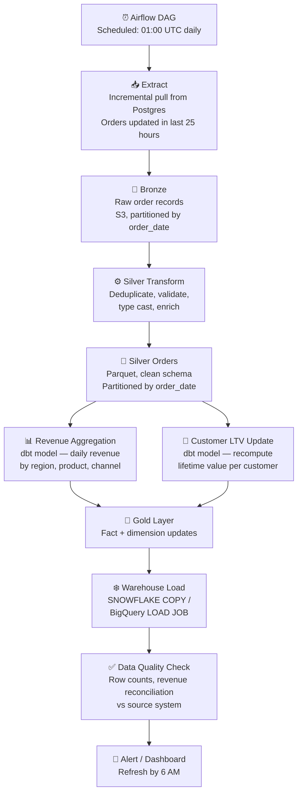

## The Problem

> "Design a daily batch pipeline that processes the previous day's orders from a transactional database, computes revenue metrics, updates customer lifetime value, and loads results into the data warehouse by 6 AM for business reporting."

Batch pipelines are the backbone of most data engineering work. They're less glamorous than streaming, but they power the dashboards, KPIs, and ML models that businesses actually run on. Getting batch right — idempotent, observable, recoverable — is a core skill.

---

## Step 1 — Requirements and Clarifications

**Questions to ask:**

- What is the data source? *(PostgreSQL orders DB, ~500K new orders/day)*
- What is the SLA? *(Data in warehouse by 6 AM; alert if missed)*
- Is the source full or incremental? *(Incremental — only yesterday's orders; some late orders may arrive up to 48 hours late)*
- What if the pipeline fails? *(Must be retryable without double-counting; support manual backfill)*
- What are the output tables? *(Daily revenue by region/product, updated customer LTV in `dim_customer`, order fact table in warehouse)*
- How far back is a "late order" possible? *(Orders can be backdated up to 48 hours — the pipeline must handle data that arrives late)*

---

## Step 2 — Architecture Overview



---

## Step 3 — The Extract Strategy

### Incremental Window

Pull orders that were created or modified in the last 25 hours (not 24) — the extra hour overlaps with yesterday's run to catch any orders updated near midnight:

```python
def extract_orders(execution_date: date) -> str:
    """
    Extract orders for the given execution_date.
    Uses a 25-hour window to catch near-midnight updates.
    """
    window_start = datetime.combine(execution_date - timedelta(days=1),
                                    time(23, 0, 0))  # 11 PM day before
    window_end   = datetime.combine(execution_date,
                                    time(23, 59, 59))  # 11:59 PM execution day

    query = """
        SELECT *
        FROM orders
        WHERE updated_at >= %(start)s
          AND updated_at <  %(end)s
    """
    df = pd.read_sql(query, conn, params={"start": window_start, "end": window_end})

    # Write to Bronze
    output_path = f"s3://datalake/bronze/orders/order_date={execution_date}/"
    df.to_parquet(output_path, index=False)
    return output_path
```

**Why `updated_at` instead of `created_at`?** An order created yesterday may be updated today (status change: pending → shipped). If you filter by `created_at`, you miss status updates. `updated_at` catches all changes within the window.

### Late Order Handling

Orders can be backdated up to 48 hours (a manual correction, a delayed sync). The pipeline must reprocess older date partitions when late data arrives.

**Strategy: Reprocess the last 3 days on every run**

```python
# Airflow DAG: reprocess 3-day window
for offset in range(0, 3):
    target_date = execution_date - timedelta(days=offset)
    extract_and_process_date(target_date)
```

The Silver layer uses `INSERT OVERWRITE` (or dynamic partition overwrite) so reprocessing a date partition is idempotent — it replaces the partition completely, not appends to it.

---

## Step 4 — Idempotency — The Critical Property

**Idempotency** means running the pipeline multiple times on the same input produces the same output. It's the property that makes retries safe.

Without idempotency, a pipeline that fails halfway and retries results in double-counted revenue, duplicate rows, or inconsistent aggregates.

**Three patterns that enforce idempotency:**

**Pattern 1 — Partition overwrite**

Process a date partition and write it with `INSERT OVERWRITE PARTITION`. Re-running replaces the partition — no duplicates:

```sql
-- Spark SQL
INSERT OVERWRITE TABLE silver.orders
PARTITION (order_date = '2024-03-14')
SELECT *
FROM bronze.orders
WHERE order_date = '2024-03-14'
  AND ROW_NUMBER() OVER (PARTITION BY order_id ORDER BY updated_at DESC) = 1;
```

**Pattern 2 — MERGE / UPSERT for dimension updates**

When updating `dim_customer` LTV, use MERGE not INSERT — so re-running doesn't create duplicate customer rows:

```sql
MERGE INTO dim_customer AS target
USING (
  SELECT
    customer_id,
    SUM(order_total) AS lifetime_value,
    COUNT(*) AS order_count,
    MAX(order_date) AS last_order_date
  FROM silver.orders
  WHERE order_status = 'completed'
  GROUP BY customer_id
) AS source
ON target.customer_id = source.customer_id
WHEN MATCHED THEN
  UPDATE SET
    lifetime_value  = source.lifetime_value,
    order_count     = source.order_count,
    last_order_date = source.last_order_date,
    updated_at      = CURRENT_TIMESTAMP
WHEN NOT MATCHED THEN
  INSERT (customer_id, lifetime_value, order_count, last_order_date, updated_at)
  VALUES (source.customer_id, source.lifetime_value, source.order_count,
          source.last_order_date, CURRENT_TIMESTAMP);
```

**Pattern 3 — Truncate-and-reload for small aggregates**

For daily aggregate tables that are small (< 1M rows), truncate the target partition and reload — simpler than MERGE and fully idempotent:

```sql
DELETE FROM gold.daily_revenue WHERE revenue_date = '2024-03-14';
INSERT INTO gold.daily_revenue
SELECT
  order_date AS revenue_date,
  region,
  product_category,
  channel,
  SUM(order_total)  AS gross_revenue,
  COUNT(*)          AS order_count,
  COUNT(DISTINCT customer_id) AS unique_customers
FROM silver.orders
WHERE order_date = '2024-03-14'
  AND order_status = 'completed'
GROUP BY 1, 2, 3, 4;
```

---

## Step 5 — Orchestration with Airflow

```python
from airflow import DAG
from airflow.operators.python import PythonOperator
from airflow.utils.dates import days_ago
from datetime import timedelta

default_args = {
    "owner": "data-engineering",
    "retries": 3,
    "retry_delay": timedelta(minutes=5),
    "email_on_failure": True,
    "email": ["data-oncall@company.com"],
    "sla": timedelta(hours=5),  # Alert if not complete within 5 hours of start
}

with DAG(
    dag_id="daily_orders_pipeline",
    schedule_interval="0 1 * * *",  # 1 AM UTC daily
    start_date=days_ago(1),
    default_args=default_args,
    catchup=True,          # Enables backfill
    max_active_runs=1,     # Prevent concurrent runs
) as dag:

    extract = PythonOperator(
        task_id="extract_orders",
        python_callable=extract_orders,
        op_kwargs={"execution_date": "{{ ds }}"},
    )

    silver_transform = PythonOperator(
        task_id="silver_transform",
        python_callable=run_silver_transform,
    )

    gold_revenue = PythonOperator(
        task_id="gold_daily_revenue",
        python_callable=run_dbt_model,
        op_kwargs={"model": "daily_revenue"},
    )

    gold_ltv = PythonOperator(
        task_id="gold_customer_ltv",
        python_callable=run_dbt_model,
        op_kwargs={"model": "customer_ltv"},
    )

    warehouse_load = PythonOperator(
        task_id="warehouse_load",
        python_callable=load_to_warehouse,
    )

    data_quality = PythonOperator(
        task_id="data_quality_checks",
        python_callable=run_quality_checks,
    )

    extract >> silver_transform >> [gold_revenue, gold_ltv] >> warehouse_load >> data_quality
```

`catchup=True` is critical — it enables Airflow to automatically backfill missed runs by executing historical DAG runs in order. Without this, a weekend outage means manually triggering backfills for each missed day.

---

## Step 6 — Data Quality and Reconciliation

Never load data without validating it first. The quality check task runs before the dashboard refresh alert:

```python
def run_quality_checks(execution_date: str):
    checks = [
        # Row count check — must have orders (not zero, not suspiciously low)
        ("row_count",
         f"SELECT COUNT(*) FROM silver.orders WHERE order_date = '{execution_date}'",
         lambda n: n > 1000,
         "Fewer than 1000 orders — possible extract failure"),

        # Revenue reconciliation — warehouse total must match source system within 0.1%
        ("revenue_reconcile",
         f"""SELECT ABS(warehouse_rev - source_rev) / source_rev AS diff
             FROM (
               SELECT
                 (SELECT SUM(order_total) FROM gold.daily_revenue WHERE revenue_date = '{execution_date}') AS warehouse_rev,
                 (SELECT SUM(total_amount) FROM postgres_orders WHERE DATE(created_at) = '{execution_date}') AS source_rev
             )""",
         lambda diff: diff < 0.001,
         "Revenue discrepancy > 0.1% vs source system"),

        # Null rate check on critical columns
        ("null_order_id",
         f"SELECT COUNT(*) FROM silver.orders WHERE order_date = '{execution_date}' AND order_id IS NULL",
         lambda n: n == 0,
         "Null order_ids detected in Silver"),

        # Completeness — Silver row count >= Bronze row count (no records dropped)
        ("completeness",
         f"""SELECT bronze_cnt, silver_cnt, silver_cnt >= bronze_cnt * 0.999 AS ok
             FROM (
               SELECT
                 (SELECT COUNT(*) FROM bronze.orders WHERE order_date = '{execution_date}') AS bronze_cnt,
                 (SELECT COUNT(*) FROM silver.orders WHERE order_date = '{execution_date}') AS silver_cnt
             )""",
         lambda row: row["ok"],
         "Silver dropped > 0.1% of Bronze records"),
    ]

    failures = []
    for name, query, assertion, message in checks:
        result = run_query(query)
        if not assertion(result):
            failures.append(f"CHECK FAILED [{name}]: {message} (got: {result})")

    if failures:
        raise ValueError("\n".join(failures))

    print(f"✅ All quality checks passed for {execution_date}")
```

---

## Step 7 — Failure Handling and Backfill

**Scenario: Pipeline failed for 3 days due to a source DB outage**

Recovery steps:
1. Fix the root cause (DB connection, credentials, etc.)
2. Trigger backfill in Airflow: `airflow dags backfill daily_orders_pipeline --start-date 2024-03-12 --end-date 2024-03-14`
3. Airflow runs the DAG for each missed date in order
4. Each run uses `execution_date` to target the correct date partition
5. Partition overwrites ensure no data is double-counted
6. Quality checks run for each date before proceeding

**Scenario: A bug in the revenue aggregation produced wrong numbers for 2 weeks**

Recovery steps:
1. Fix the dbt model
2. Re-run just the Gold and warehouse load steps for the affected dates (Bronze and Silver are correct)
3. Use Airflow's task-level retry or `airflow tasks clear` to re-run from a specific task
4. Quality checks automatically validate the corrected output

**Scenario: The source system sends duplicate order records**

Bronze landing uses a deduplication step in Silver. The window function `ROW_NUMBER() OVER (PARTITION BY order_id ORDER BY updated_at DESC) = 1` keeps only the latest version of each order. Bronze is not deduped — it's a faithful copy of what arrived.

---

## Common Interview Questions

**"How do you make a batch pipeline idempotent?"**

Three patterns: (1) partition overwrite — write to a date partition and overwrite it on re-run, never append; (2) MERGE/UPSERT for dimension updates — match on natural key and update vs insert; (3) truncate-and-reload for small aggregate tables. The key principle: a pipeline run should produce the same output regardless of how many times it runs on the same input.

**"What is `catchup` in Airflow and why does it matter?"**

`catchup=True` tells Airflow to run all DAG instances between `start_date` and now if the scheduler was down. Without it, a 3-day outage results in 3 missing pipeline runs that must be backfilled manually. With `catchup=True`, Airflow automatically queues and runs them in order when the scheduler recovers.

**"How do you handle late-arriving data in a batch pipeline?"**

Reprocess a rolling window of recent date partitions on every run — typically 2–3 days back. Since partitions are overwritten (not appended), the reprocessing is idempotent. Late records that arrive within the window are automatically included. Records that arrive after the window are either ignored (acceptable loss) or trigger a manual backfill.

**"How would you design a data quality framework for this pipeline?"**

At minimum: row count checks (not zero, not suspiciously low), revenue reconciliation against the source system (within tolerance), null checks on required columns, and a completeness check (Silver row count ≥ Bronze × tolerance). Run checks as a blocking task before loading to the warehouse. Fail loudly — a quality check failure should prevent bad data from reaching dashboards and trigger an immediate alert.

**"What's the difference between a full refresh and an incremental load?"**

Full refresh: extract all records from the source, overwrite the destination table. Correct but expensive at scale. Incremental: extract only records changed since the last run, merge into the destination. Faster and cheaper but requires a reliable change indicator (`updated_at`, a change log, or CDC) and careful handling of deletes. Use full refresh for small reference tables and incremental for large transactional tables.

---

## Key Takeaways

- Idempotency is the most important property of a batch pipeline — achieve it through partition overwrite, MERGE, or truncate-and-reload
- Extract with a window slightly larger than 24 hours to catch near-midnight updates; reprocess the last 2–3 partitions to handle late-arriving data
- Use `updated_at` not `created_at` for incremental extraction — status changes on existing records will be missed by `created_at`
- `catchup=True` in Airflow enables automatic backfill after outages; `max_active_runs=1` prevents concurrent runs from corrupting shared state
- Data quality checks are not optional — validate row counts, reconcile revenue against source, and check null rates before loading to the warehouse
- Fail loudly: a pipeline that loads wrong data silently is worse than a pipeline that fails and alerts
- Keep the execution date as a parameter throughout the pipeline — it's what makes per-date backfills possible
