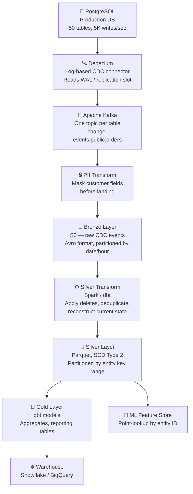

## The Problem

> "Design a pipeline that replicates changes from a production PostgreSQL database into a lakehouse in near-real-time. Downstream consumers include a data warehouse for BI and an ML feature store. The source DB has 50 tables, 500 GB total, and receives ~5,000 writes/sec at peak."

CDC (Change Data Capture) pipelines are a core data engineering interview topic. They test your understanding of database internals, streaming systems, and the challenges of keeping two systems in sync reliably.

---

## Step 1 — Requirements and Clarifications

**Questions to ask:**

- What latency is acceptable? *(< 2 minutes into the lakehouse, < 5 minutes into the warehouse)*
- Which tables? All 50, or a subset? *(All, but some are high-frequency transactional, some are low-frequency reference tables)*
- What happens when the source schema changes? *(DDL changes happen monthly — the pipeline must not break)*
- Is the destination the authoritative record or a derived copy? *(Derived copy — source DB is authoritative)*
- Are there PII or compliance constraints? *(Customer PII must be masked before landing in the lakehouse)*

**Stated assumptions:**

- 50 tables, ~500 GB current data
- Peak write throughput: 5,000 writes/sec across all tables (~200 MB/sec WAL generation)
- Latency SLA: changes visible in warehouse within 5 minutes of commit in source DB
- Schema changes: ALTER TABLE events arrive with 24-hour advance notice (best-effort)
- PII tables: `customer`, `user`, `payment_method` — mask before lakehouse landing

---

## Step 2 — Architecture Overview



---

## Step 3 — Layer-by-Layer Design

### Debezium — Log-Based CDC

**Why log-based, not query-based?**

Query-based CDC polls the source table on a schedule (`SELECT * WHERE updated_at > last_run`). It misses hard deletes, requires an `updated_at` column on every table, adds read load to the production DB, and can't detect interleaved changes within the poll interval.

Log-based CDC reads the PostgreSQL Write-Ahead Log (WAL) via a replication slot. Every INSERT, UPDATE, and DELETE is captured as it commits — zero additional load on the primary, no polling, no missed deletes.

**Debezium configuration for PostgreSQL:**

```json
{
  "connector.class": "io.debezium.connector.postgresql.PostgresConnector",
  "database.hostname": "prod-db.internal",
  "database.port": "5432",
  "database.dbname": "app_db",
  "database.server.name": "prod",
  "plugin.name": "pgoutput",
  "slot.name": "debezium_slot",
  "publication.name": "debezium_pub",
  "table.include.list": "public.*",
  "snapshot.mode": "initial",
  "key.converter": "io.confluent.kafka.serializers.KafkaAvroSerializer",
  "value.converter": "io.confluent.kafka.serializers.KafkaAvroSerializer",
  "schema.history.internal.kafka.topic": "schema-changes.app_db"
}
```

`snapshot.mode = initial` does a one-time full table scan on first startup to populate Kafka with the current state, then switches to log streaming. This is the initial load + CDC in one operation.

**Replication slot risk:** The WAL is retained until the slot consumer has read it. If Debezium falls behind, the WAL grows unboundedly and can fill the disk. Monitor `pg_replication_slots` and alert when lag exceeds a threshold.

### Kafka — Topic Design

One topic per table: `cdc.public.orders`, `cdc.public.customers`, etc. This allows independent scaling, retention policies per table, and easy consumer-group management per table.

**Debezium change event structure:**

```json
{
  "before": { "order_id": 1001, "status": "pending", "total": 99.99 },
  "after":  { "order_id": 1001, "status": "shipped", "total": 99.99 },
  "op":     "u",      -- i=insert, u=update, d=delete, r=read (snapshot)
  "ts_ms":  1710496800000,
  "source": { "table": "orders", "lsn": 12345678, "txId": 987 }
}
```

The `before` / `after` duality is critical: it captures not just what the new state is, but what changed from. This enables downstream consumers to compute diffs and detect specific field changes.

### Bronze Layer — Raw CDC Events

Write all Debezium events to S3 as Avro, partitioned by `table_name / date / hour`. This is the immutable audit log — every change, in order, forever.

```
s3://datalake/bronze/cdc/
  table=orders/
    date=2024-03-15/
      hour=10/
        part-00001.avro
```

Avro is chosen over Parquet for Bronze because:
- CDC events have complex nested schemas (`before`, `after`, `source` objects) that Avro handles naturally
- Avro preserves the schema with each file, enabling reads even if the Kafka schema registry is unavailable
- Parquet is better for analytical reads; Bronze is an archive, not a query target

### Silver Transform — Reconstructing Current State

The most complex layer. CDC events are a log of changes; the warehouse needs a current-state table (and optionally a history table for SCD Type 2).

**The merge pattern:**

```sql
-- Apply CDC events to the Silver orders table (BigQuery MERGE syntax)
MERGE INTO silver.orders AS target
USING (
  SELECT
    after.order_id,
    after.customer_id,
    after.status,
    after.total_amount,
    after.placed_at,
    op,
    ts_ms,
    ROW_NUMBER() OVER (PARTITION BY after.order_id ORDER BY ts_ms DESC, source.lsn DESC) AS rn
  FROM bronze.cdc_orders
  WHERE date = CURRENT_DATE
    AND op IN ('i', 'u', 'r')
) AS source
ON target.order_id = source.order_id AND source.rn = 1
WHEN MATCHED THEN
  UPDATE SET
    customer_id  = source.customer_id,
    status       = source.status,
    total_amount = source.total_amount,
    placed_at    = source.placed_at,
    _updated_at  = TIMESTAMP_MILLIS(source.ts_ms)
WHEN NOT MATCHED THEN
  INSERT (order_id, customer_id, status, total_amount, placed_at, _updated_at)
  VALUES (source.order_id, source.customer_id, source.status, source.total_amount,
          source.placed_at, TIMESTAMP_MILLIS(source.ts_ms));

-- Handle deletes separately
DELETE FROM silver.orders
WHERE order_id IN (
  SELECT after.order_id
  FROM bronze.cdc_orders
  WHERE date = CURRENT_DATE AND op = 'd'
);
```

**SCD Type 2 for history:** For tables where history matters (e.g., `customers`, `products`), apply the SCD Type 2 pattern from the Data Modeling path — expire the old row, insert a new row. The `before` field in the CDC event gives you exactly what changed and when.

### PII Masking

PII masking happens between Kafka and Bronze landing — before any data touches storage:

```python
# Stream processor (Flink / Spark Structured Streaming)
def mask_pii(event):
    if event["source"]["table"] in PII_TABLES:
        if event["after"]:
            event["after"]["email"] = hash_sha256(event["after"]["email"])
            event["after"]["phone"] = "REDACTED"
            event["after"]["ip_address"] = "REDACTED"
        if event["before"]:
            event["before"]["email"] = hash_sha256(event["before"]["email"])
            # ... same masking on before
    return event
```

The original PII never lands on S3. Only the hashed identifiers do. The hash is consistent — `user_id` joins still work because the same email always hashes to the same value.

---

## Step 4 — Handling Schema Changes

Schema changes are the hardest part of CDC pipelines to get right.

**Types of schema changes and their impact:**

| DDL change | Impact | Handling |
|-----------|--------|---------|
| `ADD COLUMN` (nullable) | Backward-compatible | Avro schema auto-evolves; new field appears as null in existing Bronze events |
| `ADD COLUMN NOT NULL` | Breaking | Debezium fails — coordinate with source team; use a migration window |
| `DROP COLUMN` | Breaking for consumers using that column | Detect in schema registry; alert downstream teams before it lands |
| `RENAME COLUMN` | Breaking | Treat as DROP + ADD; version the schema |
| `CHANGE TYPE` (safe cast) | Backward-compatible | e.g., INT → BIGINT |
| `CHANGE TYPE` (unsafe) | Breaking | Alert immediately |

**The schema registry as a circuit breaker:**

Configure Confluent Schema Registry with `BACKWARD` compatibility on all topics. A Debezium schema change that would break existing consumers is rejected at the registry — Debezium fails to publish, alerting the pipeline team before bad data lands. This forces coordination: no breaking change can sneak through.

---

## Step 5 — Failure Handling and Operations

**Replication slot lag:**

```sql
-- Monitor in PostgreSQL
SELECT slot_name,
       pg_size_pretty(pg_wal_lsn_diff(pg_current_wal_lsn(), restart_lsn)) AS lag_size
FROM pg_replication_slots;
```

Alert when lag exceeds 1 GB. If Debezium is down for more than the Kafka retention window (default 7 days), a full re-snapshot is needed — expensive but recoverable.

**Kafka consumer group failure:** Kafka offsets are committed after successful Bronze writes. On restart, the consumer resumes from the last committed offset. Combined with idempotent Bronze writes (Avro files keyed by LSN range), restarts are safe.

**Out-of-order events:** LSN (Log Sequence Number) is the authoritative ordering — use it, not `ts_ms`. Client clocks drift; the WAL LSN is monotonically increasing per transaction.

**Initial snapshot + live CDC race condition:** Debezium uses a consistent snapshot — it captures the table state at a specific LSN, then replays all WAL events after that LSN. There's no window where you can miss events between the snapshot and the live stream.

**Backfill after a schema fix:** If a Silver table has bad data due to a schema bug, reprocess from Bronze Avro files. Bronze is always the source of truth — never modify Bronze.

---

## Common Interview Questions

**"Why use log-based CDC instead of query-based?"**

Log-based reads the database's internal change log (WAL in Postgres). It captures deletes, has no polling overhead on the source, and captures every change regardless of whether the table has an `updated_at` column. Query-based misses deletes, adds read load to the production DB, and misses rapid changes between polls.

**"What is a replication slot and what's the risk?"**

A replication slot is a PostgreSQL mechanism that reserves WAL segments for a consumer to read. The risk: if the consumer (Debezium) falls behind or stops, the WAL accumulates indefinitely — potentially filling the disk. Always monitor `pg_replication_slots` lag and set a maximum lag alarm.

**"How do you handle deletes in a CDC pipeline?"**

Debezium produces a delete event with `op = 'd'` and the `before` state. In the Bronze landing, write the delete event as-is. In Silver, either hard-delete the row from the current-state table or soft-delete it (set `deleted_at = event_timestamp`). For SCD Type 2 history tables, expire the current row rather than deleting it.

**"What happens if the pipeline is down for 6 hours?"**

Debezium resumes from its last committed WAL position (tracked via the replication slot). Kafka has 7-day retention. All 6 hours of changes are still available — Debezium reads them in order and publishes to Kafka. The downstream Silver and Gold jobs process the backlog. The main risk is replication slot WAL accumulation on the source DB if the slot isn't moving — monitor this separately.

---

## Key Takeaways

- Log-based CDC (Debezium + PostgreSQL WAL) is superior to query-based: captures deletes, no polling load, and reliable ordering via LSN
- Monitor PostgreSQL replication slot lag — unread WAL can fill disk if Debezium falls behind
- Use one Kafka topic per table for independent scaling and retention control
- Bronze stores raw CDC Avro events — the immutable audit log; Silver applies the MERGE to reconstruct current state
- PII must be masked before landing on S3 — hash identifiers so joins still work
- Use a schema registry with backward compatibility to prevent breaking schema changes from silently corrupting downstream consumers
- Handle the three CDC operation types separately: inserts and updates via MERGE, deletes via explicit DELETE or soft-delete
