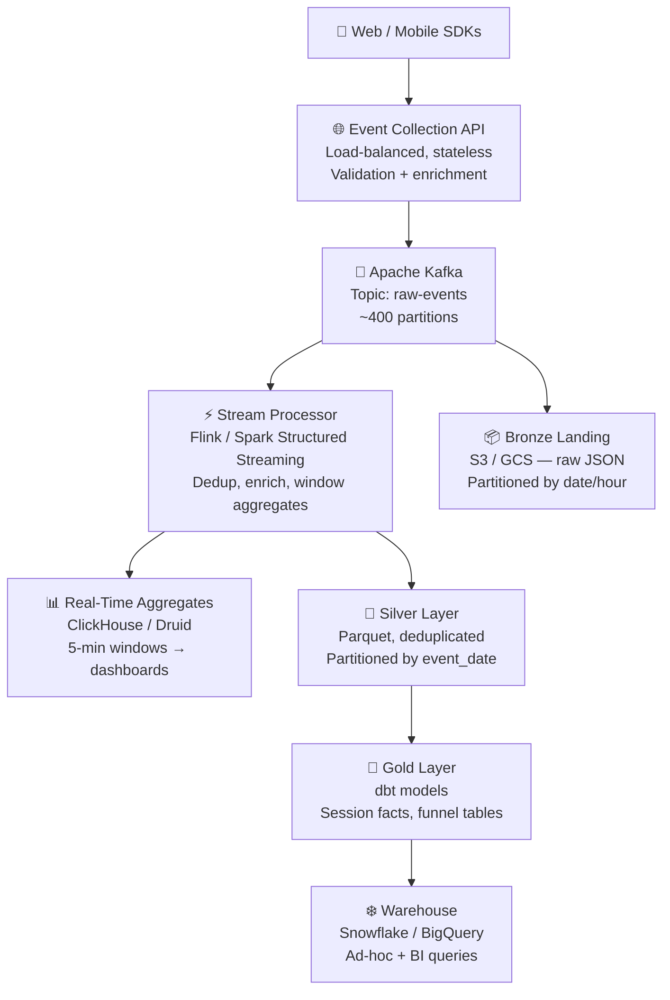

## The Problem

> "Design a clickstream pipeline that collects user events from a web and mobile application, makes them available for real-time dashboards within 5 minutes, and supports ad-hoc historical analysis across 2 years of data."

This is one of the most common data engineering system design prompts. It hits every major concept: high-volume ingestion, streaming vs batch, storage tiers, and serving layers for different consumers.

---

## Step 1 — Requirements and Clarifications

**Questions to ask:**

- What event types? *(Page views, clicks, searches, add-to-cart, purchases — call this ~10 event types)*
- What is the expected volume? *(50 million DAU, ~100 events/user/day = 5 billion events/day)*
- What does "real-time dashboard" mean exactly? *(5-minute latency for KPIs: active users, funnel conversion, error rates)*
- Who else consumes this data? *(ML team for recommendation models, product analytics for ad-hoc queries)*
- Are there compliance requirements? *(PII in events — user IDs, IP addresses — must be handled)*

**Stated assumptions:**

- 5 billion events/day → ~58,000 events/sec average, ~200,000 events/sec peak (10am–10pm)
- Average event payload: 1 KB (JSON with user_id, session_id, event_type, properties, timestamp)
- Daily raw volume: ~5 TB/day; 2-year retention: ~3.5 PB (before compression)
- Real-time SLA: aggregates available within 5 minutes of event occurrence
- Historical SLA: ad-hoc queries on 2 years of data complete in < 30 seconds

---

## Step 2 — Scale Estimates

| Metric | Value |
|--------|-------|
| Peak ingest rate | 200,000 events/sec |
| Average event size | 1 KB |
| Peak ingest bandwidth | ~200 MB/sec |
| Daily raw volume | ~5 TB |
| Compressed Parquet (10:1) | ~500 GB/day |
| 2-year storage (compressed) | ~365 TB |
| Kafka partitions needed | ~400 (at 500 KB/sec per partition) |

---

## Step 3 — Architecture Overview



---

## Step 4 — Layer-by-Layer Design

### Event Collection API

A stateless HTTP service (or multiple, behind a load balancer) that:
- Validates the event schema (required fields present, event_type is valid)
- Enriches events server-side: `server_received_at` timestamp, IP geolocation, user-agent parsing
- Produces events to Kafka with `user_id` as the partition key (so all events for a user land on the same partition — important for session reconstruction)

**Why not write directly to Kafka from the client?** Clients can't be trusted with Kafka credentials and can't handle Kafka protocol complexity. The API is the trust boundary.

```
Event payload (after server enrichment):
{
  "event_id":       "uuid-v4",          -- dedup key
  "user_id":        "u_abc123",
  "session_id":     "s_xyz789",
  "event_type":     "product_view",
  "page_url":       "/products/123",
  "properties":     { "product_id": "P123", "category": "Electronics" },
  "client_ts":      "2024-03-15T10:23:45.123Z",  -- client clock (unreliable)
  "server_ts":      "2024-03-15T10:23:45.891Z",  -- authoritative timestamp
  "ip_address":     "203.0.113.42",
  "geo_country":    "US",
  "geo_city":       "Seattle",
  "user_agent":     "Mozilla/5.0 ...",
  "device_type":    "desktop"
}
```

### Kafka

The central buffer and event bus. Key decisions:

**Topic design:** One topic `raw-events` with ~400 partitions. Partition by `user_id` hash — keeps a user's events ordered within a partition, enabling session reconstruction.

**Retention:** 7 days. Long enough to replay in case of downstream outages; not so long that storage costs explode. Raw events are also written to Bronze (S3) for permanent storage.

**Schema evolution:** Use Confluent Schema Registry with Avro. Register an `event` schema. New optional fields are backward-compatible additions. Breaking changes require a new schema version. The registry prevents consumers from breaking silently when a producer changes fields.

### Stream Processor (Flink / Spark Structured Streaming)

Two parallel consumers from Kafka:

**Consumer 1 — Raw landing to Bronze:**
Minimal processing. Deserialize, add `ingest_date` partition column, write to S3 as JSON. Checkpoint every minute. Purpose: immutable archive that can be reprocessed if downstream logic changes.

**Consumer 2 — Real-time aggregations:**
Richer processing for the 5-minute dashboard SLA:

```
For each 5-minute tumbling window:
  - Count active users (distinct user_id)
  - Count events by event_type
  - Count errors (event_type = 'error')
  - Compute funnel steps (view → add_to_cart → purchase)

Watermark: 2 minutes (events up to 2 min late are included in their window)
Output: upsert to ClickHouse / Druid aggregate table
```

**Deduplication:** Events arrive at-least-once from the collection API. Deduplicate on `event_id` using a stateful operator with a 1-hour dedup window (Flink's keyed state, keyed on `event_id`).

### Silver Layer — Cleaned Events

A daily batch job (Spark / dbt) reads from Bronze, applies:
- **Deduplication** on `event_id` within each day
- **Type casting** — `client_ts` from string to timestamp, `properties` from JSON string to struct
- **PII masking** — hash `user_id` and `ip_address` before writing (or store in a separate restricted table)
- **Validation** — drop events with null `event_type` or malformed payloads, write to a dead-letter table

Output: Parquet, partitioned by `event_date / event_hour`, registered in the metastore (Glue, Hive, Unity Catalog).

### Gold Layer — Business Aggregates

dbt models on top of Silver that build:

| Table | Grain | Description |
|-------|-------|-------------|
| `fct_sessions` | One row per session | Duration, page views, entry/exit page, converted |
| `fct_funnel_daily` | One row per funnel step per day | Views, add-to-carts, purchases, conversion rates |
| `fct_content_engagement` | One row per page per day | Views, unique users, avg time on page |
| `dim_user_first_seen` | One row per user | First event date, acquisition channel, device type |

### Serving Layer

| Consumer | Tool | Data source |
|---------|------|-----------|
| Real-time operations dashboard | ClickHouse / Apache Druid | Stream processor output |
| Product analytics (ad-hoc) | BigQuery / Snowflake | Gold layer via warehouse |
| Data scientists | Databricks / Athena | Silver Parquet directly |
| ML feature store | Redis | Pre-computed user features from Gold |

---

## Step 5 — Failure Handling and Operations

**Kafka consumer lag:** Alert when consumer lag exceeds 5 minutes of events. Auto-scaling on the stream processor handles traffic spikes; manual intervention for prolonged lag.

**Stream processor failure:** Flink checkpoints to S3 every 60 seconds. On restart, replay from the last checkpoint. At-least-once delivery + deduplication on `event_id` ensures no double-counts in the output.

**Schema change in events:** New optional fields in the Avro schema pass schema registry compatibility check automatically. New required fields or renamed fields are rejected — the producing team must increment the schema version. Silver layer uses `SELECT *` — new fields appear automatically in downstream tables.

**Late data:** The 2-minute watermark handles network delays. Events more than 2 minutes late are written to a `late_events` partition and merged into the correct date partition in the next daily Silver run.

**Collection API outage:** Kafka acts as the buffer. Mobile SDKs retry with exponential backoff and store events locally for up to 72 hours. Desktop clients retry for up to 30 minutes. No events lost during a sub-hour API outage.

**Bronze corruption:** Bronze is append-only. If a Silver or Gold job writes bad data, restore from Bronze. Bronze is never overwritten.

**Monitoring metrics:**

| Metric | Alert threshold |
|--------|----------------|
| Kafka consumer lag | > 5 min of events |
| Event ingest rate drop | > 30% below baseline |
| Silver job failure | Any failure |
| Real-time aggregate freshness | > 6 minutes stale |
| Dead-letter event rate | > 0.1% of total events |

---

## Common Interview Questions

**"Why Kafka and not writing directly to S3?"**

Kafka decouples producers from consumers and handles backpressure. At 200K events/sec, writing directly to S3 would create millions of tiny files (S3 PUT per event is expensive and slow). Kafka buffers, batches, and allows multiple consumers to process the same events independently — the stream processor and the Bronze landing job both read from Kafka without coordinating.

**"Why keep a Bronze raw layer if you have Silver?"**

Bronze is the immutable archive. If a bug in the Silver transformation is discovered 3 months later, you can reprocess from Bronze to fix it. Without Bronze, that data is gone. The Silver layer is derived from Bronze — never the source of truth.

**"How do you handle duplicate events?"**

Deduplicate on `event_id` (a UUID generated client-side and stamped server-side). In the stream processor, maintain a keyed state store on `event_id` with a 1-hour TTL — if the same `event_id` arrives twice within an hour, drop the duplicate. In the daily Silver batch, run a window function: `ROW_NUMBER() OVER (PARTITION BY event_id ORDER BY server_ts) = 1`.

**"How would you backfill 2 years of historical data if you add a new Gold table?"**

The raw data is in Bronze (S3, partitioned by ingest date). Run a Spark job that reads all 2 years of Bronze partitions, applies the Silver transforms, and outputs to the new Gold table. Run in parallel across date partitions. Use dynamic partition overwrite so a partial failure doesn't corrupt existing partitions.

---

## Key Takeaways

- Partition Kafka by `user_id` to keep a user's events ordered — required for session reconstruction
- Run two parallel Kafka consumers: one for raw Bronze landing (minimal processing), one for real-time aggregations (enriched, windowed)
- The Bronze layer is immutable — never overwrite it; it's your reprocessing safety net
- Deduplication on `event_id` at the stream layer (stateful, 1-hour window) and the batch Silver layer (window function)
- Serve real-time aggregates from ClickHouse/Druid, historical ad-hoc from the warehouse — different tools for different latency requirements
- Watermarks handle late events in streaming; a late-events partition + daily merge handles the rest
- Monitor consumer lag, ingest rate drops, and dead-letter rates — these are your early warning signals
