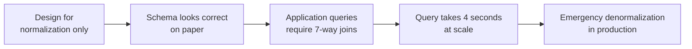

## Why Pitfalls Matter in Interviews

Data modeling interviews are as much about what you *avoid* as what you build. An interviewer who sees a clean ERD with no obvious mistakes will probe for the edge cases: "What happens when a user deletes their account?" or "How do you handle a product that can belong to multiple categories?"

The mistakes in this article are all real. They appear in production schemas at companies of every size. Knowing them — and knowing *why* they're wrong — separates candidates who can design a schema from candidates who can design a schema that survives contact with reality.

---

## Pitfall 1: The EAV Anti-Pattern

**Entity-Attribute-Value (EAV)** is a schema design that stores every attribute as a row rather than a column:

```sql
-- EAV table
CREATE TABLE product_attributes (
  product_id  BIGINT,
  attr_name   VARCHAR(100),
  attr_value  TEXT
);
```

It looks flexible. Any product can have any attribute. No schema changes needed when you add a new attribute.

**What it actually produces:**

| product_id | attr_name | attr_value |
|-----------|-----------|-----------|
| 1 | color | red |
| 1 | weight_kg | 1.2 |
| 1 | in_stock | true |
| 2 | color | blue |
| 2 | screen_size_in | 15.6 |

To retrieve a product with its color and weight, you pivot rows back into columns:

```sql
SELECT
  product_id,
  MAX(CASE WHEN attr_name = 'color' THEN attr_value END) AS color,
  MAX(CASE WHEN attr_name = 'weight_kg' THEN attr_value END)::FLOAT AS weight_kg
FROM product_attributes
GROUP BY product_id;
```

Every query requires this pivot. You can't enforce types — everything is `TEXT`. You can't add a `CHECK` constraint. You lose foreign key integrity. Query performance is terrible at scale.

**The fix depends on why you reached for EAV:**

| Reason for EAV | Better solution |
|---------------|----------------|
| Products have different attributes by category | Category-specific tables or a JSONB column for optional attributes |
| Attributes are added frequently by non-engineers | A typed JSONB column (`attributes JSONB`) with schema validation in the application |
| Building a fully generic data platform | A document store (MongoDB) or a schema-on-read approach — not a relational EAV |

```sql
-- Better: typed columns for known attributes + JSONB for variable ones
CREATE TABLE product (
  product_id    BIGSERIAL PRIMARY KEY,
  name          VARCHAR(255) NOT NULL,
  category_id   BIGINT NOT NULL,
  base_price    NUMERIC(10,2) NOT NULL,
  attributes    JSONB  -- optional: {"color": "red", "weight_kg": 1.2}
);

-- Now you can index specific JSONB paths when needed
CREATE INDEX idx_product_color ON product ((attributes->>'color'));
```

> **Interview tip:** EAV is the right answer to exactly one question: "name an anti-pattern you'd never use in a relational database." If you find yourself reaching for it, you're using the wrong database type for the problem.

---

## Pitfall 2: Storing Lists in a Column

Putting comma-separated values, pipe-delimited strings, or JSON arrays in a single column to avoid creating a table:

```sql
-- WRONG
CREATE TABLE post (
  post_id  BIGSERIAL PRIMARY KEY,
  title    TEXT NOT NULL,
  tag_ids  TEXT  -- "1,4,7,12"
);
```

This violates 1NF immediately. Problems that follow:

- Finding all posts with tag 4 requires `LIKE '%,4,%'` — slow, fragile, index-useless
- Counting posts per tag is impossible without parsing
- Enforcing referential integrity to the `tag` table is impossible
- Removing a tag from a post requires string manipulation

**The fix: a proper junction table**

```sql
CREATE TABLE post (
  post_id  BIGSERIAL PRIMARY KEY,
  title    TEXT NOT NULL
);

CREATE TABLE tag (
  tag_id  BIGSERIAL PRIMARY KEY,
  name    VARCHAR(100) NOT NULL UNIQUE
);

CREATE TABLE post_tag (
  post_id  BIGINT NOT NULL REFERENCES post(post_id),
  tag_id   BIGINT NOT NULL REFERENCES tag(tag_id),
  PRIMARY KEY (post_id, tag_id)
);
```

The junction table is two lines of DDL. The comma-string version buys you nothing and costs you everything.

The one exception: **PostgreSQL arrays** for a narrow case — when you have a bounded, homogeneous list that you query only as a whole (e.g., storing a list of notification channels), and you don't need to join or filter on individual elements.

---

## Pitfall 3: Using Strings for Everything

Defaulting to `VARCHAR` when a more constrained type would enforce correctness:

```sql
-- WRONG
CREATE TABLE "order" (
  order_id   BIGSERIAL PRIMARY KEY,
  status     VARCHAR(50),   -- anything can go here
  total      VARCHAR(50),   -- "£1,234.00" — good luck aggregating
  created_at VARCHAR(50)    -- "Jan 15 2024" — unsortable
);
```

**Why this hurts:**

- No enforcement: `status = 'shiped'` inserts silently
- No arithmetic: summing totals stored as strings requires CAST at query time, breaks on formatting variations
- No date functions: sorting by `created_at` as a string gives lexicographic order, not chronological

**The fix: use the right type for each column**

```sql
CREATE TABLE "order" (
  order_id   BIGSERIAL     PRIMARY KEY,
  status     VARCHAR(20)   NOT NULL DEFAULT 'pending'
                           CHECK (status IN ('pending','processing','shipped','delivered','cancelled')),
  total      NUMERIC(12,2) NOT NULL CHECK (total >= 0),
  created_at TIMESTAMPTZ   NOT NULL DEFAULT now()
);
```

The `CHECK` constraint on `status` is your guard against typos. `NUMERIC` makes aggregations work correctly. `TIMESTAMPTZ` gives you proper sorting, timezone handling, and date arithmetic.

---

## Pitfall 4: Ignoring NULL

Nullability is a modeling decision, not a detail. Two common mistakes:

**Mistake A — Making everything nullable:**

```sql
CREATE TABLE customer (
  customer_id  BIGSERIAL PRIMARY KEY,
  email        VARCHAR(255),  -- nullable? a customer with no email?
  created_at   TIMESTAMPTZ    -- nullable? when was this record created?
);
```

If a column should always have a value, declare it `NOT NULL`. Nullable columns require null-checks everywhere in application code and produce surprising results in aggregations (`COUNT(email)` vs `COUNT(*)`).

**Mistake B — Using NULL to mean multiple different things:**

```sql
-- What does NULL mean here?
-- "we don't know the delivery date" OR "the order hasn't shipped yet"?
CREATE TABLE "order" (
  order_id       BIGSERIAL PRIMARY KEY,
  delivered_at   TIMESTAMPTZ  -- NULL means ???
);
```

If NULL has two distinct meanings, encode them explicitly:

```sql
CREATE TABLE "order" (
  order_id       BIGSERIAL PRIMARY KEY,
  status         VARCHAR(20) NOT NULL DEFAULT 'pending',
  shipped_at     TIMESTAMPTZ,   -- NULL = not yet shipped
  delivered_at   TIMESTAMPTZ    -- NULL = not yet delivered
);
```

The `status` column captures the state machine explicitly. The timestamp columns only record when the event happened — NULL unambiguously means "hasn't happened yet."

---

## Pitfall 5: Missing Audit Columns

Omitting `created_at` and `updated_at` from every table:

```sql
-- Missing audit trail
CREATE TABLE customer (
  customer_id  BIGSERIAL PRIMARY KEY,
  email        VARCHAR(255) NOT NULL UNIQUE,
  first_name   VARCHAR(100) NOT NULL,
  last_name    VARCHAR(100) NOT NULL
  -- when was this customer created? when was their profile last updated?
);
```

Without audit columns you can't answer basic operational questions:
- "How many customers signed up last week?"
- "Which records have been modified since our last export?"
- "When did this customer's email change?"

**The fix: add them to every table, defaulted automatically:**

```sql
CREATE TABLE customer (
  customer_id  BIGSERIAL    PRIMARY KEY,
  email        VARCHAR(255) NOT NULL UNIQUE,
  first_name   VARCHAR(100) NOT NULL,
  last_name    VARCHAR(100) NOT NULL,
  created_at   TIMESTAMPTZ  NOT NULL DEFAULT now(),
  updated_at   TIMESTAMPTZ  NOT NULL DEFAULT now()
);
```

In Postgres, keep `updated_at` accurate with a trigger:

```sql
CREATE OR REPLACE FUNCTION set_updated_at()
RETURNS TRIGGER AS $$
BEGIN
  NEW.updated_at = now();
  RETURN NEW;
END;
$$ LANGUAGE plpgsql;

CREATE TRIGGER customer_updated_at
BEFORE UPDATE ON customer
FOR EACH ROW EXECUTE FUNCTION set_updated_at();
```

ORMs (Prisma, SQLAlchemy, ActiveRecord) handle this automatically — but when writing raw DDL, always add these columns.

---

## Pitfall 6: Hard Deletes When You Need Soft Deletes

Deleting rows permanently when the business logic requires them to be recoverable or auditable:

```sql
-- Hard delete — permanent, unrecoverable
DELETE FROM customer WHERE customer_id = 42;
```

Problems:

- Foreign key violations if child records (orders, addresses) exist — forces cascading deletes or orphaned rows
- No audit trail: "Why did this customer disappear?"
- Users can't recover their account if they deleted it by mistake
- Analytics lose historical data: cohort analysis breaks when customers vanish

**Soft delete pattern — add a `deleted_at` column:**

```sql
ALTER TABLE customer ADD COLUMN deleted_at TIMESTAMPTZ;

-- "Delete" a customer
UPDATE customer SET deleted_at = now() WHERE customer_id = 42;

-- Query active customers
SELECT * FROM customer WHERE deleted_at IS NULL;
```

Use a partial index to keep queries on active records fast:

```sql
CREATE INDEX idx_customer_active ON customer (email)
WHERE deleted_at IS NULL;
```

**When to use hard vs soft deletes:**

| Use hard delete | Use soft delete |
|----------------|----------------|
| Truly transient data (sessions, temp rows) | User-generated content with audit requirements |
| Data that must be purged for compliance (GDPR right-to-erasure) | Business entities where history matters |
| Log tables where retention policy applies | Records referenced by analytics or reporting |

> **Interview tip:** When an interviewer asks "how do you handle account deletion?", the answer isn't DELETE. It's: soft delete the account, anonymize PII for GDPR compliance (overwrite email with a hash), retain the order history with anonymized customer reference. Demonstrate that you've thought about audit trails and compliance, not just schema mechanics.

---

## Pitfall 7: Not Modeling for the Access Patterns

Designing the schema based on what feels "clean" without considering how it will actually be queried:



The classic example: a perfectly normalized address table that forces a join on every single customer display page, when 95% of the time you only need the primary address.

**Questions to ask before writing DDL:**

1. What are the top 5 most frequent queries this schema will serve?
2. Which entities are always loaded together?
3. What aggregations will the reporting layer run?
4. Are there any time-series access patterns (always filtered by date range)?
5. What's the read-to-write ratio?

These answers determine where you denormalize, what you index, and whether a relational model is even the right choice.

---

## Pitfall 8: Many-to-Many Stored as Arrays

A variant of Pitfall 2, common enough to call out separately — storing a many-to-many relationship as an array column rather than a junction table:

```sql
-- WRONG: user roles stored as an array
CREATE TABLE "user" (
  user_id  BIGSERIAL PRIMARY KEY,
  email    VARCHAR(255) NOT NULL,
  role_ids INT[]  -- {1, 3, 5}
);
```

This looks idiomatic in Postgres (arrays are a real type) but breaks when you need to:

- Query all users with a specific role: requires array contains operator, not index-friendly at scale
- Add metadata to the assignment (who granted this role? when does it expire?): impossible in an array

**The fix:**

```sql
CREATE TABLE user_role (
  user_id     BIGINT NOT NULL REFERENCES "user"(user_id),
  role_id     BIGINT NOT NULL REFERENCES role(role_id),
  granted_at  TIMESTAMPTZ NOT NULL DEFAULT now(),
  granted_by  BIGINT REFERENCES "user"(user_id),
  expires_at  TIMESTAMPTZ,
  PRIMARY KEY (user_id, role_id)
);
```

The junction table now supports metadata, expiration, and efficient indexed queries.

---

## Pitfall 9: Premature Optimization

Adding partitioning, sharding, or aggressive denormalization to a table that has 50,000 rows:

- Partitioned tables add schema complexity and operational overhead (partition management, maintenance windows)
- Sharding requires application-layer routing logic and makes cross-shard queries painful
- Denormalization creates update anomalies that application code must manage

**The rule:** optimize when you have evidence of a problem, not a fear of one. A normalized schema on Postgres with good indexes handles tens of millions of rows comfortably. Start there. Measure. Optimize what's actually slow.

The one exception: if you're designing a greenfield system that will clearly reach hundreds of millions of rows in year one (e.g., event logging for a platform with millions of daily users), design partitioning in from the start — retrofitting it later is painful.

---

## Common Interview Questions

**"What is the EAV anti-pattern and why is it problematic?"**

EAV stores attributes as rows (entity, attribute name, value) instead of typed columns. It eliminates type safety, makes constraints impossible, turns every query into a pivot operation, and performs poorly. It's tempting because it looks flexible, but a JSONB column or a document store handles the same use case without the drawbacks.

**"When would you use a soft delete instead of a hard delete?"**

When the data has audit requirements, is referenced by analytics, needs to be recoverable, or is tied to legal compliance. Soft deletes preserve history and maintain referential integrity. Hard deletes are appropriate for truly transient data or when regulations require permanent erasure (GDPR).

**"What's wrong with making all columns nullable?"**

Nullable columns propagate nulls through queries in unexpected ways, require null-checks in every code path, and make aggregations ambiguous (`COUNT(col)` vs `COUNT(*)`). A null column should mean exactly one thing: "this data doesn't exist." If a column must always have a value, NOT NULL enforces that at the database level — not just in application code.

**"A colleague says they'll store product tags as a comma-separated string to keep the schema simple. How do you respond?"**

Politely point out that it violates 1NF, makes querying for posts by tag require a LIKE scan, prevents a foreign key to the tag table, and makes tag counts impossible without parsing. A junction table is three lines of DDL and eliminates every one of these problems. The junction table is simpler in practice, not the string.

**"How do you decide when to add audit columns and what should they contain?"**

Every table that represents a business entity should have `created_at` and `updated_at` as non-nullable TIMESTAMPTZ columns with database-level defaults. Add `created_by` (FK to user) when you need to know who created the record. Add `deleted_at` for soft-delete patterns. These cost almost nothing at insert time and are invaluable the first time someone asks "when did this record change?"

---

## Key Takeaways

- EAV destroys type safety, constraint enforcement, and query performance — use JSONB or a document store instead
- Comma-separated values and JSON arrays in columns violate 1NF — always resolve many-to-many with a junction table
- Use the right type for every column: NUMERIC for money, TIMESTAMPTZ for timestamps, CHECK constraints for enums
- NOT NULL is a design decision — every nullable column should have one explicit meaning
- Add `created_at` and `updated_at` to every business entity table — they cost nothing and are invaluable
- Default to soft deletes for entities with audit requirements; hard delete only for transient data or compliance erasure
- Design for your actual query patterns, not for theoretical correctness alone
- Premature optimization adds complexity without evidence — normalize first, measure, then optimize what's actually slow
