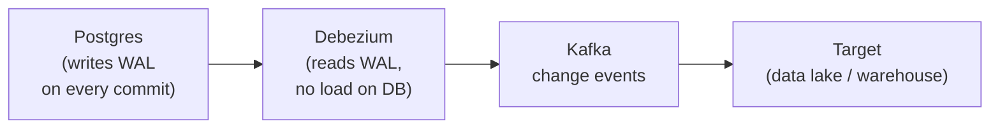

## The Extraction Problem

Extraction is deceptively simple — "just copy the data from A to B" — until you hit the real constraints: the source database can't handle extra load, records are deleted without notice, the API rate-limits you before you finish, or a file arrives while it's still being written.

Good extraction design means getting all the data reliably, without hurting the source system.

---

## Full Extract vs Incremental Extract

The first decision for any database or API source:

| | Full Extract | Incremental Extract |
|---|-------------|---------------------|
| **What it does** | `SELECT * FROM table` — copies everything | `SELECT * FROM table WHERE updated_at > last_run` — copies only changes |
| **Latency** | High — re-reads all rows | Low — only new/changed rows |
| **Source load** | High — full table scan every run | Low — small scans |
| **Simplicity** | Very simple | Requires a watermark column |
| **Misses deletes?** | No — full snapshot catches deletions | Yes — deleted rows don't appear in `WHERE updated_at > ?` |
| **Use when** | Small tables (<1M rows), no `updated_at` column, infrequent runs | Large tables, `updated_at` exists, frequent runs |

### The Watermark Pattern

Incremental extraction requires tracking where you left off:

```python
def incremental_extract(conn, table, watermark_store):
    # 1. Read the last successful watermark
    last_run = watermark_store.get(f"{table}.last_updated_at")
    
    # 2. Extract only rows newer than the watermark
    rows = conn.execute(f"""
        SELECT * FROM {table}
        WHERE updated_at > '{last_run}'
        ORDER BY updated_at ASC
    """)
    
    # 3. Process and load
    load_to_destination(rows)
    
    # 4. Advance the watermark only after successful load
    new_watermark = max(row['updated_at'] for row in rows)
    watermark_store.set(f"{table}.last_updated_at", new_watermark)
```

**Critical rule:** Only advance the watermark after the load succeeds. If you advance it before loading and the load fails, you'll never re-extract the skipped records.

**The overlap pattern:** Use `WHERE updated_at > last_run - INTERVAL '5 minutes'` to catch records updated just before the last run's cutoff. This produces duplicates — deduplicate in Silver with `dropDuplicates(["id"])`.

---

## Batch Extraction

Runs on a schedule: hourly, daily, or triggered by a file arrival. The standard choice for most pipelines.

### High-Volume Batch Extraction

For large tables (hundreds of millions of rows), a single query is too slow and puts too much load on the source. Split the extraction into parallel chunks:

```python
# Partition extraction by date range
def extract_partitioned(conn, table, start_date, end_date, num_partitions=10):
    date_ranges = split_date_range(start_date, end_date, num_partitions)
    
    with ThreadPoolExecutor(max_workers=num_partitions) as pool:
        futures = [
            pool.submit(extract_date_range, conn, table, r['start'], r['end'])
            for r in date_ranges
        ]
        results = [f.result() for f in futures]
    
    return merge_results(results)
```

**Spark JDBC parallel extraction:**

```python
# Spark reads a table in parallel — one task per partition
df = spark.read.jdbc(
    url=jdbc_url,
    table="orders",
    column="order_date",          # partition column
    lowerBound="2024-01-01",
    upperBound="2024-03-31",
    numPartitions=50,             # 50 parallel reads
    properties=jdbc_props
)
```

Each Spark task executes a range query on the source database — `WHERE order_date BETWEEN '2024-01-01' AND '2024-01-20'`, etc. This distributes the extraction load across 50 parallel queries but requires the partition column to be indexed.

### Semi-Structured and Unstructured Data Extraction

Not all data arrives as clean tabular rows. Common semi-structured sources:

| Source | Format | Extraction challenge |
|--------|--------|---------------------|
| Application logs | Plain text or JSON lines | Parsing variable-length log lines, handling schema changes |
| Nested API responses | JSON with nested objects | Flattening nested structures |
| Email / documents | HTML, PDF, DOCX | Text extraction, no schema |
| IoT sensors | Binary, MessagePack | Protocol-specific parsing |

**Flattening nested JSON in Spark:**

```python
from pyspark.sql.functions import explode, col

# Source: {"order_id": "1", "items": [{"sku": "A", "qty": 2}, {"sku": "B", "qty": 1}]}
raw = spark.read.json("s3://bronze/orders/")

# Flatten: one row per item
flattened = (
    raw
    .withColumn("item", explode(col("items")))   # creates one row per array element
    .select(
        col("order_id"),
        col("item.sku").alias("sku"),
        col("item.qty").alias("quantity")
    )
)
```

**Schema inference trap:** `spark.read.json()` infers schema from the first few rows. If later rows have new fields or different types, Spark silently drops or misreads them. In production, always define the schema explicitly with `StructType`.

---

## Real-Time Extraction

When batch isn't fresh enough, extract in real time using one of these patterns:

### Change Data Capture (CDC)

Reads the database transaction log (WAL in Postgres, binlog in MySQL) to capture every INSERT, UPDATE, and DELETE as it happens.



**Why CDC is the best OLTP extraction method:**
- Zero production DB load — WAL is written regardless
- Captures deletes (incremental SQL can't)
- Sub-second latency
- Preserves before/after values for every row change

**CDC event structure:**

```json
{
  "op": "u",              // u=update, c=create, d=delete
  "before": {"order_id": "1001", "status": "pending"},
  "after":  {"order_id": "1001", "status": "shipped"},
  "ts_ms": 1710000000000
}
```

### Event Stream Consumption

For Kafka topics — a consumer group subscribes and processes messages continuously:

```python
consumer = KafkaConsumer(
    'user-events',
    bootstrap_servers='broker:9092',
    group_id='bronze-loader',
    auto_offset_reset='earliest',   # start from beginning on first run
    enable_auto_commit=False,        # manual offset commit for exactly-once
)

for message in consumer:
    record = json.loads(message.value)
    write_to_bronze(record)
    consumer.commit()               # commit offset only after successful write
```

**At-least-once vs exactly-once:**
- `auto_commit=True` → offset committed even if processing fails → at-most-once (can miss records)
- Manual commit after processing → at-least-once (safe, may produce duplicates on retry)
- Kafka transactions + idempotent writes → exactly-once (most complex, highest guarantees)

---

## High-Quality Extraction — Critical Data

For financial records, medical data, or any source where missing or duplicate records have serious consequences:

### Pre-Extraction Validation

```python
def validate_source_before_extract(conn, table, expected_min_rows):
    count = conn.execute(f"SELECT COUNT(*) FROM {table}").fetchone()[0]
    
    if count < expected_min_rows:
        raise DataQualityError(
            f"{table} has {count} rows, expected at least {expected_min_rows}. "
            "Source may be truncated or pipeline may have run before data was ready."
        )
```

### Row Count Reconciliation

After extraction, verify you got what you expected:

```python
source_count = conn.execute("SELECT COUNT(*) FROM orders WHERE date = '2024-03-15'").fetchone()[0]
extracted_count = len(extracted_records)

if source_count != extracted_count:
    raise ReconciliationError(
        f"Expected {source_count} rows, extracted {extracted_count}. "
        f"Missing {source_count - extracted_count} records."
    )
```

### Checksum Validation

For financial data, verify totals match between source and destination:

```python
source_total = conn.execute("SELECT SUM(amount) FROM transactions WHERE date = '2024-03-15'").fetchone()[0]
extracted_total = sum(r['amount'] for r in extracted_records)

if abs(source_total - extracted_total) > 0.01:   # allow for floating point tolerance
    raise ReconciliationError(f"Amount mismatch: source={source_total}, extracted={extracted_total}")
```

---

## Common Interview Questions

**"How do you extract from a table that has no `updated_at` column?"**

Three options in increasing complexity: (1) Full extract — re-copy the entire table every run (acceptable if small); (2) add an `updated_at` column to the source table (requires app change); (3) CDC — read the WAL for changes without needing a watermark column.

**"What happens if your incremental extraction misses a record?"**

The record is silently absent from your warehouse. Prevention: (1) use CDC instead of `updated_at` filtering — CDC captures every write; (2) run periodic full-refresh reconciliation to verify row counts match.

**"How do you handle files that arrive while they're still being written?"**

The flag file pattern: the sender writes `data_20240315.csv` first, then `data_20240315.csv.done` when writing is complete. Your sensor waits for the `.done` file before triggering extraction of the `.csv`. Never trigger on the data file directly.

---

## Key Takeaways

- Always choose incremental over full extract for large tables — full extract wastes compute and puts unnecessary load on the source
- Advance the watermark only after a successful load — never before
- Use an overlap window (`last_run - 5 min`) to catch late-arriving records; deduplicate in Silver
- CDC (Debezium / WAL reading) is the gold standard for OLTP extraction: zero source DB load, captures deletes, sub-second latency
- For Kafka: manual offset commit = at-least-once; auto-commit = at-most-once; use manual commit in production
- For critical data (financial, medical): validate row counts and totals between source and extracted data before loading
