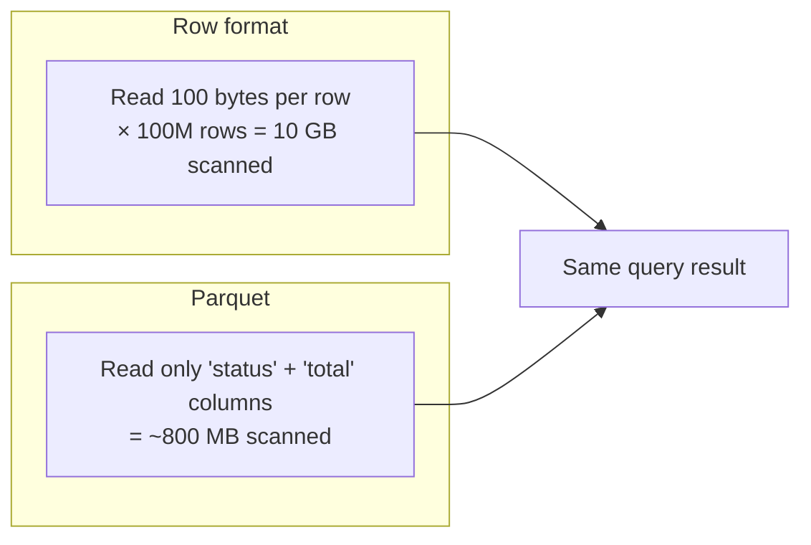
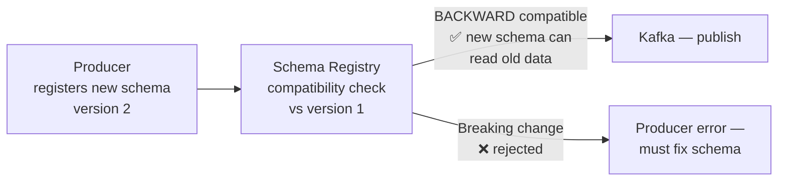
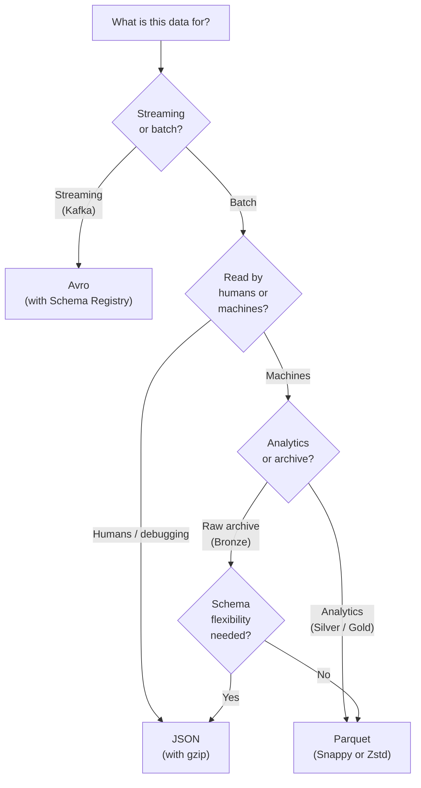

## Why Data Format Matters

The choice of data format affects query speed, storage cost, schema evolution, and pipeline complexity. Every layer of a data pipeline uses different formats for different reasons — understanding the trade-offs is a practical interview expectation.

---

## The Four Formats

### JSON

Human-readable, self-describing, schema embedded in every record.

```json
{
  "order_id": "1001",
  "customer_id": "C042",
  "status": "shipped",
  "total": 99.99,
  "items": [
    {"product_id": "P01", "qty": 2, "price": 29.99},
    {"product_id": "P02", "qty": 1, "price": 40.01}
  ],
  "created_at": "2024-03-15T10:23:00Z"
}
```

**Characteristics:**

| Property | Detail |
|---------|--------|
| Storage | Row-oriented, verbose — typically 3–5× larger than Parquet |
| Compression | gzip or zstd reduces size significantly |
| Schema | Schema-less — any field can appear or disappear |
| Query speed | Slow for analytics — every field is parsed even if only one is needed |
| Schema evolution | Trivially flexible — add fields without coordination |
| Human readable | Yes |

**Use JSON for:**
- Raw landing (Bronze layer) — flexibility to accept schema changes without pipeline breakage
- API responses — the universal exchange format
- Event payloads in Kafka (when Avro is overkill and schema governance isn't needed)
- Configuration files

**Avoid JSON for:**
- Large-scale analytical reads — the verbosity and row orientation are expensive

### Avro

Binary, row-oriented, schema stored separately in a registry or embedded in the file header.

```json
// Avro schema definition (JSON notation, separate from data)
{
  "type": "record",
  "name": "Order",
  "namespace": "com.company.events",
  "fields": [
    {"name": "order_id",    "type": "string"},
    {"name": "customer_id", "type": "string"},
    {"name": "total",       "type": "double"},
    {"name": "created_at",  "type": "long", "logicalType": "timestamp-millis"},
    {"name": "note",        "type": ["null", "string"], "default": null}
  ]
}
```

**Characteristics:**

| Property | Detail |
|---------|--------|
| Storage | Row-oriented, binary — compact without index overhead |
| Compression | Snappy, deflate, zstd supported natively |
| Schema | Schema required — defined separately, versioned |
| Query speed | Not designed for analytics — reads entire row even for one field |
| Schema evolution | Formal evolution rules: backward, forward, full compatibility |
| Splittable | Yes — large files can be split for parallel processing |

**Use Avro for:**
- Kafka topics — schema in registry, compact binary payload, fast serialization/deserialization
- CDC events (Debezium output) — structured change events with before/after payloads
- Long-term event archives where schema evolution must be managed formally

**Avoid Avro for:**
- Analytical queries — not columnar; reads unnecessary fields

### Parquet

Binary, **columnar**, schema embedded in footer. The standard format for analytical workloads.

```
Row 1:  order_id=1001, customer_id=C042, status=shipped, total=99.99
Row 2:  order_id=1002, customer_id=C043, status=pending, total=149.00
Row 3:  order_id=1003, customer_id=C042, status=shipped, total=49.99

Stored on disk as:
Column: order_id    → [1001, 1002, 1003]          (compressed together)
Column: customer_id → ["C042", "C043", "C042"]    (compressed together)
Column: status      → ["shipped", "pending", "shipped"]
Column: total       → [99.99, 149.00, 49.99]
```

**Why columnar is fast for analytics:**

```sql
SELECT SUM(total) FROM orders WHERE status = 'shipped'
```

A row-oriented format reads every field of every row, then discards all but `total` and `status`. A columnar format reads *only* the `status` and `total` columns — skipping `order_id`, `customer_id`, and all others entirely.



**Row group statistics** enable further pruning. Each Parquet row group (128 MB by default) stores min/max values per column. A query with `WHERE order_date = '2024-03-15'` skips row groups whose max `order_date` is before that date — without reading the data.

**Characteristics:**

| Property | Detail |
|---------|--------|
| Storage | Columnar + compression (Snappy, gzip, Zstd) — typically 5–10× smaller than JSON |
| Query speed | Extremely fast for SELECT on a subset of columns |
| Schema evolution | Adding nullable columns is safe; renaming or removing breaks readers |
| Splittable | Yes — row groups are independent |
| Use case | Analytics, data lake Silver/Gold layers, warehouse export/import |

### ORC (Optimized Row Columnar)

Similar to Parquet — columnar, binary, analytical. ORC is the Hive/Presto/Hudi native format; Parquet dominates in Spark, Arrow, and most modern tools.

| | Parquet | ORC |
|---|---------|-----|
| Best ecosystem | Spark, Arrow, Snowflake, BigQuery | Hive, Presto, Hudi |
| Compression | Snappy, gzip, Zstd | Zlib, Snappy, LZO |
| Complex types | Full support | Full support |
| Default choice | ✅ For most pipelines | Only for Hive-centric stacks |

---

## Compression

Compression applies to all formats. Choose based on the read/write balance:

| Algorithm | Compression ratio | Speed | Splittable | Use when |
|-----------|------------------|-------|-----------|---------|
| **Snappy** | Moderate (2–3×) | Very fast | No (within Parquet row groups) | Default for Spark output — fast read/write |
| **gzip** | Good (4–6×) | Slower | No | Storage cost matters, reads are less frequent |
| **Zstd** | Excellent (5–8×) | Fast | No | Best balance — preferred for new pipelines |
| **bzip2** | Excellent | Slow | Yes | When file-level splitting is needed |
| **LZ4** | Low | Extremely fast | No | Low-latency pipelines where CPU is the bottleneck |

For Parquet: **Snappy** is the most common default. **Zstd** is increasingly preferred for better ratios at similar speeds.

---

## Schema Evolution

Schemas change. A new field is added, an old one is removed, a type changes. Each format handles this differently:

### Parquet Schema Evolution

```python
# Original schema
old_schema = StructType([
    StructField("order_id", StringType()),
    StructField("total", DoubleType()),
])

# New schema — added optional field, changed column order
new_schema = StructType([
    StructField("order_id", StringType()),
    StructField("total", DoubleType()),
    StructField("discount", DoubleType(), nullable=True),  # ✅ safe — new nullable column
])

# Read old files with new schema — Spark fills discount with null
df = spark.read \
    .schema(new_schema) \
    .option("mergeSchema", "true") \  # merge schemas across files in the directory
    .parquet("s3://orders/")
```

**Safe vs breaking changes for Parquet:**

| Change | Safe? |
|--------|-------|
| Add nullable column | ✅ Old files read as null |
| Add required column (non-null) | ❌ Old files have no value |
| Rename column | ❌ Old files use old name — becomes null |
| Widen type (INT → BIGINT) | ✅ Usually safe |
| Narrow type (BIGINT → INT) | ❌ Potential overflow |
| Drop column | ✅ Old files ignored for that column |

### Avro Schema Evolution with Schema Registry

Avro has formal evolution rules enforced by the Confluent Schema Registry:



**BACKWARD compatibility rules (most common):**
- Add a field with a default value ✅ — old data reads as the default
- Delete a field that had a default ✅ — consumers ignore it
- Rename a field ❌ — consumers using the old name break
- Add a required field (no default) ❌ — old data has no value for it
- Change a field type ❌

```json
// Version 1
{"name": "order_id", "type": "string"}

// Version 2 — BACKWARD compatible addition
{"name": "order_id", "type": "string"},
{"name": "discount_pct", "type": ["null", "double"], "default": null}  // default required
```

---

## Schema Registry in Practice

The Schema Registry is the governance layer for Kafka schemas. Every Avro (or Protobuf) schema is registered with a version number. Producers write the schema ID into the message header; consumers fetch the schema from the registry to deserialize.

```python
from confluent_kafka.avro import AvroProducer
from confluent_kafka import avro

schema_registry_conf = {'url': 'http://schema-registry:8081'}
value_schema = avro.load('schemas/order_event.avsc')

producer = AvroProducer({
    'bootstrap.servers': 'broker:9092',
    'schema.registry.url': 'http://schema-registry:8081',
}, default_value_schema=value_schema)

producer.produce(topic='order-events', value=order_event_dict)
```

The registry's compatibility mode (`BACKWARD`, `FORWARD`, `FULL`) acts as a circuit breaker — a producer publishing a breaking schema change is rejected at the registry before any consumer sees bad data.

---

## Choosing the Right Format — Summary



---

## Common Interview Questions

**"Why is Parquet better than CSV for analytics?"**

Parquet is columnar — a query reading 3 of 50 columns scans only those 3 columns' data. CSV reads every column for every row. Parquet also compresses homogeneous column data dramatically (repeated strings like status values compress 20:1). It stores schema and row group statistics in the footer — enabling predicate pushdown that skips entire file sections without reading them.

**"What is the difference between Avro and Parquet?"**

Both are binary formats, but optimized for different use cases. Avro is row-oriented and optimized for write throughput and schema evolution — ideal for streaming (Kafka), where each event is written and read in full. Parquet is columnar and optimized for analytical reads — ideal for the data lake, where queries scan billions of rows but only a few columns. Avro for Kafka → landing; Parquet for Silver/Gold → analytics.

**"What is schema evolution and why does it matter?"**

Schema evolution is the ability to change a schema — add, remove, or modify fields — without breaking existing producers or consumers. In a production pipeline, schemas change constantly (new fields in app events, renamed columns in source DBs). Without schema evolution support, every change requires coordinated downtime across producers and consumers. Avro with Schema Registry, Parquet with `mergeSchema`, and Delta Lake with `schema evolution` all handle this — each with different guarantees.

**"What is a Schema Registry and why would you use it?"**

A Schema Registry is a central store for Avro (or Protobuf) schemas, versioned per Kafka topic. Producers register schemas before publishing; consumers fetch schemas to deserialize messages. The registry enforces compatibility rules — a producer publishing a breaking change is rejected before consumers see it. Without a registry, a producer can silently publish incompatible data that breaks downstream consumers with no warning.

---

## Key Takeaways

- JSON for raw landing and streaming (flexibility over performance); Avro for Kafka (schema governance + compact binary); Parquet for analytics (columnar, compressed, fast)
- Parquet's columnar storage means only queried columns are scanned — 10–50× faster than row-oriented formats for analytical queries
- Row group statistics (min/max per column) enable predicate pushdown — entire file sections are skipped without reading the data
- Safe Parquet schema evolution: add nullable columns, widen types. Breaking: rename, drop required, narrow type
- Avro BACKWARD compatibility: add fields with defaults, delete fields that had defaults. Breaking: rename, add required fields
- Schema Registry enforces compatibility at publish time — prevents silent breaking changes from reaching consumers
- Compression: Snappy for speed, Zstd for the best ratio-vs-speed balance, gzip when storage cost dominates
