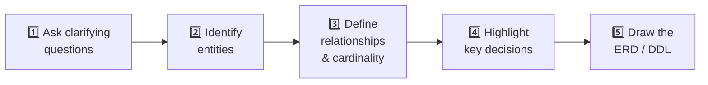
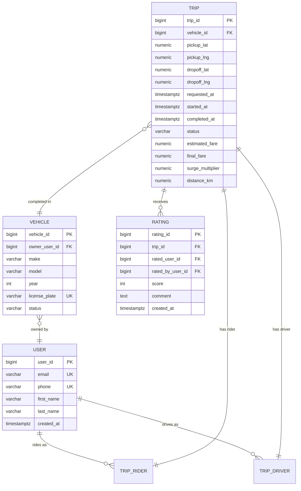
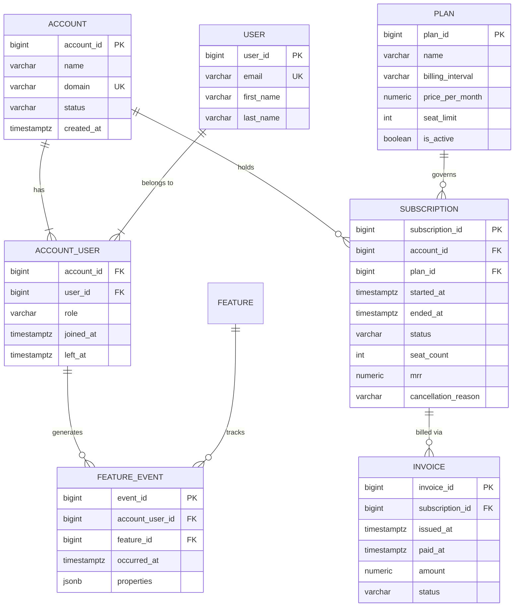
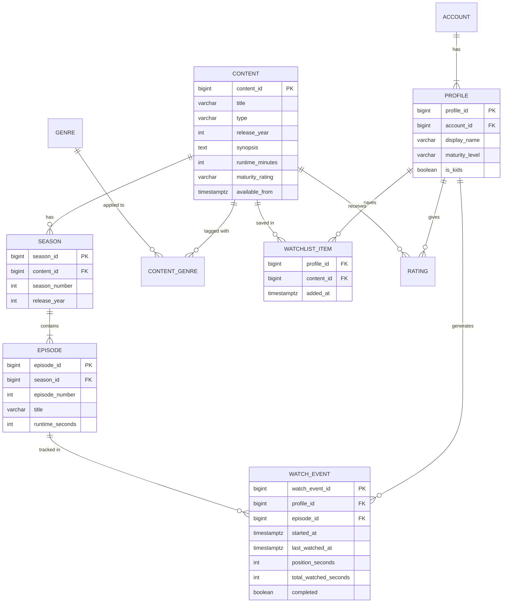

## How to Approach a Case Study in an Interview

Every data modeling case study follows the same five-step process. Interviewers reward candidates who work through it methodically rather than jumping straight to DDL.



The clarifying questions are not stalling — they demonstrate that you understand the business context and know that one ambiguous requirement changes the entire model. Interviewers who don't give you requirements expect you to ask for them.

---

## Case Study 1 — Ride-Sharing Platform

### Requirements

> "Design the data model for a ride-sharing platform like Uber. Drivers complete trips for riders. Riders rate drivers, and drivers rate riders. The business needs to track earnings, trip history, and calculate surge pricing."

### Clarifying Questions to Ask

- Can a person be both a driver and a rider? *(Yes — one user table, roles assigned per context)*
- Is a trip always one driver, one rider? Or can trips be pooled? *(Start with one-to-one, note pooled as an extension)*
- How granular is location data — just pickup/dropoff, or full GPS route? *(Pickup/dropoff for now)*
- Is pricing calculated before or after the trip? *(Estimated before, finalized after)*
- Do we need to track the vehicle separately from the driver? *(Yes — one driver may have multiple vehicles)*

### Entities and Relationships



### Key Design Decisions

**1. One `USER` table, not separate `DRIVER` and `RIDER` tables.**

A person can be both. Splitting them creates duplicate profiles and makes it impossible to track a driver booking a ride. Role-specific attributes (driver license number, vehicle associations) live in linked tables, not in `USER`.

**2. `TRIP_DRIVER` and `TRIP_RIDER` as separate join records rather than FKs on `TRIP`.**

For pooled rides (future): multiple riders can share one trip. Keeping the relationship in a join table makes this extension trivial — add a second `TRIP_RIDER` row. Direct FKs on `TRIP` would require a schema change.

**3. Snapshot both `estimated_fare` and `final_fare` on the trip.**

The estimate is set at booking; the final fare can change based on actual distance or wait time. Storing both enables business analysis on estimate accuracy and allows dispute resolution.

**4. `surge_multiplier` stored on the trip.**

Surge pricing changes by the minute. If you only store `final_fare`, you lose the information that a 2.4× surge applied. Store the multiplier and base fare as separate facts.

**5. Mutual ratings — both parties rate each other.**

`RATING` has `rated_user_id` (who was rated) and `rated_by_user_id` (who gave the rating), both FKs to `USER`. The `trip_id` links back to the context. A driver's average rating is `AVG(score) WHERE rated_user_id = driver_id`.

### Warehouse Extension

For analytics, build a `fact_trip` with dimensions on driver, rider, vehicle, date, and city:

```sql
CREATE TABLE fact_trip (
  trip_key          BIGINT PRIMARY KEY,
  date_key          INT NOT NULL,       -- dim_date
  driver_key        BIGINT NOT NULL,    -- dim_user
  rider_key         BIGINT NOT NULL,    -- dim_user (same dimension, different role)
  vehicle_key       BIGINT NOT NULL,    -- dim_vehicle
  city_key          BIGINT NOT NULL,    -- dim_geography
  distance_km       NUMERIC(8,2),
  duration_minutes  INT,
  final_fare        NUMERIC(8,2),
  surge_multiplier  NUMERIC(4,2),
  base_fare         NUMERIC(8,2),
  driver_rating     NUMERIC(3,2),
  rider_rating      NUMERIC(3,2)
);
```

---

## Case Study 2 — SaaS Subscription Platform

### Requirements

> "Design the data model for a B2B SaaS platform. Companies subscribe to one of three plans (Starter, Growth, Enterprise). Each plan has a monthly and annual pricing option. The business tracks MRR (Monthly Recurring Revenue), churn, and feature usage per account."

### Clarifying Questions to Ask

- Is billing per company or per seat? *(Per company, but seat count determines tier pricing)*
- Can a company have multiple active subscriptions? *(No — one active subscription at a time)*
- What happens when a company upgrades mid-cycle? *(Prorate and create a new subscription record)*
- Do we need to track which users within a company use which features? *(Yes — usage is per user)*
- Is the plan catalogue static or can plans change over time? *(Plans can change — must preserve what a company subscribed to)*

### Entities and Relationships



### Key Design Decisions

**1. `SUBSCRIPTION` stores a snapshot of `mrr` and `seat_count`.**

Plan prices change over time. If you only store `plan_id` on the subscription, you lose the revenue figure that applied at subscription time. Snapshot `mrr` and `seat_count` when the subscription is created or updated.

**2. `PLAN` uses `is_active` to retire plans without deleting them.**

Existing subscribers must be able to reference their original plan. Never delete plan rows — mark them inactive so new signups can't choose them but historical records remain valid.

**3. `SUBSCRIPTION.ended_at` is nullable.**

`NULL` means the subscription is currently active. `NOT NULL` means it has been cancelled or superseded. This is the same pattern as soft deletes — query `WHERE ended_at IS NULL` for active subscriptions.

**4. `ACCOUNT_USER.left_at` is nullable for the same reason.**

A user who left an account has a `left_at` timestamp. Current members have `left_at IS NULL`. This preserves the history of who had access when — important for security audits.

**5. `FEATURE_EVENT` uses `JSONB properties` for flexibility.**

Feature events vary wildly in their metadata. An export event might log `{rows: 5000, format: "csv"}` while a collaboration event logs `{shared_with: 3, channel: "slack"}`. A fixed schema would require an EAV pattern. JSONB gives flexibility with the ability to index specific paths when a property becomes important to query.

### MRR Tracking in the Warehouse

MRR is a semi-additive measure — you can sum it across accounts at a point in time, but not across time periods (that gives you cumulative MRR, not monthly MRR).

```sql
-- Monthly MRR snapshot fact table
CREATE TABLE fact_mrr_snapshot (
  month_key     INT NOT NULL,         -- dim_date (first of month)
  account_key   BIGINT NOT NULL,
  plan_key      BIGINT NOT NULL,
  mrr           NUMERIC(10,2) NOT NULL,
  seat_count    INT NOT NULL,
  is_new        BOOLEAN NOT NULL,     -- first month on this plan
  is_churned    BOOLEAN NOT NULL,     -- last month before cancellation
  is_expansion  BOOLEAN NOT NULL,     -- upgrade from prior month
  PRIMARY KEY (month_key, account_key)
);
```

This table powers MRR dashboards, cohort retention curves, and churn analysis — all without recalculating from raw subscription records each time.

---

## Case Study 3 — Content Streaming Platform

### Requirements

> "Design the data model for a content streaming platform. Users can watch movies and TV shows. TV shows have seasons and episodes. Users can create watchlists, and the platform needs to track watch history to power a recommendation engine."

### Clarifying Questions to Ask

- Can content appear on multiple platforms (licensed vs original)? *(Track origin and licensing, but it's out of scope for the model)*
- Is watch history per episode (TV) or per title (movies)? *(Per episode — needed for "continue watching")*
- Can multiple profiles share one account? *(Yes — like Netflix profiles)*
- Do we need to track how far into a piece of content a user watched? *(Yes — position in seconds for resume)*
- Is the recommendation engine built on explicit ratings, implicit watch behaviour, or both? *(Both)*

### Entities and Relationships



### Key Design Decisions

**1. `CONTENT` covers both movies and TV shows with `type`.**

Movies have no seasons or episodes — their `runtime_minutes` is the whole film. TV shows have seasons and episodes. A discriminated union approach (one `CONTENT` table with type-specific tables linked by FK) is cleaner than a massive nullable-column table and avoids duplicating shared attributes like title, synopsis, and genre.

**2. `WATCH_EVENT` is per episode, not per title.**

Movies have one "episode" — the film itself. By making every watch event reference an `episode_id`, you unify the tracking model. For a movie, there's one `EPISODE` record representing the film. For TV, there's one per episode. The "continue watching" feature uses `position_seconds` from the most recent watch event per profile.

**3. `total_watched_seconds` vs `position_seconds`.**

`position_seconds` is where the user stopped — used for resuming. `total_watched_seconds` is the cumulative time actually watched (a user who scrubs back and rewatches a scene accumulates more time than the position suggests). Both are needed: position for UX, total for engagement analytics.

**4. `CONTENT_GENRE` as a junction table.**

A movie can have multiple genres (Action, Thriller). A genre applies to multiple movies. Many-to-many — always a junction table.

**5. `WATCHLIST_ITEM` has `content_id`, not `episode_id`.**

You add a *show* to your watchlist, not a specific episode. The composite PK `(profile_id, content_id)` ensures a show appears only once per profile.

### Warehouse Extension for Recommendations

The recommendation engine needs aggregated behaviour signals:

```sql
-- Aggregated content engagement (rebuilt nightly)
CREATE TABLE fact_content_engagement (
  date_key              INT NOT NULL,
  content_key           BIGINT NOT NULL,
  genre_key             BIGINT NOT NULL,
  total_starts          INT NOT NULL,
  total_completions     INT NOT NULL,
  completion_rate       NUMERIC(5,4),   -- non-additive: store components too
  avg_watch_pct         NUMERIC(5,4),   -- non-additive
  total_watch_hours     NUMERIC(10,2),  -- additive
  watchlist_adds        INT NOT NULL,
  watchlist_removes     INT NOT NULL,
  PRIMARY KEY (date_key, content_key)
);
```

Collaborative filtering models train on the raw `WATCH_EVENT` data. The `fact_content_engagement` table powers the BI dashboards showing content performance without querying billions of raw events.

---

## Common Interview Questions

**"Walk me through how you'd design a data model for [X]."**

Use the five-step framework: ask clarifying questions, identify entities from the nouns, define cardinality for each relationship, call out the non-obvious design decisions, then draw the ERD. Don't draw anything until after step one — the clarifying questions often change the model entirely.

**"How would you model a user who can be both a buyer and a seller?"**

One `USER` table with role-specific data in linked tables. Splitting into `BUYER` and `SELLER` tables creates duplicate profiles and makes cross-role queries painful. The distinction in behaviour is captured in the transaction records (a `LISTING` belongs to a seller user; an `ORDER` belongs to a buyer user) — not in the user table itself.

**"How do you handle a many-to-many where the relationship itself has attributes?"**

The junction table carries those attributes. In the ride-sharing case, if a driver could work for multiple platforms simultaneously, the platform assignment would carry a `start_date` and `commission_rate` — those belong on the junction table, not on the driver or the platform.

**"How would you extend an OLTP schema to support analytics?"**

Build a separate dimensional model in the warehouse. Don't run analytical queries on the OLTP schema — it's normalized for writes. Extract the entities into facts and dimensions: the core transactional event becomes a fact table, descriptive attributes become dimensions. Keep the OLTP source of truth clean; build the warehouse model on top via an ETL/ELT pipeline.

---

## Key Takeaways

- Always ask clarifying questions before drawing anything — one ambiguous requirement changes the whole model
- Prefer a single user table with role-specific linked tables over separate role-based tables; users often have multiple roles
- Store snapshots of values that change over time (fare, price, MRR) — a FK back to the current value gives wrong historical answers
- Use nullable timestamp columns (`ended_at`, `left_at`, `deleted_at`) to encode active vs inactive state cleanly
- JSONB is appropriate for event properties that vary per event type — just don't use it where structured columns with constraints belong
- Every case study has a warehouse extension: identify the core event (fact), the descriptive context (dimensions), and the grain
- Non-additive measures (rates, percentages) should be stored as components and calculated at query time
