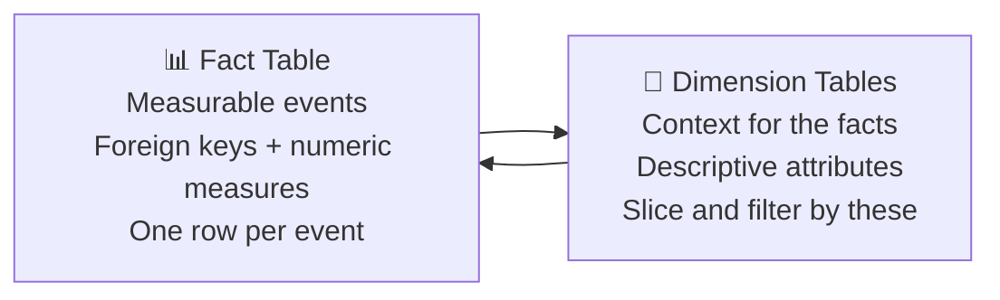
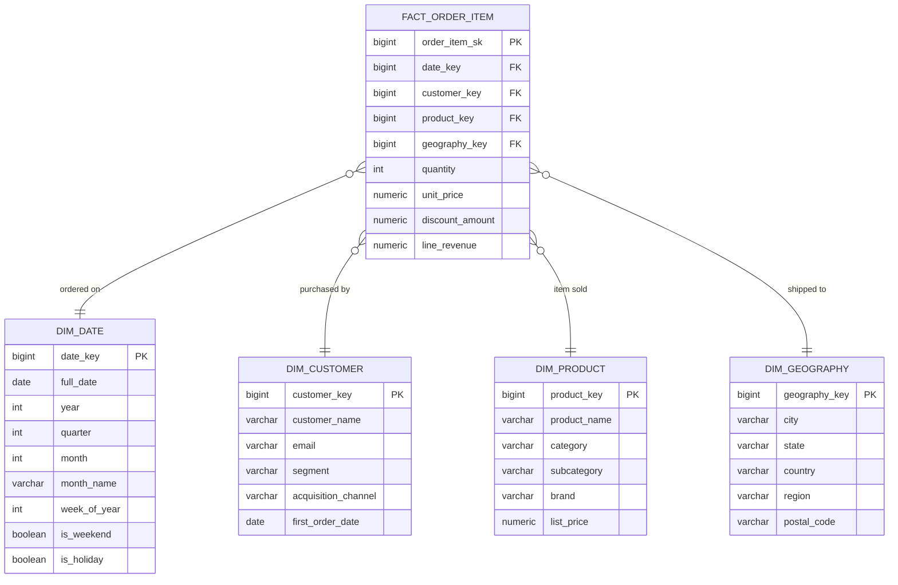
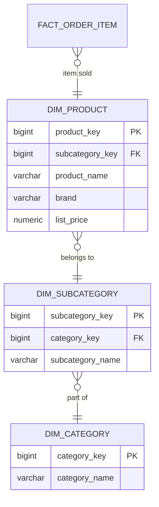
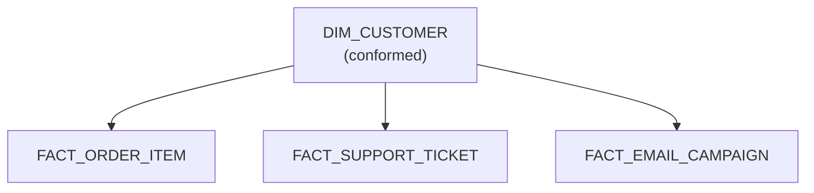

## OLTP vs OLAP — Two Different Problems

The normalized relational schemas from the earlier articles are designed for **OLTP** (Online Transaction Processing): fast inserts, updates, and single-record lookups. A warehouse is built for a completely different workload — **OLAP** (Online Analytical Processing): aggregations across millions of rows, historical trend analysis, and multi-dimensional slicing.

| | OLTP | OLAP |
|---|------|------|
| **Primary operation** | INSERT / UPDATE / DELETE | SELECT with aggregations |
| **Query pattern** | Single record by key | Millions of rows, GROUP BY |
| **Schema design goal** | Minimize redundancy (3NF) | Minimize joins, maximize query speed |
| **Data freshness** | Real-time | Hourly / daily batch or near-real-time |
| **Typical row count** | Thousands to millions | Billions |
| **Users** | Application code | Analysts, BI tools, data scientists |
| **Example system** | Postgres, MySQL | Snowflake, BigQuery, Redshift |

The same e-commerce schema that works perfectly for taking orders falls apart for analytics. A query like "revenue by product category, broken down by customer region, for the last 90 days" would require joining six normalized tables and scanning millions of rows — repeated by dozens of analysts simultaneously.

Warehouse modeling solves this by restructuring data specifically for analytical reads.

---

## Dimensional Modeling — The Kimball Approach

**Dimensional modeling** is the dominant framework for warehouse schema design, developed by Ralph Kimball in the 1990s. It organizes data into two types of tables:



**Fact table** — stores what happened. Each row is an event or transaction. Contains:
- Foreign keys to every relevant dimension
- Numeric measures (revenue, quantity, duration)
- The grain: exactly one row per *what?*

**Dimension table** — stores the context for what happened. Contains:
- A surrogate key (the PK)
- Descriptive attributes used for filtering and grouping (`category_name`, `customer_region`, `product_brand`)
- Denormalized for read performance — redundancy is intentional

---

## The Star Schema

The star schema is the foundational dimensional model: one fact table surrounded by dimension tables, joined by surrogate keys.



Notice: `DIM_PRODUCT` has `category`, `subcategory`, and `brand` all in one table — even though in the OLTP schema these would be normalized into separate tables. This intentional denormalization eliminates joins at query time.

**An analyst query on the star schema:**

```sql
SELECT
  p.category,
  p.brand,
  g.region,
  SUM(f.line_revenue)    AS total_revenue,
  SUM(f.quantity)        AS units_sold
FROM fact_order_item f
JOIN dim_product   p ON f.product_key   = p.product_key
JOIN dim_geography g ON f.geography_key = g.geography_key
JOIN dim_date      d ON f.date_key      = d.date_key
WHERE d.year = 2024 AND d.quarter = 1
GROUP BY p.category, p.brand, g.region
ORDER BY total_revenue DESC;
```

Four joins on integer surrogate keys — fast even across hundreds of millions of fact rows. Compare this to the equivalent query on the normalized OLTP schema which would join 6+ tables with string-based keys.

---

## The Date Dimension

The date dimension deserves special attention — it appears in nearly every warehouse and is almost always pre-populated as a static lookup table.

```sql
-- Populate dim_date for a full year
INSERT INTO dim_date (date_key, full_date, year, quarter, month, month_name,
                      week_of_year, day_of_week, day_name, is_weekend, is_holiday)
SELECT
  TO_CHAR(d, 'YYYYMMDD')::INT,
  d,
  EXTRACT(YEAR FROM d),
  EXTRACT(QUARTER FROM d),
  EXTRACT(MONTH FROM d),
  TO_CHAR(d, 'Month'),
  EXTRACT(WEEK FROM d),
  EXTRACT(DOW FROM d),
  TO_CHAR(d, 'Day'),
  EXTRACT(DOW FROM d) IN (0, 6),
  FALSE  -- populate holiday flag separately
FROM GENERATE_SERIES('2020-01-01'::DATE, '2030-12-31'::DATE, '1 day') AS d;
```

Using a date dimension instead of raw timestamps lets analysts filter by `is_holiday = true` or `month_name = 'December'` without any date arithmetic in the query.

> **Interview tip:** When designing a warehouse schema, always ask "do you need a date dimension?" The answer is almost always yes. Date dimensions are small (~3,650 rows per decade), never change, and unlock calendar-aware analysis without complex date functions in every query.

---

## Star Schema vs Snowflake Schema

The **snowflake schema** normalizes dimension tables further — breaking out sub-dimensions to reduce redundancy:



| | Star Schema | Snowflake Schema |
|---|------------|----------------|
| **Joins per query** | One join per dimension | Multiple joins per dimension hierarchy |
| **Query performance** | Faster — fewer joins | Slower — more joins |
| **Storage** | More (redundant dimension attributes) | Less (normalized) |
| **Ease of use for analysts** | Simpler — one table per concept | More complex — must know the hierarchy |
| **ETL complexity** | Simpler to load | More complex — must load in dependency order |

> **Interview guidance:** Default to star schema. Modern columnar warehouses (Snowflake, BigQuery, Redshift) compress storage efficiently, making the storage savings of a snowflake schema largely irrelevant. The join overhead and complexity cost are real. Snowflake schema is worth considering only when dimension tables are very large or when the hierarchy is deep and frequently changes.

---

## Fact Table Types

Not all facts are the same. Kimball defines three fact table types based on the nature of the event being measured:

### Transaction Fact Table
One row per discrete event. The most common type.

```
fact_order_item     — one row per line item on an order
fact_page_view      — one row per page view
fact_payment        — one row per payment transaction
```

Grain is clear and immutable. Rows are inserted, never updated (except for corrections).

### Periodic Snapshot Fact Table
One row per entity per time period, capturing state at regular intervals.

```
fact_account_balance_daily   — one row per account per day
fact_inventory_weekly        — one row per SKU per week
```

Useful for trending and balance-over-time analysis. The OLTP source might only store the latest state; the snapshot captures history.

```sql
-- Daily inventory snapshot
CREATE TABLE fact_inventory_snapshot (
  date_key        INT NOT NULL,
  product_key     BIGINT NOT NULL,
  warehouse_key   BIGINT NOT NULL,
  units_on_hand   INT NOT NULL,
  units_reserved  INT NOT NULL,
  units_available INT NOT NULL,
  PRIMARY KEY (date_key, product_key, warehouse_key)
);
```

### Accumulating Snapshot Fact Table
One row per business process instance, updated as the process progresses through stages.

```sql
-- Order fulfillment pipeline — one row per order, updated at each stage
CREATE TABLE fact_order_fulfillment (
  order_key          BIGINT PRIMARY KEY,
  placed_date_key    INT,
  confirmed_date_key INT,   -- NULL until confirmed
  shipped_date_key   INT,   -- NULL until shipped
  delivered_date_key INT,   -- NULL until delivered
  days_to_ship       INT,   -- computed when shipped
  days_to_deliver    INT    -- computed when delivered
);
```

Each row is updated when the order moves through each stage. Enables cycle-time analysis: average days from order to delivery, bottleneck stage identification.

---

## Conformed Dimensions

A **conformed dimension** is a dimension table shared across multiple fact tables — same keys, same attributes, same grain.



When `DIM_CUSTOMER` is conformed, an analyst can join `FACT_ORDER_ITEM` and `FACT_SUPPORT_TICKET` through the shared customer key to answer: "Do customers who contact support more than twice have lower lifetime value?"

Without conformed dimensions, each fact table uses its own customer representation — joins across facts become impossible or produce wrong results.

> **Interview tip:** Conformed dimensions are the key to building a **data mart architecture** — each business unit has its own fact tables, but they all share the same dimension tables. The shared dimensions are what make cross-functional analysis possible.

---

## Measures: Additive, Semi-Additive, Non-Additive

Every measure in a fact table has an **additivity** property that determines how it can be aggregated:

| Type | Description | Example | Can SUM across... |
|------|------------|---------|------------------|
| **Additive** | Can be summed across all dimensions | `line_revenue`, `quantity` | Time ✅ Product ✅ Region ✅ |
| **Semi-additive** | Can be summed across some dimensions, not others | `account_balance` | Product ✅ Region ✅ Time ❌ |
| **Non-additive** | Cannot be meaningfully summed | `unit_price`, `ratio`, `percentage` | None — use AVG or recalculate |

The classic semi-additive mistake: summing daily account balances across dates gives you a meaningless number. Use `MAX(balance)` or the end-of-period balance instead.

Non-additive measures like profit margin should be stored as components (`revenue` and `cost`) and calculated at query time: `SUM(revenue - cost) / SUM(revenue)`.

---

## Modern Warehouse Platforms

The principles above apply across all platforms, but implementation details vary:

| Platform | Storage model | Partitioning | Clustering | Key consideration |
|----------|-------------|-------------|-----------|------------------|
| **Snowflake** | Columnar, automatic micro-partitions | Cluster keys hint at co-location | `CLUSTER BY (date_trunc('month', order_date))` | Separation of storage and compute; auto-scaling |
| **BigQuery** | Columnar, serverless | Native partition by DATE/TIMESTAMP or integer range | Cluster on up to 4 columns after partitioning | Partition pruning + clustering = cost and speed |
| **Redshift** | Columnar, MPP | Distribution key (which node), sort key (on-disk order) | `DISTKEY(customer_id) SORTKEY(order_date)` | Distribution strategy critical for join performance |
| **Databricks / Delta Lake** | Parquet + transaction log | `PARTITIONED BY (year, month)` | `OPTIMIZE ZORDER BY (customer_id)` | ACID on data lake; Z-ordering for multi-column pruning |

The dimensional model is platform-agnostic. The DDL and optimization hints differ, but a star schema with a date dimension and conformed customer/product dimensions is the right design on all of them.

---

## Common Interview Questions

**"What is the difference between a fact table and a dimension table?"**

A fact table records measurable events — one row per transaction or snapshot period, containing numeric measures and foreign keys to dimensions. A dimension table provides context — descriptive attributes used for filtering and grouping (customer name, product category, date attributes). Facts are narrow and deep; dimensions are wide and relatively small.

**"Why use a star schema instead of keeping the normalized OLTP schema in the warehouse?"**

The normalized schema minimizes redundancy for write performance. In the warehouse you're optimizing for read performance across billions of rows. Star schema eliminates the multi-table joins needed for every analytical query, makes BI tools simpler to use (each dimension is one table), and benefits from columnar compression even with denormalized dimension attributes. The storage cost of redundancy is minimal on modern warehouses.

**"What is the grain of a fact table and why does it matter?"**

The grain is the precise definition of what one row represents — "one line item on one order" or "the daily balance of one account." All measures must be consistent with the grain. If you mix grains (adding header-level data to a line-item fact), you get double-counting errors in aggregations. Declare the grain before adding any columns and verify every measure is atomic at that grain.

**"What are conformed dimensions?"**

Dimension tables that are defined once and reused across multiple fact tables — same surrogate keys, same attribute definitions. They enable cross-process analysis: joining order facts and support ticket facts through a shared customer dimension. Without conformed dimensions, a data warehouse becomes a collection of isolated silos.

**"What is the difference between a transaction fact, a periodic snapshot, and an accumulating snapshot?"**

Transaction: one row per event, immutable after insert — best for revenue, clicks, payments. Periodic snapshot: one row per entity per time period, capturing state at regular intervals — best for balances and inventory levels over time. Accumulating snapshot: one row per business process instance, updated as it moves through stages — best for pipeline and fulfillment cycle-time analysis.

---

## Key Takeaways

- OLTP is optimized for writes and single-record lookups; OLAP is optimized for aggregations across billions of rows — the same schema design doesn't serve both
- Dimensional modeling organizes data into fact tables (events + measures) and dimension tables (context for filtering and grouping)
- Star schema: one fact table, one join per dimension — faster and simpler than snowflake schema for most warehouse workloads
- Always define the grain of a fact table first — every measure must be atomic at that grain
- The date dimension is nearly universal — pre-populate it to enable calendar-aware analysis without date functions in every query
- Three fact table types: transaction (one row per event), periodic snapshot (state over time), accumulating snapshot (pipeline stages)
- Conformed dimensions enable cross-functional analysis by sharing dimension tables across multiple fact tables
- Measures are additive, semi-additive, or non-additive — know the difference before aggregating
- SCDs (Slowly Changing Dimensions) handle how dimension attributes change over time — covered in detail in the SCD articles
