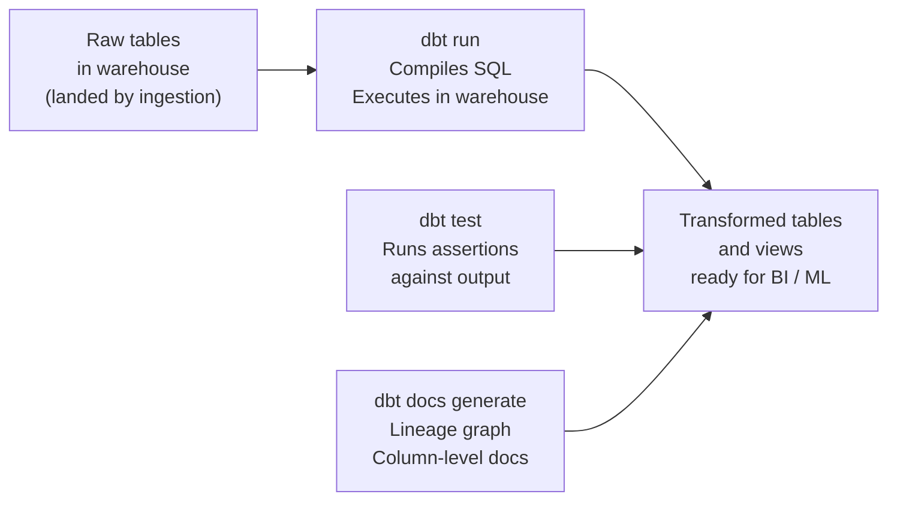

## What dbt Is

dbt (data build tool) is a transformation framework that runs SQL in your data warehouse. It takes raw or lightly processed data that's already in the warehouse, applies SQL transformations to produce clean, tested, documented tables, and manages the dependency graph between those transformations.

The tagline: **dbt does the T in ELT**. Your ingestion tools (Fivetran, Airbyte, Kafka, Spark) handle the E and L — getting raw data into the warehouse. dbt handles everything after that.

dbt is now the standard tool for analytics engineering. Understanding how it works — models, materializations, tests, sources, and snapshots — is expected in most data engineering interviews.

---

## How dbt Works



dbt compiles your `.sql` model files into actual SQL statements and runs them against your warehouse (Snowflake, BigQuery, Redshift, DuckDB, etc.). dbt doesn't compute anything locally — all processing happens in the warehouse.

---

## Models

A model is a `.sql` file in the `models/` directory. Each file becomes a table or view in the warehouse.

```sql
-- models/silver/orders.sql
WITH source AS (
    SELECT * FROM {{ source('bronze', 'raw_orders') }}
),

deduped AS (
    SELECT *,
        ROW_NUMBER() OVER (
            PARTITION BY order_id
            ORDER BY _extracted_at DESC
        ) AS rn
    FROM source
),

cleaned AS (
    SELECT
        order_id,
        customer_id,
        CAST(order_date AS DATE)                         AS order_date,
        UPPER(status)                                    AS status,
        ROUND(CAST(total_amount AS NUMERIC), 2)          AS total_amount_usd,
        _extracted_at
    FROM deduped
    WHERE rn = 1
      AND order_id IS NOT NULL
)

SELECT * FROM cleaned
```

**`{{ source('bronze', 'raw_orders') }}`** — the `source()` function references a raw table defined in a `sources.yml` file. This tells dbt that `raw_orders` is an upstream dependency, enabling lineage tracking and freshness checks.

**`{{ ref('orders') }}`** — references another dbt model. dbt uses these references to build the dependency DAG and execute models in the correct order:

```sql
-- models/gold/daily_revenue.sql
SELECT
    o.order_date,
    p.category,
    SUM(o.total_amount_usd) AS revenue,
    COUNT(DISTINCT o.customer_id) AS unique_customers
FROM {{ ref('orders') }} o          -- depends on silver.orders
JOIN {{ ref('products') }} p        -- depends on silver.products
    ON o.product_id = p.product_id
WHERE o.status = 'completed'
GROUP BY 1, 2
```

dbt resolves the full DAG — `daily_revenue` depends on `orders` and `products`, so those run first.

---

## Materializations

A materialization controls how dbt writes the model to the warehouse:

| Materialization | What dbt does | When to use |
|----------------|--------------|-------------|
| `view` | Creates/replaces a SQL view | Lightweight transforms, always fresh, no storage cost |
| `table` | DROP + CREATE TABLE on every run | Clean rebuild each run, moderate size |
| `incremental` | INSERT or MERGE only new/changed rows | Large tables where full rebuild is too slow |
| `ephemeral` | CTE injected into downstream models — no table created | Intermediate logic reused by one model |

```yaml
# dbt_project.yml — set defaults per directory
models:
  my_project:
    staging:
      +materialized: view        # staging models are views
    silver:
      +materialized: table       # silver rebuilt daily
    gold:
      +materialized: incremental # gold appended incrementally
```

### Incremental Models in Detail

Incremental models are the most important materialization for large-scale pipelines:

```sql
-- models/gold/fact_order_events.sql
{{
  config(
    materialized='incremental',
    unique_key='order_event_id',
    incremental_strategy='merge'    -- or 'append', 'delete+insert'
  )
}}

SELECT
    order_event_id,
    order_id,
    event_type,
    occurred_at,
    metadata
FROM {{ ref('silver_order_events') }}


    -- On incremental runs: only process events from the last 3 days
    -- (3-day window handles late-arriving events)
    WHERE occurred_at >= DATEADD('day', -3, CURRENT_DATE)


-- On full refresh (dbt run --full-refresh): the WHERE clause is skipped
-- and all records are processed
```

**`is_incremental()`** — a dbt macro that returns `true` when the model already exists and is being updated (not first run or `--full-refresh`). The `WHERE` clause limits the scan to recent data.

**Incremental strategies:**

| Strategy | How it works | Best for |
|---------|-------------|---------|
| `append` | INSERT new rows only | Immutable event logs |
| `merge` | UPSERT by `unique_key` | Mutable records (orders that change status) |
| `delete+insert` | Delete matching keys, then insert | When MERGE isn't supported |

---

## Sources

Sources declare the raw tables your dbt project depends on — the outputs of your ingestion layer:

```yaml
# models/sources.yml
version: 2

sources:
  - name: bronze
    database: my_warehouse
    schema: bronze_layer
    tables:
      - name: raw_orders
        description: "Raw order events from Kafka → S3 → warehouse load"
        loaded_at_field: _extracted_at    # column dbt uses for freshness checks
        freshness:
          warn_after: {count: 6, period: hour}
          error_after: {count: 12, period: hour}
        columns:
          - name: order_id
            description: "Unique order identifier from the source CRM"
          - name: _extracted_at
            description: "When this record was loaded into Bronze"
```

`dbt source freshness` checks whether source tables have been updated within the configured thresholds — alerting before downstream models run on stale data.

---

## Tests

dbt has two types of tests:

### Generic Tests (built-in)

Applied to columns via configuration:

```yaml
# models/silver/schema.yml
version: 2

models:
  - name: orders
    columns:
      - name: order_id
        tests:
          - not_null
          - unique
      - name: status
        tests:
          - not_null
          - accepted_values:
              values: ['pending', 'processing', 'shipped', 'delivered', 'cancelled']
      - name: customer_id
        tests:
          - not_null
          - relationships:
              to: ref('customers')
              field: customer_id       # referential integrity check
```

`dbt test` runs all tests and fails on violations. Run after `dbt run` in your CI pipeline.

### Singular Tests (custom SQL)

For business logic assertions that generic tests can't express:

```sql
-- tests/assert_revenue_positive.sql
-- This test PASSES if the query returns 0 rows
-- It FAILS if any rows are returned (rows = violations)

SELECT order_id, total_amount_usd
FROM {{ ref('orders') }}
WHERE total_amount_usd < 0        -- no negative revenue allowed
```

```sql
-- tests/assert_no_future_orders.sql
SELECT order_id, order_date
FROM {{ ref('orders') }}
WHERE order_date > CURRENT_DATE   -- orders can't be in the future
```

---

## Snapshots — SCD Type 2 in dbt

dbt Snapshots implement SCD Type 2 automatically — tracking how source records change over time:

```sql
-- snapshots/customers.sql


{{
  config(
    target_schema='snapshots',
    unique_key='customer_id',
    strategy='timestamp',
    updated_at='updated_at',
    invalidate_hard_deletes=True
  )
}}

SELECT
    customer_id,
    full_name,
    email,
    city,
    segment,
    updated_at
FROM {{ source('crm', 'customers') }}


```

Run `dbt snapshot` daily. dbt adds:
- `dbt_valid_from` — when this row became current
- `dbt_valid_to` — when it was superseded (NULL for the current row)
- `dbt_scd_id` — surrogate key for the snapshot row

Query current state: `WHERE dbt_valid_to IS NULL`

---

## The dbt DAG and Lineage

dbt generates a full lineage graph from `ref()` and `source()` calls. Running `dbt docs generate && dbt docs serve` opens an interactive lineage explorer:

```
source: bronze.raw_orders
    └── model: silver.orders
            ├── model: gold.daily_revenue
            │       └── model: gold.executive_summary
            └── model: gold.customer_ltv
                    └── model: gold.at_risk_customers
```

**This lineage graph tells you:**
- Which models are affected if `raw_orders` schema changes
- What to rerun if `silver.orders` has a bug
- How to trace a dashboard metric back to its source

---

## dbt in CI/CD

Production dbt workflows run in CI:

```yaml
# .github/workflows/dbt.yml (simplified)
- name: Run dbt on PR (staging environment)
  run: |
    dbt run --target staging --select state:modified+  # only changed models + downstream
    dbt test --target staging --select state:modified+

- name: Deploy to production
  if: github.ref == 'refs/heads/main'
  run: |
    dbt run --target prod
    dbt test --target prod
    dbt docs generate
```

**`state:modified+`** — runs only the models that changed in this PR and all their downstream dependents. This makes CI fast — you're not rebuilding the entire warehouse on every PR.

---

## Common Interview Questions

**"What is dbt and what problem does it solve?"**

dbt is a transformation framework that runs SQL in the warehouse. It solves the problem of unmanaged SQL: transformations scattered across scripts, no testing, no lineage, no documentation, and no environment promotion. dbt brings software engineering practices — version control, testing, CI/CD — to SQL transformations. It's the T in ELT.

**"What is the difference between a view and an incremental model in dbt?"**

A view is a SQL query stored in the warehouse — computed on every read, no storage cost, always fresh. An incremental model is a physical table that dbt updates by merging or appending only new/changed rows — fast to update, but requires explicit logic (`is_incremental()`) to define what "new" means. Use views for lightweight transforms; use incremental for large tables where full rebuilds are too slow.

**"How does dbt know the order to run models?"**

dbt builds a DAG from `ref()` calls. If model B uses `{{ ref('A') }}`, dbt knows B depends on A and runs A first. The DAG is acyclic — no circular references allowed. dbt runs independent models in parallel by default.

**"How do you handle slowly changing dimensions in dbt?"**

Use dbt Snapshots. Define a snapshot file with a `unique_key` and a `strategy` (timestamp-based or check-based). Running `dbt snapshot` on a schedule detects changes, expires the old row by setting `dbt_valid_to`, and inserts a new current row. The snapshot table maintains full history — query current state with `WHERE dbt_valid_to IS NULL`.

---

## Key Takeaways

- dbt does the T in ELT — it transforms data that's already in the warehouse, not in transit
- Models are `.sql` files that compile into warehouse DDL; `ref()` and `source()` build the dependency DAG
- Four materializations: view (always fresh, no storage), table (full rebuild), incremental (merge/append new rows), ephemeral (CTE, no table)
- Generic tests (`not_null`, `unique`, `accepted_values`, `relationships`) run assertions after every build
- Snapshots implement SCD Type 2 automatically — run `dbt snapshot` on a schedule to track dimension history
- `state:modified+` in CI runs only changed models and their downstream dependents — keeps PRs fast to validate
- Never hardcode environment-specific values in models — use `target.name` or variables for multi-environment deployments
