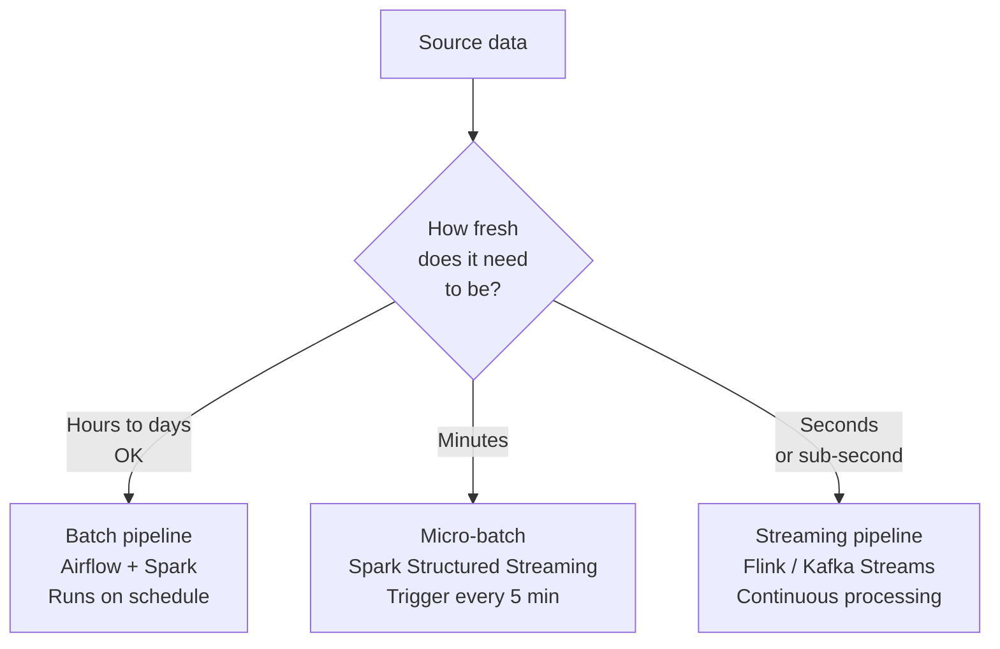

## ELT vs ETL — The Modern Shift

The traditional model was **ETL**: Extract → Transform → Load. Data left the source, was transformed in a separate compute layer (like an on-premise server), and then loaded into the destination.

The modern model is **ELT**: Extract → Load → Transform. Data lands raw first, then gets transformed *inside* the destination system (a cloud warehouse or data lake with massive compute capacity).

```mermaid
flowchart LR
    subgraph ETL — Traditional
        A1["Source"] --> B1["Transform\n(external server)"] --> C1["Warehouse"]
    end
    subgraph ELT — Modern
        A2["Source"] --> B2["Land raw\n(warehouse / lake)"] --> C2["Transform in place\n(SQL / Spark / dbt)"]
    end
```

**Why ELT won:**

| Factor | ETL | ELT |
|--------|-----|-----|
| Transform compute | Dedicated ETL server | Cloud warehouse (Snowflake, BigQuery, Spark) |
| Raw data access | Lost after transform | Preserved — raw layer is queryable |
| Schema changes | Pipeline breaks | Raw layer absorbs changes; transform layer adapts |
| Debugging | Hard — intermediate data gone | Easy — raw layer is always there to reprocess |
| Cost | Transform server always running | Pay for compute only when transforming |

**The practical implication for interviews:** when asked "how would you design a pipeline?", always default to ELT unless there's a specific reason to transform before loading (e.g., PII redaction before data leaves the source system's network perimeter).

---

## The Medallion Architecture — Three Layers of Quality

The modern data lake organizes data into three quality tiers:

```mermaid
flowchart LR
    S["Source\nSystems"] --> B

    subgraph Bronze — Raw Landing
        B["Raw events\nJSON / Avro\nNo transformation\nSchema-flexible\nRetain forever"]
    end

    subgraph Silver — Cleaned & Validated
        Si["Deduplicated\nType-casted\nNull-filtered\nEnriched\nParquet / Delta"]
    end

    subgraph Gold — Business-Ready
        G["Dimensional models\nAggregations\nKPI tables\nParquet / Delta\nOptimized for queries"]
    end

    B --> Si --> G
    G --> W["Warehouse\nBI Tools\nML Models"]
```

### Bronze — Raw Landing Zone

**What it is:** The exact bytes from the source, written as-is. No transformation, no filtering.

**Why it matters:** Bronze is your safety net. If a transformation bug corrupts Silver, you reprocess from Bronze. If the business needs a new field you didn't capture, you can't go back and get it — unless Bronze has it.

**Format:** JSON or Avro (preserves source schema flexibility), compressed with gzip or Snappy. Parquet is also used when source schema is stable.

**Retention:** Indefinite (or compliance-driven — often 5–7 years).

### Silver — Cleaned & Validated

**What it is:** Bronze + quality applied. Deduplication, type casting, null filtering, joins to reference data (currency conversion, user enrichment).

**Format:** Always Parquet or Delta Lake. Columnar format makes analytical reads fast.

**SLA:** Available within 30 minutes to 2 hours of source events landing in Bronze.

### Gold — Business-Ready

**What it is:** Silver + business logic. Dimensional models (fact tables, dim tables), pre-aggregated KPI tables, ML feature tables.

**Format:** Parquet or Delta, heavily partitioned for query performance.

**SLA:** Daily refresh is standard; real-time Gold layers exist but are complex.

---

## Where Each Layer Lives

| Layer | Common storage | Common compute |
|-------|---------------|----------------|
| Bronze | S3 / GCS / ADLS | Kafka Connect (writes), minimal compute |
| Silver | S3 / Delta Lake | Spark, Flink, Kafka Streams |
| Gold | S3 / Delta Lake / Warehouse | Spark, dbt (runs in warehouse) |
| Serving | Snowflake / BigQuery / Redshift | Built-in warehouse query engine |

---

## Pipeline Patterns — Batch vs Streaming

Every ELT pipeline is either batch, streaming, or a combination of both:



| Pattern | Latency | Complexity | Cost | Use when |
|---------|---------|-----------|------|---------|
| **Batch** | Hours | Low | Low | Nightly reports, warehouse refreshes |
| **Micro-batch** | Minutes | Medium | Medium | Near-real-time dashboards |
| **Streaming** | Seconds | High | Higher | Fraud detection, live monitoring, surge pricing |

**The key insight:** most business questions don't need sub-second freshness. Before defaulting to streaming, verify the freshness requirement. Batch pipelines are dramatically simpler to build, test, and maintain.

---

## The Pipeline Contract

Every layer boundary has an implicit contract:

```
Bronze: "I will always have a raw record for every event that happened."
Silver: "Every record I contain passed validation and is deduplicated."
Gold:   "Every metric I contain is computed by an agreed business rule."
```

When things go wrong, these contracts tell you exactly which layer to investigate:
- Wrong number? → Gold (business logic)
- Duplicates? → Silver (dedup failed)
- Missing records? → Bronze (ingestion gap)

---

## Key Takeaways

- ELT (not ETL) is the modern standard — transform inside the warehouse/lake, not in a separate server
- Bronze (raw) → Silver (clean) → Gold (business-ready) is the universal 3-layer pattern
- Bronze is your safety net — always ingest raw data before transforming anything
- Choose batch over streaming unless you have a genuine sub-minute freshness requirement
- Each layer boundary is a quality contract — when data is wrong, the layer that violated its contract is where you investigate
