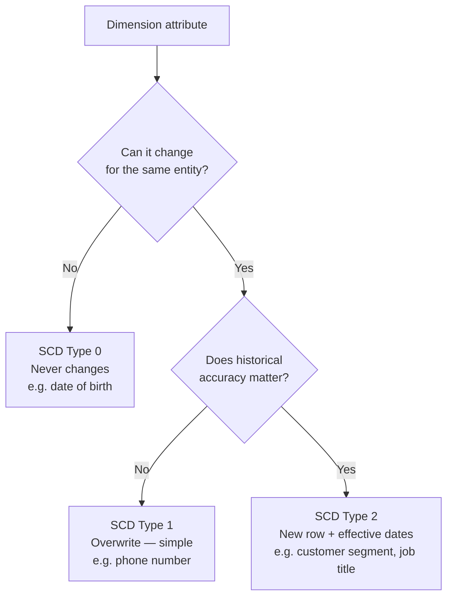
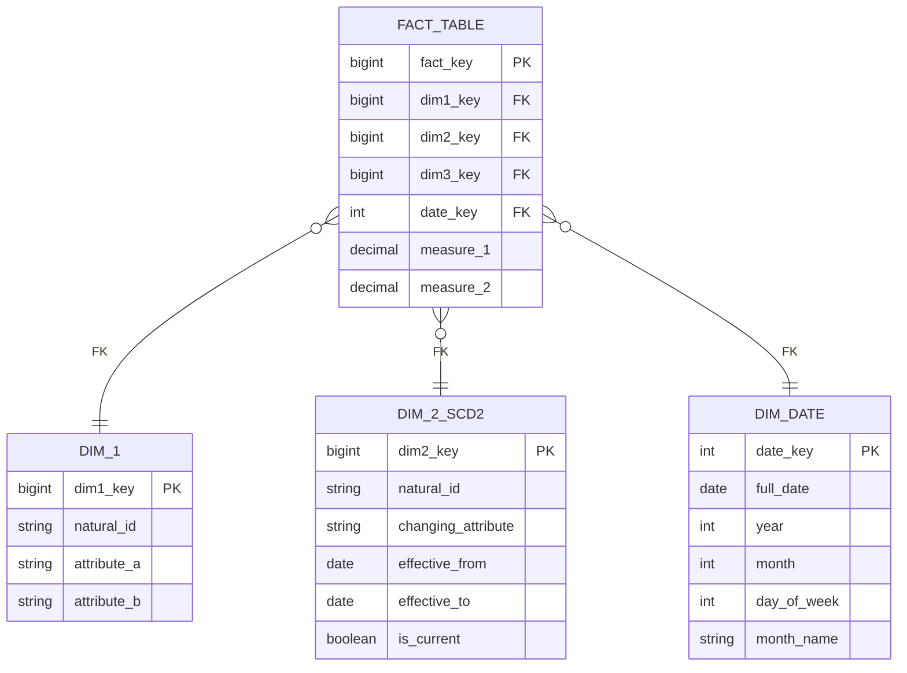

## The Framework Every Interviewer Is Looking For

Most candidates struggle in data modeling interviews because they jump straight to tables. They hear "design a schema for Uber" and immediately start listing columns. This is the wrong order.

FAANG interviewers aren't grading your ability to remember column names. They're grading your ability to reason systematically about business problems. The candidates who pass have a repeatable process. Here it is.

---

## The 4-Step Framework

```
Step 1: List the business questions
Step 2: Define the fact grain
Step 3: Attach the dimensions
Step 4: Identify what changes over time (→ SCD)
```

Walk through these four steps out loud in every interview. The interviewer will track your thinking, not just your output.

---

## Step 1 — List the Business Questions

Before any table or column, ask: **what does the business need to measure?**

Collect 4–6 business questions, then decode them:

- **Nouns** in the questions become **dimension tables** (who, what, where)
- **Verbs / numbers** become **facts** (how many, how much, how long)
- **Time** in every question becomes the **date dimension** (always)

**Example: a food delivery platform**

| Business question | Nouns (→ dimensions) | Verb/number (→ fact) |
|-------------------|----------------------|----------------------|
| How many orders per restaurant per city per hour? | restaurant, city, hour | count of orders |
| What is the average delivery time by courier zone? | courier, zone | delivery time |
| Which restaurants have the highest repeat order rate? | restaurant, customer | repeat flag |
| How does courier availability affect acceptance rate? | courier, time | availability, acceptance |

Decoded:
- **Dimensions**: restaurant, courier/driver, service zone, customer, date, time
- **Facts**: order events, delivery timing, courier availability events

This step forces you to understand the *business* before you design the *tables*.

---

## Step 2 — Define the Fact Grain

The grain is the single most important decision in dimensional modeling. It defines what one row in your fact table represents.

State it explicitly as: **"One row represents ___"**

```
One row = one order in its final state
One row = one physician-device-site usage per day
One row = one payment lifecycle event (AUTH, CAPTURE, or REFUND)
```

**Grain determines everything else:**
- What measures are valid (you can't store ORDER-level and LINE-level measures in the same fact)
- Which aggregations make sense
- How slowly changing dimensions attach

**Choosing the right grain**

The right grain is almost always the most atomic (most granular) level where a business event occurs:

| Too coarse | Too granular | Just right |
|-----------|-------------|------------|
| Revenue per restaurant per month | Every database write | Final order state at delivery |
| Active users per day | Every click event | Meaningful business events |

If a question asks for monthly totals, you can always GROUP BY from daily grain. You cannot go the other direction.

---

## Step 3 — Attach the Dimensions

Dimensions answer the **who, what, where, and when** of each fact.

After defining the grain, list every dimension key that the fact needs:

```
fact_orders grain: one row per completed order

Foreign keys needed:
  → order_key        (degenerate dimension — the order itself)
  → restaurant_key   (what restaurant)
  → customer_key     (who ordered)
  → driver_key       (who delivered)
  → service_zone_key (where delivered)
  → date_key         (when ordered)
  → time_key         (time of day)

Measures:
  → delivery_time_minutes
  → total_amount_usd
  → items_count
```

Every FK must be resolvable in a single JOIN. If the question asks "revenue by restaurant", the fact must contain `restaurant_key`. If it's missing, you'll need a subquery or you've chosen the wrong grain.

---

## Step 4 — Identify What Changes Over Time → SCD

Ask this question for every dimension: **"Can this attribute change for the same entity, and does history matter?"**

```
For each dimension attribute, ask:
  Does this change?      → if No: Type 0 (hardcode / don't track)
  Does history matter?   → if No: Type 1 (overwrite)
                         → if Yes: Type 2 (new row + date range)
```

**The SCD decision tree:**



**SCD Type 2 pattern — always use the same 3 columns:**

```sql
CREATE TABLE dim_customer (
    customer_key    BIGINT PRIMARY KEY,
    customer_id     VARCHAR(50),          -- natural/business key
    -- ... attributes ...
    segment         VARCHAR(50),          -- SCD2 attribute
    -- SCD2 mechanics
    effective_from  DATE     NOT NULL,
    effective_to    DATE,                 -- NULL = current row
    is_current      BOOLEAN  NOT NULL
);
```

Attach to a fact using the historical key, not the natural key:

```sql
-- ✅ Correct: join by surrogate key that was current at event time
SELECT f.*, d.segment
FROM fact_orders f
JOIN dim_customer d
  ON f.customer_key = d.customer_key;   -- customer_key = surrogate key at time of event

-- ❌ Wrong: joining by natural key returns current segment, not historical segment
SELECT f.*, d.segment
FROM fact_orders f
JOIN dim_customer d
  ON f.customer_id = d.customer_id     -- returns multiple rows for SCD2 customers
 AND d.is_current = TRUE;              -- returns TODAY's segment, not segment at order time
```

---

## Putting It Together — The Interview Template

When the interviewer gives you a domain, say this out loud:

> "Before I design any tables, let me start by identifying the business questions this schema needs to answer. Then I'll define the grain of the central fact table, attach the dimensions, and flag any attributes that need SCD2."

Then work through the 4 steps visibly. Write on the whiteboard:

```
1. Business questions: [list 4-6]
2. Fact grain: "One row represents ___"
3. Dimensions: restaurant, driver, zone, date, time
4. SCDs: driver zone → SCD2 because drivers move between zones
```

This demonstrates analytical thinking — the thing interviewers are actually grading.

---

## The ERD You Should Be Able to Draw

For any domain, the standard FAANG answer looks like this:



---

## Common Traps — and How to Avoid Them

**Trap 1: Wrong grain**

You define grain as "one row per order" but then try to store per-line-item revenue. These are different grains — you'd get duplicate order-level facts for each line item.

*Fix:* State the grain explicitly before writing any measures. If you need both order-level and line-level facts, create two fact tables.

**Trap 2: Forgetting SCD2 costs**

SCD2 means a dimension table has multiple rows per entity. Every query that joins must filter with a date range or `is_current = TRUE`.

*Fix:* For point-in-time analysis (joins from a fact table), use the surrogate key that was assigned at event time — the fact row already carries the correct historical snapshot.

**Trap 3: Modeling the source system, not the analysis**

The interview question is about what analysts need to answer, not what the OLTP application writes.

*Fix:* Start from business questions, not from operational tables.

**Trap 4: Overcomplicating with too many fact tables**

*Fix:* One fact per business process. If you have orders, delivery events, and driver availability — those are three separate processes → three fact tables. Don't stuff them all into one.

---

## Key Takeaways

- Start every interview with business questions — nouns → dimensions, verbs → facts
- State the grain as "one row represents ___" before writing any columns
- Every dimension FK in the fact table must be joinable in one hop
- SCD2 for attributes where history matters: use `effective_from / effective_to / is_current`
- Join facts to SCD2 dimensions via the surrogate key (the fact already carries the historical snapshot)
- Use the same 4-step framework visibly — the interviewer is grading your process, not just your output
