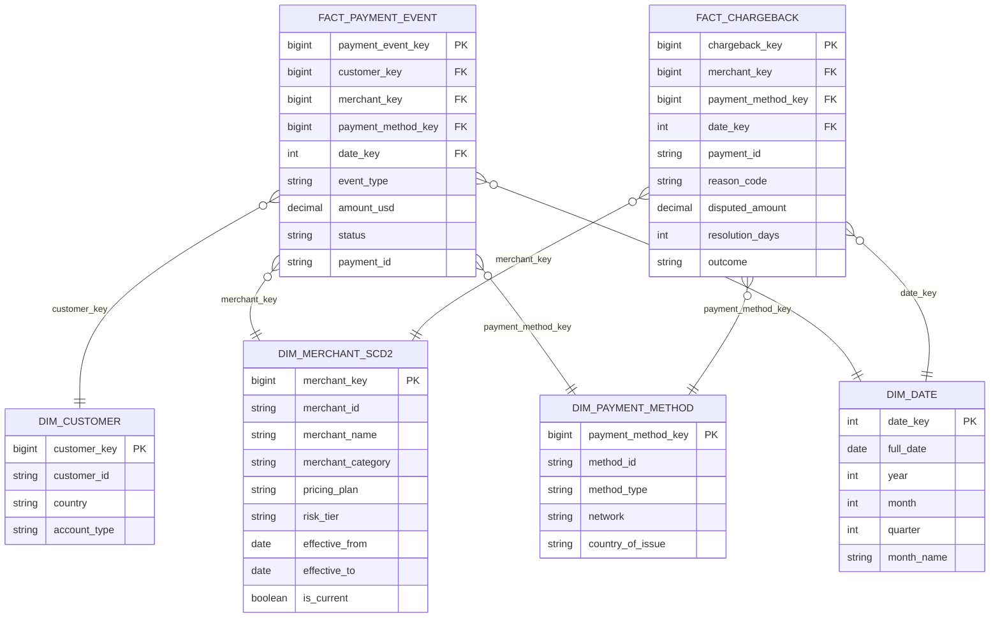

## The Business Context

A payment processing platform handles the full lifecycle of digital payments for online merchants. The analytics team needs to answer:

1. What is the authorization-to-capture conversion rate by merchant category?
2. What is the daily revenue breakdown by merchant and payment method?
3. How does fraud rate vary by payment method over time?
4. Which merchants have the highest chargeback rate month-over-month?
5. What is the average chargeback resolution time by merchant risk tier?

Your task: design the dimensional model and write the SQL.

---

## Step 1 — Decode the Business Questions

| Question | Nouns (→ dimensions) | Measures (→ fact) |
|----------|----------------------|-------------------|
| Auth-to-capture conversion | merchant, payment method | auth count, capture count |
| Revenue by merchant and method | merchant, payment method, date | captured amount |
| Fraud rate by method | payment method, date | fraud flag, total count |
| Chargeback rate by merchant | merchant, date | chargeback count, order count |
| Resolution time by risk tier | merchant (risk_tier) | resolution time |

**Dimensions**: customer, merchant, payment method, date  
**Key insight**: Merchants change category (e.g., software → marketplace) and pricing plans. This history matters for analysis — a chargeback spike should be attributed to the merchant's *tier at the time*, not their current tier → SCD Type 2

---

## Step 2 — Define the Fact Grains

| Fact table | Grain | Why it exists |
|-----------|-------|---------------|
| `fact_payment_event` | One row per payment lifecycle event (AUTH, CAPTURE, REFUND) | Captures the full state machine of a payment |
| `fact_chargeback` | One row per chargeback case | Separate process: initiated by customer, resolved with evidence |

**Why not collapse payment events into a single "order" row?**

A single order generates 2–3 payment events: one AUTH (hold funds), one CAPTURE (actual charge), optionally one REFUND. Each event has different amounts, timestamps, and statuses. Storing them as separate rows lets you measure each transition precisely — including failed CAPTUREs after successful AUTHs.

---

## Step 3 — Attach the Dimensions



---

## Step 4 — SCD Decision

**`dim_merchant_scd2`** tracks merchant category, pricing plan, and risk tier changes. These attributes determine fee structures, fraud thresholds, and regulatory requirements — historical accuracy is essential.

```sql
CREATE TABLE dim_merchant_scd2 (
    merchant_key      BIGINT PRIMARY KEY,
    merchant_id       VARCHAR(50)   NOT NULL,  -- natural key
    merchant_name     VARCHAR(200)  NOT NULL,
    -- SCD2 attributes (change over time)
    merchant_category VARCHAR(100),            -- software, marketplace, retail, travel
    pricing_plan      VARCHAR(100),            -- standard, premium, enterprise
    risk_tier         VARCHAR(50),             -- low, medium, high
    -- SCD2 mechanics
    effective_from    DATE          NOT NULL,
    effective_to      DATE,                    -- NULL = currently active version
    is_current        BOOLEAN       NOT NULL DEFAULT TRUE,
    -- audit
    created_at        TIMESTAMP     NOT NULL DEFAULT CURRENT_TIMESTAMP
);

-- Only one current row per merchant
CREATE UNIQUE INDEX uix_merchant_scd2_current
    ON dim_merchant_scd2 (merchant_id)
    WHERE is_current = TRUE;
```

**When a merchant upgrades their pricing plan:**

```sql
-- Step 1: Close the old version
UPDATE dim_merchant_scd2
SET effective_to = CURRENT_DATE - INTERVAL '1 day',
    is_current   = FALSE
WHERE merchant_id = 'M001'
  AND is_current  = TRUE;

-- Step 2: Insert the new version
INSERT INTO dim_merchant_scd2
  (merchant_id, merchant_name, merchant_category, pricing_plan, risk_tier,
   effective_from, effective_to, is_current)
VALUES
  ('M001', 'Acme Corp', 'marketplace', 'enterprise', 'medium',
   CURRENT_DATE, NULL, TRUE);
```

---

## Full DDL

```sql
CREATE TABLE dim_customer (
    customer_key    BIGINT PRIMARY KEY,
    customer_id     VARCHAR(50)   UNIQUE NOT NULL,
    country         VARCHAR(100),
    account_type    VARCHAR(50)   -- individual, business
);

CREATE TABLE dim_payment_method (
    payment_method_key  BIGINT PRIMARY KEY,
    method_id           VARCHAR(50)   UNIQUE NOT NULL,
    method_type         VARCHAR(50)   NOT NULL,  -- credit_card, debit_card, bank_transfer, wallet
    network             VARCHAR(50),              -- Visa, Mastercard, Amex
    country_of_issue    VARCHAR(3)                -- ISO country code
);

CREATE TABLE dim_date (
    date_key        INT           PRIMARY KEY,
    full_date       DATE          NOT NULL,
    year            INT           NOT NULL,
    month           INT           NOT NULL,
    quarter         INT           NOT NULL,
    month_name      VARCHAR(20),
    is_weekend      BOOLEAN
);

CREATE TABLE fact_payment_event (
    payment_event_key   BIGINT PRIMARY KEY,
    payment_id          VARCHAR(100)  NOT NULL,  -- degenerate dimension
    customer_key        BIGINT        NOT NULL REFERENCES dim_customer(customer_key),
    merchant_key        BIGINT        NOT NULL REFERENCES dim_merchant_scd2(merchant_key),
    payment_method_key  BIGINT        NOT NULL REFERENCES dim_payment_method(payment_method_key),
    date_key            INT           NOT NULL REFERENCES dim_date(date_key),
    event_type          VARCHAR(20)   NOT NULL,   -- AUTH, CAPTURE, REFUND
    amount_usd          DECIMAL(12,2) NOT NULL,
    status              VARCHAR(20)   NOT NULL,   -- approved, declined, pending
    is_fraud_flagged    BOOLEAN       NOT NULL DEFAULT FALSE,
    event_timestamp     TIMESTAMP     NOT NULL
);

CREATE TABLE fact_chargeback (
    chargeback_key      BIGINT PRIMARY KEY,
    payment_id          VARCHAR(100)  NOT NULL,  -- links back to original payment
    merchant_key        BIGINT        NOT NULL REFERENCES dim_merchant_scd2(merchant_key),
    payment_method_key  BIGINT        NOT NULL REFERENCES dim_payment_method(payment_method_key),
    date_key            INT           NOT NULL REFERENCES dim_date(date_key),  -- date filed
    reason_code         VARCHAR(50),   -- fraud, item_not_received, unauthorized
    disputed_amount     DECIMAL(12,2) NOT NULL,
    resolution_days     INT,           -- NULL if still open
    outcome             VARCHAR(20)    -- won, lost, pending
);
```

---

## The SQL Exercises

### Query 1 — Authorization-to-Capture Conversion

> "For each merchant category, what percentage of approved AUTH events are followed by a CAPTURE?"

```sql
WITH auth_events AS (
    SELECT payment_id, merchant_key
    FROM fact_payment_event
    WHERE event_type = 'AUTH'
      AND status     = 'approved'
),
capture_events AS (
    SELECT DISTINCT payment_id
    FROM fact_payment_event
    WHERE event_type = 'CAPTURE'
      AND status     = 'approved'
)
SELECT
    m.merchant_category,
    COUNT(a.payment_id)                                                         AS total_auths,
    COUNT(c.payment_id)                                                         AS captured,
    ROUND(
        100.0 * COUNT(c.payment_id) / NULLIF(COUNT(a.payment_id), 0),
        2
    )                                                                           AS conversion_rate_pct
FROM auth_events          a
JOIN dim_merchant_scd2    m  ON a.merchant_key  = m.merchant_key
LEFT JOIN capture_events  c  ON a.payment_id    = c.payment_id
WHERE m.is_current = TRUE  -- use current merchant category for this report
GROUP BY m.merchant_category
ORDER BY conversion_rate_pct DESC;
```

**Interview note**: `LEFT JOIN capture_events` — not every AUTH has a CAPTURE. `NULLIF` guards against zero-division when a category has zero auths (edge case, but defensive SQL is good SQL).

---

### Query 2 — Daily Revenue by Merchant and Payment Method

> "Show captured revenue per merchant per payment method per day for the last 30 days."

```sql
SELECT
    d.full_date,
    m.merchant_name,
    m.merchant_category,
    pm.method_type,
    pm.network,
    SUM(f.amount_usd)    AS captured_revenue,
    COUNT(*)             AS capture_count
FROM fact_payment_event   f
JOIN dim_merchant_scd2    m  ON f.merchant_key        = m.merchant_key
JOIN dim_payment_method   pm ON f.payment_method_key  = pm.payment_method_key
JOIN dim_date             d  ON f.date_key             = d.date_key
WHERE f.event_type   = 'CAPTURE'
  AND f.status       = 'approved'
  AND d.full_date   >= CURRENT_DATE - INTERVAL '30 days'
GROUP BY d.full_date, m.merchant_name, m.merchant_category, pm.method_type, pm.network
ORDER BY d.full_date DESC, captured_revenue DESC;
```

---

### Query 3 — Fraud Rate by Payment Method

> "What is the monthly fraud rate by payment method type?"

```sql
SELECT
    d.year,
    d.month,
    d.month_name,
    pm.method_type,
    COUNT(*)                                                    AS total_auth_events,
    SUM(CASE WHEN f.is_fraud_flagged THEN 1 ELSE 0 END)        AS fraud_flagged_count,
    ROUND(
        100.0 * SUM(CASE WHEN f.is_fraud_flagged THEN 1 ELSE 0 END)
        / NULLIF(COUNT(*), 0),
        3
    )                                                           AS fraud_rate_pct
FROM fact_payment_event f
JOIN dim_payment_method pm ON f.payment_method_key = pm.payment_method_key
JOIN dim_date           d  ON f.date_key            = d.date_key
WHERE f.event_type = 'AUTH'
GROUP BY d.year, d.month, d.month_name, pm.method_type
ORDER BY d.year, d.month, fraud_rate_pct DESC;
```

**Why filter on AUTH only?** Fraud flags are set at authorization time. Counting fraud on CAPTURE or REFUND events would double-count the same payment.

---

### Query 4 — Chargeback Rate by Merchant Month-over-Month

> "Show chargeback rate per merchant per month, along with the MoM change."

```sql
WITH monthly_captures AS (
    SELECT
        merchant_key,
        date_key,
        COUNT(*) AS total_captures
    FROM fact_payment_event
    WHERE event_type = 'CAPTURE'
      AND status     = 'approved'
    GROUP BY merchant_key, date_key
),
monthly_chargebacks AS (
    SELECT
        merchant_key,
        date_key,
        COUNT(*) AS total_chargebacks
    FROM fact_chargeback
    GROUP BY merchant_key, date_key
),
merchant_monthly AS (
    SELECT
        m.merchant_name,
        m.risk_tier,
        d.year,
        d.month,
        COALESCE(cb.total_chargebacks, 0)          AS chargebacks,
        COALESCE(cap.total_captures, 0)            AS captures,
        ROUND(
            100.0 * COALESCE(cb.total_chargebacks, 0)
            / NULLIF(COALESCE(cap.total_captures, 0), 0),
            3
        )                                          AS chargeback_rate_pct
    FROM dim_merchant_scd2  m
    JOIN dim_date           d   ON TRUE  -- cross join to generate all month rows
    LEFT JOIN monthly_captures cap
      ON m.merchant_key = cap.merchant_key
     AND d.date_key     = cap.date_key
    LEFT JOIN monthly_chargebacks cb
      ON m.merchant_key = cb.merchant_key
     AND d.date_key     = cb.date_key
    WHERE m.is_current = TRUE
      AND d.full_date BETWEEN CURRENT_DATE - INTERVAL '12 months' AND CURRENT_DATE
)
SELECT
    merchant_name,
    risk_tier,
    year,
    month,
    chargebacks,
    captures,
    chargeback_rate_pct,
    LAG(chargeback_rate_pct) OVER (
        PARTITION BY merchant_name
        ORDER BY year, month
    )                                              AS prev_month_rate,
    chargeback_rate_pct - LAG(chargeback_rate_pct) OVER (
        PARTITION BY merchant_name
        ORDER BY year, month
    )                                              AS rate_change
FROM merchant_monthly
ORDER BY merchant_name, year, month;
```

---

### Query 5 — Average Chargeback Resolution Time by Risk Tier

> "What is the average resolution time (in days) for chargebacks, grouped by merchant risk tier and outcome?"

```sql
SELECT
    m.risk_tier,
    cb.outcome,
    COUNT(*)                                    AS total_chargebacks,
    COUNT(cb.resolution_days)                   AS resolved_chargebacks,
    ROUND(AVG(cb.resolution_days), 1)           AS avg_resolution_days,
    ROUND(PERCENTILE_CONT(0.5) WITHIN GROUP (
        ORDER BY cb.resolution_days
    ), 1)                                       AS median_resolution_days,
    MAX(cb.resolution_days)                     AS max_resolution_days
FROM fact_chargeback        cb
JOIN dim_merchant_scd2      m  ON cb.merchant_key = m.merchant_key
WHERE m.is_current = TRUE
  AND cb.outcome != 'pending'     -- only resolved chargebacks
GROUP BY m.risk_tier, cb.outcome
ORDER BY m.risk_tier, cb.outcome;
```

**Why `COUNT(cb.resolution_days)` instead of `COUNT(*)`?** `resolution_days` is NULL for open chargebacks. `COUNT(column)` counts non-NULLs only, giving the resolved count. `COUNT(*)` gives total including open — surfacing both lets you identify risk tiers with high unresolved backlogs.

---

## Interview Discussion Points

**"Why does `fact_payment_event` contain one row per event type rather than one row per payment?"**

A payment flows through a state machine: AUTH → CAPTURE → optional REFUND. Each state has its own amount, timestamp, and status (a CAPTURE can fail even after a successful AUTH). Storing each transition as its own row preserves the full audit trail and makes it trivial to measure conversion at each step. A single-row-per-payment model would require multiple nullable columns for each possible state — and gets unwieldy as payment types grow.

**"How does the SCD2 on dim_merchant_scd2 affect chargeback analysis?"**

Chargebacks often arrive 30–90 days after the original transaction. Without SCD2, a merchant who upgraded from `risk_tier = high` to `risk_tier = low` would have all their historical chargebacks attributed to the new tier — making the low-risk tier appear problematic. The SCD2 fact join (`merchant_key` as a surrogate that was current at chargeback-filing time) correctly pins each chargeback to the merchant's tier at that moment.

**"How would you handle a multi-currency platform?"**

Add `original_amount` and `original_currency` columns to the fact table, keep `amount_usd` as the standardized reporting measure. Store exchange rates in a `dim_exchange_rate` table keyed on (currency, date). Joins on date_key × currency give the exact rate applied — keeping the USD measure stable for cross-currency aggregation.

---

## Key Takeaways

- Two fact tables map to two business processes: payment lifecycle events and chargeback cases — different grains, different questions
- `fact_payment_event` with `event_type` (AUTH/CAPTURE/REFUND) preserves the full payment state machine — essential for conversion and fraud analytics
- `dim_merchant_scd2` ensures chargebacks are attributed to the merchant's risk tier *at the time of filing*, not today's tier
- `COUNT(column)` vs `COUNT(*)` is the idiomatic NULL-aware counting pattern — critical for data quality and partial-completion queries
- `PERCENTILE_CONT(0.5) WITHIN GROUP (ORDER BY col)` is the standard SQL syntax for median — know it, it appears in FAANG SQL rounds
- `NULLIF(denominator, 0)` belongs in every percentage calculation — production data always has edge cases with zero denominators
