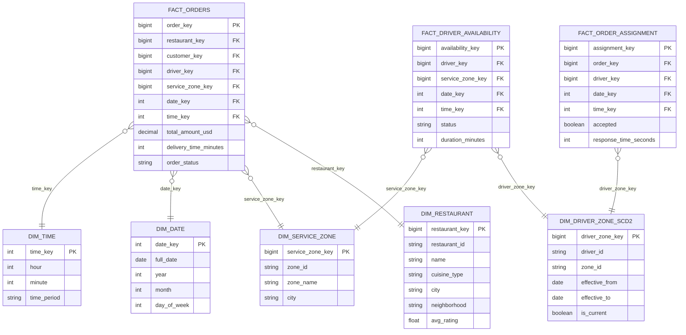

## The Business Context

A food delivery marketplace connects restaurants, customers, and drivers across multiple cities. The analytics team needs to answer:

1. How many orders were placed per city per hour of day?
2. What is the average delivery time by driver zone?
3. Which restaurants are getting repeat orders vs. first-time visits?
4. How does courier availability during peak hours affect order acceptance rate?
5. How does delivery performance compare across service zones?

Your task: design the dimensional model and write the SQL.

---

## Step 1 — Decode the Business Questions

| Question | Nouns (→ dimensions) | Measures (→ fact) |
|----------|----------------------|-------------------|
| Orders per city per hour | city, hour of day | order count |
| Avg delivery time by zone | driver zone | delivery time |
| Repeat vs. first-time restaurants | restaurant, customer | repeat flag |
| Courier availability vs. acceptance | courier, time | availability flag, acceptance flag |
| Performance across zones | service zone | delivery metrics |

**Dimensions**: restaurant, driver/courier, service zone, customer, date, time  
**Key insight**: Drivers are assigned to service zones, but zones change — a driver may cover Downtown during lunch and Midtown in the evening, or permanently transfer zones → SCD Type 2 on driver zone assignment

---

## Step 2 — Define the Fact Grains

There are **three distinct business processes** — each gets its own fact table:

| Fact table | Grain | Why separate? |
|-----------|-------|---------------|
| `fact_orders` | One row per order in its final state | Order-level metrics: revenue, delivery time, status |
| `fact_order_assignment` | One row per driver-order assignment attempt | Captures rejections, reassignments, acceptance latency |
| `fact_driver_availability_event` | One row per driver availability status change | Enables supply/demand analysis |

Never combine these — they have different granularities and different questions they answer.

---

## Step 3 — Attach the Dimensions



---

## Step 4 — SCD Decision

**`dim_driver_zone_scd2`** tracks which service zone a driver is assigned to, with full history.

```sql
CREATE TABLE dim_driver_zone_scd2 (
    driver_zone_key   BIGINT PRIMARY KEY,
    driver_id         VARCHAR(50)   NOT NULL,  -- natural key
    zone_id           VARCHAR(50)   NOT NULL,  -- natural key
    -- SCD2 columns
    effective_from    DATE          NOT NULL,
    effective_to      DATE,                    -- NULL = current assignment
    is_current        BOOLEAN       NOT NULL DEFAULT TRUE
);

-- Only one active assignment per driver at any point
CREATE UNIQUE INDEX uix_driver_zone_current
    ON dim_driver_zone_scd2 (driver_id)
    WHERE is_current = TRUE;
```

---

## Full DDL

```sql
CREATE TABLE dim_restaurant (
    restaurant_key   BIGINT PRIMARY KEY,
    restaurant_id    VARCHAR(50)   UNIQUE NOT NULL,
    name             VARCHAR(200)  NOT NULL,
    cuisine_type     VARCHAR(100),
    city             VARCHAR(100)  NOT NULL,
    neighborhood     VARCHAR(100),
    avg_rating       FLOAT
);

CREATE TABLE dim_driver (
    driver_key       BIGINT PRIMARY KEY,
    driver_id        VARCHAR(50)   UNIQUE NOT NULL,
    full_name        VARCHAR(200)  NOT NULL,
    vehicle_type     VARCHAR(50)
);

CREATE TABLE dim_customer (
    customer_key     BIGINT PRIMARY KEY,
    customer_id      VARCHAR(50)   UNIQUE NOT NULL,
    city             VARCHAR(100)
);

CREATE TABLE dim_service_zone (
    service_zone_key BIGINT PRIMARY KEY,
    zone_id          VARCHAR(50)   UNIQUE NOT NULL,
    zone_name        VARCHAR(100)  NOT NULL,
    city             VARCHAR(100)  NOT NULL
);

CREATE TABLE dim_date (
    date_key         INT           PRIMARY KEY,
    full_date        DATE          NOT NULL,
    year             INT,
    month            INT,
    quarter          INT,
    day_of_week      VARCHAR(10),
    is_weekend       BOOLEAN
);

CREATE TABLE dim_time (
    time_key         INT           PRIMARY KEY,  -- HHMM integer
    hour             INT           NOT NULL,
    minute           INT           NOT NULL,
    time_period      VARCHAR(20)   -- Morning, Lunch, Dinner, Late Night
);

CREATE TABLE fact_orders (
    order_key             BIGINT PRIMARY KEY,
    restaurant_key        BIGINT   NOT NULL REFERENCES dim_restaurant(restaurant_key),
    customer_key          BIGINT   NOT NULL REFERENCES dim_customer(customer_key),
    driver_key            BIGINT   REFERENCES dim_driver(driver_key),
    service_zone_key      BIGINT   NOT NULL REFERENCES dim_service_zone(service_zone_key),
    date_key              INT      NOT NULL REFERENCES dim_date(date_key),
    time_key              INT      NOT NULL REFERENCES dim_time(time_key),
    total_amount_usd      DECIMAL(10,2) NOT NULL,
    delivery_time_minutes INT,
    order_status          VARCHAR(50)   NOT NULL   -- completed, cancelled, failed
);

CREATE TABLE fact_order_assignment (
    assignment_key        BIGINT PRIMARY KEY,
    order_key             BIGINT   NOT NULL,
    driver_key            BIGINT   NOT NULL REFERENCES dim_driver(driver_key),
    date_key              INT      NOT NULL REFERENCES dim_date(date_key),
    time_key              INT      NOT NULL REFERENCES dim_time(time_key),
    accepted              BOOLEAN  NOT NULL,
    response_time_seconds INT
);

CREATE TABLE fact_driver_availability_event (
    availability_key      BIGINT PRIMARY KEY,
    driver_zone_key       BIGINT   NOT NULL REFERENCES dim_driver_zone_scd2(driver_zone_key),
    service_zone_key      BIGINT   NOT NULL REFERENCES dim_service_zone(service_zone_key),
    date_key              INT      NOT NULL REFERENCES dim_date(date_key),
    time_key              INT      NOT NULL REFERENCES dim_time(time_key),
    status                VARCHAR(20)   NOT NULL,  -- online, offline, on_delivery
    duration_minutes      INT
);
```

---

## The SQL Exercises

### Query 1 — Orders Per City Per Hour

> "Show total orders per city per hour of day, ranked by busiest hour."

```sql
SELECT
    sz.city,
    t.hour,
    t.time_period,
    COUNT(*)                  AS total_orders,
    SUM(f.total_amount_usd)   AS total_revenue
FROM fact_orders      f
JOIN dim_service_zone sz ON f.service_zone_key = sz.service_zone_key
JOIN dim_time         t  ON f.time_key         = t.time_key
WHERE f.order_status = 'completed'
GROUP BY sz.city, t.hour, t.time_period
ORDER BY sz.city, total_orders DESC;
```

---

### Query 2 — Average Delivery Time by Zone

> "What is the average delivery time by service zone? Flag zones that are 20% above the overall average."

```sql
WITH zone_stats AS (
    SELECT
        sz.zone_name,
        sz.city,
        AVG(f.delivery_time_minutes)    AS avg_delivery_minutes,
        COUNT(*)                         AS order_count
    FROM fact_orders      f
    JOIN dim_service_zone sz ON f.service_zone_key = sz.service_zone_key
    WHERE f.order_status = 'completed'
      AND f.delivery_time_minutes IS NOT NULL
    GROUP BY sz.zone_name, sz.city
),
overall AS (
    SELECT AVG(delivery_time_minutes) AS overall_avg
    FROM fact_orders
    WHERE order_status = 'completed'
)
SELECT
    z.zone_name,
    z.city,
    ROUND(z.avg_delivery_minutes, 1)      AS avg_delivery_minutes,
    z.order_count,
    ROUND(o.overall_avg, 1)               AS overall_avg_minutes,
    CASE
        WHEN z.avg_delivery_minutes > o.overall_avg * 1.2
        THEN '⚠️ Above threshold'
        ELSE 'OK'
    END                                   AS performance_flag
FROM zone_stats z
CROSS JOIN overall o
ORDER BY z.avg_delivery_minutes DESC;
```

**Interview note**: `CROSS JOIN overall` is valid here because `overall` is a single-row CTE — it's the idiomatic way to broadcast a scalar statistic to every row.

---

### Query 3 — New vs. Repeat Restaurants

> "For each month, how many restaurants had their first order on the platform vs. had ordered before?"

```sql
WITH restaurant_first_order AS (
    SELECT
        restaurant_key,
        MIN(date_key) AS first_order_date_key
    FROM fact_orders
    WHERE order_status = 'completed'
    GROUP BY restaurant_key
),
monthly_restaurants AS (
    SELECT DISTINCT
        f.restaurant_key,
        d.year,
        d.month,
        rfo.first_order_date_key
    FROM fact_orders f
    JOIN dim_date d ON f.date_key = d.date_key
    JOIN restaurant_first_order rfo
      ON f.restaurant_key = rfo.restaurant_key
    WHERE f.order_status = 'completed'
)
SELECT
    year,
    month,
    COUNT(DISTINCT CASE
        WHEN date_key = first_order_date_key
        THEN restaurant_key
    END)                        AS new_restaurants,
    COUNT(DISTINCT CASE
        WHEN date_key > first_order_date_key
        THEN restaurant_key
    END)                        AS repeat_restaurants
FROM monthly_restaurants
GROUP BY year, month
ORDER BY year, month;
```

---

### Query 4 — Courier Availability vs. Acceptance Rate

> "During each hour, how does driver availability (% of drivers online) correlate with order acceptance rate?"

```sql
WITH hourly_supply AS (
    SELECT
        d.date_key,
        t.hour,
        -- Count distinct drivers who were online at any point in this hour
        COUNT(DISTINCT CASE
            WHEN fa.status = 'online' THEN dz.driver_id
        END)                        AS drivers_online,
        COUNT(DISTINCT dz.driver_id) AS total_active_drivers
    FROM fact_driver_availability_event fa
    JOIN dim_driver_zone_scd2 dz ON fa.driver_zone_key = dz.driver_zone_key
    JOIN dim_date              d  ON fa.date_key        = d.date_key
    JOIN dim_time              t  ON fa.time_key        = t.time_key
    GROUP BY d.date_key, t.hour
),
hourly_demand AS (
    SELECT
        d.date_key,
        t.hour,
        COUNT(*)                                        AS total_assignments,
        SUM(CASE WHEN a.accepted THEN 1 ELSE 0 END)    AS accepted_assignments
    FROM fact_order_assignment a
    JOIN dim_date d ON a.date_key = d.date_key
    JOIN dim_time t ON a.time_key = t.time_key
    GROUP BY d.date_key, t.hour
)
SELECT
    s.date_key,
    s.hour,
    s.drivers_online,
    s.total_active_drivers,
    ROUND(100.0 * s.drivers_online / NULLIF(s.total_active_drivers, 0), 1)  AS availability_pct,
    ROUND(100.0 * d.accepted_assignments / NULLIF(d.total_assignments, 0), 1) AS acceptance_rate_pct
FROM hourly_supply  s
JOIN hourly_demand  d
  ON s.date_key = d.date_key
 AND s.hour     = d.hour
ORDER BY s.date_key, s.hour;
```

**Why two separate CTEs?** Supply (driver availability events) and demand (order assignments) live in different fact tables at different grain. Joining them directly would produce a cross join. Aggregate each independently first, then join on the shared time grain.

---

## Interview Discussion Points

**"Why do you have three fact tables instead of one?"**

Each fact table represents a different business process with a different grain:
- `fact_orders` — the completed transaction (one row per order)
- `fact_order_assignment` — the dispatch attempt (one row per driver ping, which may be rejected before acceptance)
- `fact_driver_availability_event` — supply tracking (one row per status change)

Combining them would force you to mix grains. If you put availability events into `fact_orders`, you'd have NULL measures everywhere an order didn't occur. Separating them keeps every fact table dense and semantically clean.

**"Why is dim_driver_zone_scd2 a separate table instead of zone_id on dim_driver?"**

A single FK on dim_driver would give you the driver's *current* zone, not the zone they were in *when an event occurred*. Since we're tracking historical delivery performance by zone, we need the zone assignment at the time of each delivery event. The SCD2 table + date range join provides that.

**"How would you handle a driver who is active in multiple zones simultaneously?"**

The current model assumes one active zone per driver. For multi-zone drivers, remove the partial unique index and allow multiple is_current=TRUE rows per driver. The fact table would then need explicit zone_key rather than deriving it from the driver's assignment.

---

## Key Takeaways

- Three distinct business processes → three fact tables at different grains: orders, assignments, availability
- Never mix grains in a single fact table — the presence of NULLs where measures "don't apply" is a sign of mixed grain
- `dim_driver_zone_scd2` enables zone-based historical analytics without contaminating the driver dimension with change history
- The two-CTE pattern (aggregate independently, then join) is the standard approach for questions that span multiple fact tables
- `NULLIF(value, 0)` is the correct guard for all percentage/ratio calculations in SQL
