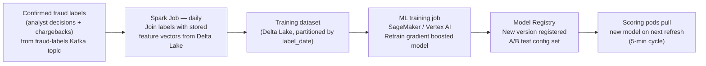

## The Interview Prompt

> "Design a real-time fraud detection system for a payment processor handling 50,000 transactions per second. The system must score each transaction in under 100 milliseconds. It should learn from confirmed fraud cases and update models without downtime."

This is a Meta/Stripe/PayPal-level system design question. It tests whether you can handle a latency-sensitive, stateful, dual-path architecture.

---

## Step 1 — Clarify Requirements (ask these out loud)

Before drawing anything, spend 2–3 minutes on requirements:

**Scale:**
- 50K transactions/sec peak → ~4.3B/day
- 100ms scoring SLA end-to-end
- Global or single region? (assume multi-region active-active)

**Functional requirements:**
- Score every transaction as fraud/not-fraud in real time
- Detect patterns over time windows (velocity checks: 5 transactions from same card in 10 min)
- Feed confirmed fraud labels back into the ML model
- Alert risk analysts for manual review

**Non-functional:**
- 99.99% availability — false negatives (missed fraud) are expensive; false positives (blocking legit customers) are damaging
- Sub-100ms P99 latency for the scoring path
- Eventual model freshness — retrain within hours of new confirmed labels

**What we're NOT building:**
- The ML model training logic itself
- Customer communication (SMS alerts)
- Dispute resolution workflow

---

## Step 2 — High-Level Architecture

Two paths — always split hot path from cold path in fraud/ML systems:

```mermaid
flowchart TD
    subgraph Hot Path — sub-100ms
        A["Payment Gateway\n50K txn/sec"] --> B["Kafka\ntransaction-events topic\n100 partitions"]
        B --> C["Flink Job\nStateful Feature Computation\n+ Rule Engine"]
        C --> D["Feature Store\n(Redis)\nPre-computed features per entity"]
        D --> E["ML Scoring Service\n(gRPC, 10ms SLA)"]
        E --> F["Decision\nApprove / Decline / Review"]
        F --> G["Kafka\nfraud-decisions topic"]
    end

    subgraph Cold Path — batch ML pipeline
        H["Confirmed Labels\n(analyst decisions, chargebacks)"] --> I["Kafka\nfraud-labels topic"]
        I --> J["Spark Job\nFeature Engineering\nTraining Dataset"]
        J --> K["S3 / Delta Lake\nTraining Data"]
        K --> L["ML Training\n(SageMaker / Vertex)"]
        L --> M["Model Registry\nVersioned Models"]
        M --> E
    end

    subgraph Sinks
        G --> N["Delta Lake\nAll decisions\n(audit + analytics)"]
        G --> O["Alerting\nHigh-risk reviews → analyst queue"]
    end
```

---

## Step 3 — Component Deep Dive

### Kafka — Event Backbone

```
Topic: transaction-events
Partitions: 100
Partition key: card_id (co-locates same card's events on same partition)
Retention: 7 days
Replication factor: 3

Why card_id as partition key?
→ Flink stateful operators keep state per key
→ All events for card X land in the same partition
→ Flink task reads that partition → all card X events go to the same task
→ State (running count, last 10 transactions) is local, no network lookup
```

**Why not partition by transaction_id?** Random distribution — events for the same card scatter across all partitions. Flink would need remote state lookups for velocity checks. This adds latency and creates network bottlenecks.

### Flink — Stateful Feature Computation

Flink reads the `transaction-events` topic and computes velocity features on the hot path:

```python
# Flink stateful processing per card_id
class FraudFeatureExtractor(KeyedProcessFunction):
    """
    State maintained per card_id:
    - transaction count in last 5 min (tumbling window)
    - transaction count in last 1 hour
    - distinct merchant count in last 24 hours
    - last transaction amount
    - last transaction location
    """

    def open(self, ctx):
        self.txn_count_5m  = ctx.get_state(ValueStateDescriptor("txn_5m", INT))
        self.txn_count_1h  = ctx.get_state(ValueStateDescriptor("txn_1h", INT))
        self.merchant_set  = ctx.get_state(ValueStateDescriptor("merchants_24h", LIST_STR))
        self.last_amount   = ctx.get_state(ValueStateDescriptor("last_amount", FLOAT))
        self.last_location = ctx.get_state(ValueStateDescriptor("last_location", STR))

    def process_element(self, txn, ctx):
        # Update state
        count_5m = (self.txn_count_5m.value() or 0) + 1
        self.txn_count_5m.update(count_5m)

        # Register cleanup timer for 5-min window expiry
        ctx.timer_service().register_event_time_timer(
            txn['event_time'] + 5 * 60 * 1000
        )

        # Build feature vector
        features = {
            'card_id':              txn['card_id'],
            'amount_usd':           txn['amount'],
            'txn_count_5m':         count_5m,
            'txn_count_1h':         self.txn_count_1h.value() or 0,
            'distinct_merchants_24h': len(self.merchant_set.get() or []),
            'amount_delta':         txn['amount'] - (self.last_amount.value() or 0),
            'location_change':      txn['location'] != (self.last_location.value() or ''),
        }

        # Write features to Redis (for the scoring service to read)
        redis.hset(f"features:{txn['card_id']}", mapping=features)

        # Also emit downstream for rule engine
        yield features
```

**Checkpointing config:**

```python
env.enable_checkpointing(30_000)   # every 30 seconds
env.get_checkpoint_config().set_checkpointing_mode(CheckpointingMode.EXACTLY_ONCE)
# State backend: RocksDB — handles millions of card_id keys without OOM
env.set_state_backend(EmbeddedRocksDBStateBackend())
```

### Feature Store (Redis) — Sub-millisecond Feature Retrieval

The scoring service needs pre-computed features instantly. Redis stores the latest feature vector per card_id, written by Flink on every transaction:

```
Key:   features:{card_id}      e.g. features:card_4111...
Value: {
    txn_count_5m: 3,
    txn_count_1h: 7,
    distinct_merchants_24h: 4,
    amount_delta: 45.00,
    location_change: true,
    updated_at: 1710000000
}
TTL: 48 hours (auto-expire inactive cards)
```

**Why Redis, not a database?**

A Postgres or DynamoDB lookup at 50K/sec would be expensive and introduce latency spikes. Redis in-memory P99 read latency is ~0.5ms. The scoring service target is 10ms — database lookups at this volume would blow the budget.

### ML Scoring Service

A lightweight gRPC service that:
1. Reads pre-computed features from Redis (0.5ms)
2. Loads the current model from local memory cache (refreshed from Model Registry every 5 min)
3. Scores the transaction (1–5ms for gradient boosted model inference)
4. Returns: `{score: 0.92, decision: "review", model_version: "v42"}`

```
Horizontal scaling: 50 pods behind a load balancer
Each pod: 8 vCPU, 16 GB RAM
Model loaded in-process (no network call to model server)
Model refresh: pull from S3 every 5 min, hot-swap without restart
```

**Why in-process model loading, not a model server?**

A model server (Triton, TorchServe) adds one more network hop — typically 5–15ms. At our 10ms scoring SLA, that's not viable. Loading the model in-process on each scoring pod trades memory for latency.

### Cold Path — Model Retraining



**Feature consistency between training and serving:**

The same features used at training time must be computed the same way at serving time — this is the **training-serving skew** problem. Solution:

- Flink writes feature vectors to both Redis (serving) AND Delta Lake (training archive)
- The training job reads from Delta Lake — the exact features that were computed at transaction time
- No feature recomputation during training — avoids discrepancies from slightly different window boundaries

---

## Step 4 — Data Flow End-to-End

```
1. Transaction arrives at payment gateway (t=0ms)
2. Gateway publishes to Kafka transaction-events (t=1ms)
3. Flink consumes, updates state, writes features to Redis (t=5ms)
4. Scoring service reads features from Redis + scores with local model (t=12ms)
5. Decision published to Kafka fraud-decisions (t=14ms)
6. Gateway reads decision, approves or declines transaction (t=20ms total)

Target: < 100ms ✅
```

```
Parallel:
- Flink also writes feature vectors to Delta Lake (async, not on critical path)
- fraud-decisions topic consumed by Delta Lake sink (audit trail)
- fraud-decisions topic consumed by alerting service (analyst queue)
```

---

## Step 5 — Scaling, Failure Modes, and Tradeoffs

### Scaling

| Component | Scaling mechanism |
|-----------|------------------|
| Kafka | Add partitions + brokers; partition by card_id keeps state locality |
| Flink | Increase task parallelism; RocksDB state scales to disk |
| Redis | Redis Cluster (sharding); read replicas for feature reads |
| Scoring service | Horizontal pod autoscaler on CPU/latency metrics |
| Cold path Spark | Increase executor count; Delta Lake handles concurrent writes |

### Failure Modes

**Flink job failure:**
Checkpoint to S3 every 30 seconds. On restart, replay from the last checkpoint offset. Kafka retention of 7 days means any messages in the gap are replayed. State is fully restored from RocksDB snapshot. The gap between checkpoint and failure (up to 30s) means some features in Redis may be stale — transactions in that window get slightly stale features. Acceptable given ML models are robust to small feature lag.

**Redis failure:**
If the feature store is unavailable, the scoring service falls back to a rule-based fallback scorer (velocity rules only, no ML). This degrades accuracy but keeps transactions flowing. Fraud decisions based on fallback are flagged for analyst review.

**Model serving failure:**
Scoring pods cache the last known good model locally. If S3 is unreachable for the 5-min refresh, the pod continues with the cached model until S3 recovers. Model staleness is bounded by the refresh cycle.

### Tradeoffs

| Decision | Alternative | Why we chose this |
|---------|------------|------------------|
| Flink for stateful features | Kafka Streams | Flink has richer windowing, RocksDB state backend, better exactly-once |
| Redis as feature store | DynamoDB | Sub-millisecond reads; DynamoDB P99 is ~5ms at high load |
| In-process model | TorchServe/Triton | Eliminates one network hop; model size fits in RAM |
| Partition by card_id | transaction_id | State locality — all card events go to same Flink task |
| Delta Lake for audit | Kafka long retention | Delta Lake enables SQL queries; Kafka is poor for ad-hoc analysis |

---

## Common Interview Questions

**"What if 100ms SLA can't be met?"**

Profile each component: Kafka consumer lag adds ~1–2ms; Flink processing ~4ms; Redis lookup ~0.5ms; model inference ~5–8ms. If under pressure: (1) pre-warm features at card tokenization time; (2) use a lighter model (logistic regression ~0.5ms vs gradient boosted ~5ms); (3) move from gRPC to shared memory if scoring service is colocated.

**"How do you handle new cards with no history?"**

Cold-start problem. For new card_ids: return a default feature vector with zero velocity counts and pass to a separate "new card" model trained on first-transaction patterns (AVS mismatch, billing address risk, card BIN risk). Route high-score new-card transactions to manual review.

**"How do you prevent training-serving skew?"**

Write features from Flink to both Redis (serving) and Delta Lake (training archive) in the same pipeline step. Never recompute features for training from raw events — use the archived feature vectors. This guarantees training and serving see identical feature representations.

**"What's the tradeoff of exactly-once vs at-least-once in Flink here?"**

Exactly-once (via Flink checkpointing + Kafka transactions) prevents double-counting in velocity features. At-least-once would increment `txn_count_5m` twice for replayed transactions, producing inflated scores. For fraud detection, false positives (blocking good transactions) are expensive — exactly-once is worth the ~10% throughput overhead.

---

## Key Takeaways

- Split every latency-sensitive ML system into a **hot path** (real-time scoring) and a **cold path** (batch retraining) — they have different latency and consistency requirements
- **Partition Kafka by entity key** (card_id) to ensure state locality in Flink — avoids remote state lookups
- **RocksDB state backend** for large-state Flink jobs — handles millions of keys by spilling to disk
- **Pre-compute features into Redis** — never compute features inside the scoring service on the critical path
- **Write features to Delta Lake and Redis simultaneously** — solves training-serving skew by using the same feature vectors at training time that were used at serving time
- **Degrade gracefully**: fallback to rule-based scoring when ML components fail — keep transactions flowing
