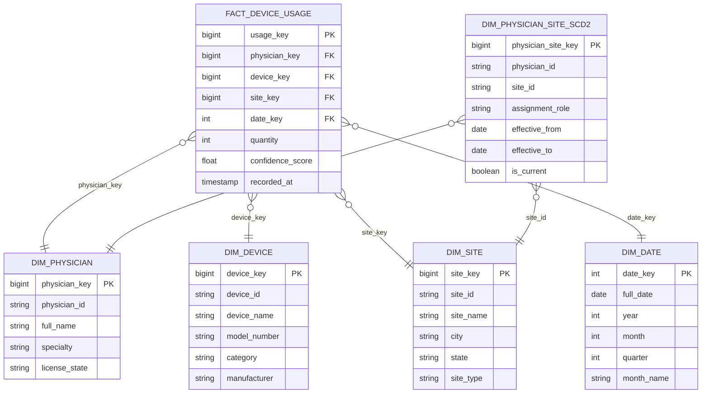

## The Business Context

A medical device company sells diagnostic equipment to hospitals and clinics. Sales reps (physicians who champion specific devices) operate across multiple clinical sites. The analytics team needs to answer:

1. Which devices are gaining adoption month-over-month?
2. How many distinct physicians used a device for the first time this month vs. last month?
3. Are physicians who recently changed sites driving usage at their new locations?
4. Does the confidence score of a usage event affect downstream diagnostic accuracy?
5. How is usage distributed across sites, and which sites are underperforming?

Your task: design the dimensional model and write the SQL.

---

## Step 1 — Decode the Business Questions

| Question | Nouns (→ dimensions) | Measures (→ fact) |
|----------|----------------------|-------------------|
| Device adoption by month | device, month | usage count |
| New vs. repeat physician users | physician | first-use flag |
| Physicians moving sites | physician, site | site assignment history |
| Confidence score impact | usage event | confidence score |
| Site distribution | site | usage count per site |

**Dimensions**: physician, device, site, date  
**Key insight**: A physician can move from one site to another. Site assignment **changes over time** and history matters for attribution → SCD Type 2

---

## Step 2 — Define the Fact Grain

> **One row represents one device usage event attributed to a physician at a clinical site on a given day.**

The grain is physician × device × site × day. If a physician uses the same device twice in one day at the same site, those can be summed in the measures column (`quantity`).

---

## Step 3 — Attach the Dimensions



---

## Step 4 — SCD Decision

**`dim_physician_site`** is the SCD2 entity. A physician can transfer between sites, and we need to attribute historical usage to the correct site at the time it happened.

```sql
CREATE TABLE dim_physician_site (
    physician_site_key  BIGINT PRIMARY KEY,
    physician_id        VARCHAR(50)   NOT NULL,  -- natural key
    site_id             VARCHAR(50)   NOT NULL,  -- natural key
    assignment_role     VARCHAR(100),
    -- SCD2 tracking columns
    effective_from      DATE          NOT NULL,
    effective_to        DATE,                    -- NULL = currently active
    is_current          BOOLEAN       NOT NULL DEFAULT TRUE,
    -- audit
    created_at          TIMESTAMP     NOT NULL DEFAULT CURRENT_TIMESTAMP
);

-- Partial unique index: only one current row per physician
CREATE UNIQUE INDEX uix_physician_site_current
    ON dim_physician_site (physician_id)
    WHERE is_current = TRUE;
```

**When a physician moves from Site A to Site B:**

```sql
-- Step 1: Expire the old row
UPDATE dim_physician_site
SET effective_to = CURRENT_DATE - INTERVAL '1 day',
    is_current   = FALSE
WHERE physician_id = 'P001'
  AND is_current   = TRUE;

-- Step 2: Insert the new row
INSERT INTO dim_physician_site
  (physician_id, site_id, assignment_role, effective_from, effective_to, is_current)
VALUES
  ('P001', 'SITE-B', 'Senior Rep', CURRENT_DATE, NULL, TRUE);
```

---

## Full DDL

```sql
-- Dimension tables
CREATE TABLE dim_physician (
    physician_key   BIGINT PRIMARY KEY,
    physician_id    VARCHAR(50)   UNIQUE NOT NULL,
    full_name       VARCHAR(200)  NOT NULL,
    specialty       VARCHAR(100),
    license_state   VARCHAR(2)
);

CREATE TABLE dim_device (
    device_key      BIGINT PRIMARY KEY,
    device_id       VARCHAR(50)   UNIQUE NOT NULL,
    device_name     VARCHAR(200)  NOT NULL,
    model_number    VARCHAR(100),
    category        VARCHAR(100),
    manufacturer    VARCHAR(200)
);

CREATE TABLE dim_site (
    site_key        BIGINT PRIMARY KEY,
    site_id         VARCHAR(50)   UNIQUE NOT NULL,
    site_name       VARCHAR(200)  NOT NULL,
    city            VARCHAR(100),
    state           VARCHAR(2),
    site_type       VARCHAR(50)   -- hospital, clinic, ambulatory
);

CREATE TABLE dim_date (
    date_key        INT           PRIMARY KEY,  -- YYYYMMDD integer
    full_date       DATE          NOT NULL,
    year            INT           NOT NULL,
    month           INT           NOT NULL,
    quarter         INT           NOT NULL,
    month_name      VARCHAR(20),
    day_of_week     VARCHAR(10)
);

-- SCD2 dimension
CREATE TABLE dim_physician_site (
    physician_site_key  BIGINT PRIMARY KEY,
    physician_id        VARCHAR(50)   NOT NULL,
    site_id             VARCHAR(50)   NOT NULL,
    assignment_role     VARCHAR(100),
    effective_from      DATE          NOT NULL,
    effective_to        DATE,
    is_current          BOOLEAN       NOT NULL DEFAULT TRUE
);

-- Fact table
CREATE TABLE fact_device_usage (
    usage_key           BIGINT PRIMARY KEY,
    physician_key       BIGINT        NOT NULL REFERENCES dim_physician(physician_key),
    device_key          BIGINT        NOT NULL REFERENCES dim_device(device_key),
    site_key            BIGINT        NOT NULL REFERENCES dim_site(site_key),
    date_key            INT           NOT NULL REFERENCES dim_date(date_key),
    quantity            INT           NOT NULL DEFAULT 1,
    confidence_score    FLOAT,
    recorded_at         TIMESTAMP     NOT NULL
);

CREATE INDEX idx_fact_du_physician ON fact_device_usage(physician_key);
CREATE INDEX idx_fact_du_device    ON fact_device_usage(device_key);
CREATE INDEX idx_fact_du_site      ON fact_device_usage(site_key);
CREATE INDEX idx_fact_du_date      ON fact_device_usage(date_key);
```

---

## The SQL Exercises

### Query 1 — Device Adoption by Month

> "Show total device usage per month, ordered by most recent month first."

```sql
SELECT
    d.year,
    d.month,
    d.month_name,
    dv.device_name,
    SUM(f.quantity) AS total_usage
FROM fact_device_usage    f
JOIN dim_date             d  ON f.date_key   = d.date_key
JOIN dim_device           dv ON f.device_key = dv.device_key
GROUP BY d.year, d.month, d.month_name, dv.device_name
ORDER BY d.year DESC, d.month DESC, total_usage DESC;
```

---

### Query 2 — Month-over-Month Usage Growth

> "For each device, show the total usage this month vs. last month and the percentage change."

```sql
WITH monthly_usage AS (
    SELECT
        dv.device_name,
        d.year,
        d.month,
        SUM(f.quantity) AS total_usage
    FROM fact_device_usage f
    JOIN dim_date          d  ON f.date_key   = d.date_key
    JOIN dim_device        dv ON f.device_key = dv.device_key
    GROUP BY dv.device_name, d.year, d.month
)
SELECT
    device_name,
    year,
    month,
    total_usage                                                             AS current_usage,
    LAG(total_usage) OVER (
        PARTITION BY device_name
        ORDER BY year, month
    )                                                                       AS prev_usage,
    ROUND(
        100.0 * (total_usage - LAG(total_usage) OVER (
            PARTITION BY device_name ORDER BY year, month
        )) / NULLIF(LAG(total_usage) OVER (
            PARTITION BY device_name ORDER BY year, month
        ), 0),
        1
    )                                                                       AS pct_change
FROM monthly_usage
ORDER BY device_name, year, month;
```

**Why `NULLIF(..., 0)`?** Prevents division by zero when last month had zero usage.

---

### Query 3 — New vs. Repeat Physician Users

> "For each device and month, how many physicians used it for the first time (new adopters) vs. again (repeat users)?"

```sql
WITH physician_first_use AS (
    -- Find each physician's first-ever usage date per device
    SELECT
        physician_key,
        device_key,
        MIN(date_key) AS first_use_date_key
    FROM fact_device_usage
    GROUP BY physician_key, device_key
),
monthly_activity AS (
    SELECT
        f.physician_key,
        f.device_key,
        d.year,
        d.month,
        d.date_key,
        pfu.first_use_date_key
    FROM fact_device_usage f
    JOIN dim_date          d   ON f.date_key  = d.date_key
    JOIN physician_first_use pfu
      ON f.physician_key = pfu.physician_key
     AND f.device_key    = pfu.device_key
)
SELECT
    dv.device_name,
    ma.year,
    ma.month,
    COUNT(DISTINCT CASE
        WHEN ma.date_key = ma.first_use_date_key THEN ma.physician_key
    END)                                AS new_adopters,
    COUNT(DISTINCT CASE
        WHEN ma.date_key > ma.first_use_date_key THEN ma.physician_key
    END)                                AS repeat_users
FROM monthly_activity ma
JOIN dim_device dv ON ma.device_key = dv.device_key
GROUP BY dv.device_name, ma.year, ma.month
ORDER BY dv.device_name, ma.year, ma.month;
```

---

### Query 4 — Usage Attribution After Site Transfer

> "For physicians who transferred sites in the last 6 months, compare their usage at the old site vs. the new site."

```sql
-- Find physicians who transferred in the last 6 months
WITH recent_transfers AS (
    SELECT physician_id
    FROM dim_physician_site
    WHERE effective_from >= CURRENT_DATE - INTERVAL '6 months'
      AND is_current = FALSE   -- rows that were expired (transferred away)
),
usage_by_site_version AS (
    SELECT
        p.physician_id,
        ps.site_id,
        ps.effective_from,
        ps.effective_to,
        CASE WHEN ps.is_current THEN 'new_site' ELSE 'old_site' END AS site_version,
        SUM(f.quantity) AS total_usage
    FROM fact_device_usage f
    JOIN dim_physician     p  ON f.physician_key = p.physician_key
    JOIN dim_physician_site ps
      ON p.physician_id = ps.physician_id
     AND f.recorded_at::DATE BETWEEN ps.effective_from
                                  AND COALESCE(ps.effective_to, CURRENT_DATE)
    WHERE p.physician_id IN (SELECT physician_id FROM recent_transfers)
    GROUP BY p.physician_id, ps.site_id, ps.effective_from, ps.effective_to, ps.is_current
)
SELECT
    physician_id,
    site_id,
    site_version,
    effective_from,
    effective_to,
    total_usage
FROM usage_by_site_version
ORDER BY physician_id, effective_from;
```

**What this demonstrates**: The SCD2 date range join (`f.recorded_at BETWEEN effective_from AND effective_to`) correctly attributes each usage event to the site the physician was assigned to *at the time the event was recorded* — not their current site.

---

### Query 5 — Data Quality: Confidence Score Completeness

> "What percentage of usage events have a confidence score? Break down by device category."

```sql
SELECT
    dv.category,
    COUNT(*)                                                    AS total_events,
    COUNT(f.confidence_score)                                   AS events_with_score,
    COUNT(*) - COUNT(f.confidence_score)                        AS events_missing_score,
    ROUND(
        100.0 * COUNT(f.confidence_score) / COUNT(*),
        1
    )                                                           AS pct_complete
FROM fact_device_usage f
JOIN dim_device        dv ON f.device_key = dv.device_key
GROUP BY dv.category
ORDER BY pct_complete ASC;  -- surface worst completeness first
```

**Note**: `COUNT(column)` counts non-NULL values, while `COUNT(*)` counts all rows — this is standard SQL behavior that makes data quality queries straightforward.

---

## Interview Discussion Points

**"Why is physician_site its own SCD2 table and not just a column on dim_physician?"**

Because the relationship between a physician and a site is itself an entity with its own lifecycle. A physician can be active at multiple sites simultaneously (different roles), and that history needs to be preserved for attribution analysis. Embedding it as a simple FK on dim_physician would lose the multi-site capability.

**"Why use a surrogate key (physician_key, device_key) instead of the natural IDs?"**

Surrogate keys decouple the warehouse from source system IDs. If the source system renumbers a device, the warehouse history is unaffected. Surrogate keys are also integers — faster for joins than string comparisons.

**"Could you combine physician_key and site_key into the fact directly and skip dim_physician_site?"**

Yes — for simple queries. But you'd lose the ability to answer "was this usage attributed to the right site?" for physicians who moved. The separate SCD2 table is essential for audit and attribution queries.

---

## Key Takeaways

- The grain — **physician × device × site × day** — is the central design decision that makes all queries correct
- `dim_physician_site` as SCD2 enables **point-in-time attribution**: each usage event is attributed to the site the physician held at the time of the event
- The date range join (`BETWEEN effective_from AND effective_to`) is the standard pattern for SCD2 historical attribution
- `NULLIF(..., 0)` prevents division-by-zero in growth calculations
- `COUNT(column)` vs `COUNT(*)` is the idiomatic way to measure column completeness in SQL
