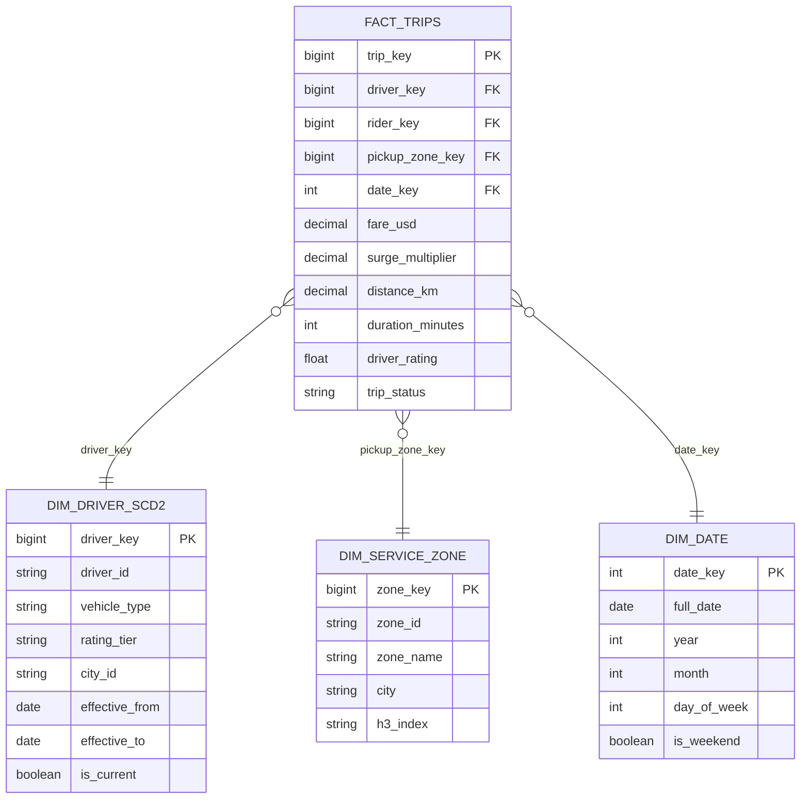

## The Interview Prompt

> "Design the analytics platform for a ride-sharing company like Uber or Lyft. The system must support real-time surge pricing computation, live driver availability dashboards, and a batch data warehouse that business analysts use to run reports on trips, revenue, and driver performance."

This question appears at Uber, Lyft, DoorDash, and any company with a marketplace model. It tests your ability to handle a **dual-path architecture**: a hot streaming path for operational decisions and a cold batch path for business intelligence.

---

## Step 1 — Clarify Requirements

**Scale:**
- 1 million trips per day across 50 cities
- 500K driver location updates per minute at peak
- Surge pricing must recompute every 30 seconds per geofenced zone
- Analyst reports need data fresher than 2 hours (not necessarily real-time)

**Functional requirements:**
- Ingest driver GPS pings continuously
- Compute supply/demand ratio per zone in real time → feed surge multiplier
- Serve live "nearby driver" counts to the dispatch service
- Power an analyst-facing warehouse: trip revenue, driver ratings, cancellation rates, city performance
- Support data science team for pricing model iteration

**Non-functional:**
- Driver location pipeline: sub-second processing
- Surge pricing: recompute every 30 seconds
- Warehouse freshness: data available within 2 hours of trip completion
- History retained for 5 years (regulatory + model training)

---

## Step 2 — High-Level Architecture

```mermaid
flowchart TD
    subgraph Event Sources
        A1["Driver App\nGPS pings\n500K/min"]
        A2["Rider App\nRide requests\nCancellations"]
        A3["Trip Service\nTrip start/end events\nFare calculations"]
    end

    subgraph Kafka — Event Backbone
        B1["topic: driver-location\n200 partitions\npartition key: driver_id"]
        B2["topic: ride-requests\n50 partitions"]
        B3["topic: trip-events\n100 partitions\npartition key: city_id"]
    end

    subgraph Hot Path — Streaming
        C1["Flink Job 1\nDriver Location Aggregator\nSupply per zone per 30s"]
        C2["Flink Job 2\nDemand Aggregator\nOpen requests per zone per 30s"]
        C3["Surge Engine\nReads supply + demand\nComputes multiplier"]
        C4["Redis\nZone state\nDriver counts\nSurge multipliers"]
    end

    subgraph Cold Path — Batch Warehouse
        D1["Kafka → S3\nRaw landing\nBronze layer\n(all events, partitioned by hour)"]
        D2["Spark ETL — hourly\nClean + enrich\nSilver layer"]
        D3["dbt — daily\nDimensional models\nGold layer"]
        D4["Snowflake / BigQuery\nAnalyst-facing warehouse"]
    end

    A1 --> B1
    A2 --> B2
    A3 --> B3

    B1 --> C1
    B2 --> C2
    C1 & C2 --> C3
    C3 --> C4

    B1 & B2 & B3 --> D1
    D1 --> D2
    D2 --> D3
    D3 --> D4
```

---

## Step 3 — Hot Path: Surge Pricing Pipeline

### Driver Location → Supply Signal

Every driver app sends a GPS ping every 10–15 seconds. At 500K drivers at peak, that's ~40K events/second.

**Kafka topic: `driver-location`**
- 200 partitions, keyed by `driver_id`
- Each message: `{driver_id, lat, lon, status, city_id, timestamp}`
- Status values: `available`, `on_trip`, `offline`

**Flink Job — Supply Aggregator:**

```python
# Tumbling 30-second window, keyed by zone_id
driver_stream \
    .map(lambda ping: assign_zone(ping))          # lat/lon → zone_id
    .key_by('zone_id') \
    .window(TumblingEventTimeWindows.of(Time.seconds(30))) \
    .aggregate(AvailableDriverCount())             # count status='available'
    .add_sink(RedisZoneSink())                     # write to Redis: zone:{zone_id}:supply
```

`assign_zone()` maps a GPS coordinate to a geofenced zone using an in-memory H3 index (Uber's hexagonal grid). Zones are ~500m hexagons.

### Demand Signal — Open Ride Requests

**Kafka topic: `ride-requests`**

Flink counts open (unmatched) ride requests per zone in the same 30-second window:

```python
request_stream \
    .filter(lambda r: r['status'] == 'pending') \
    .map(lambda r: assign_zone(r)) \
    .key_by('zone_id') \
    .window(TumblingEventTimeWindows.of(Time.seconds(30))) \
    .aggregate(PendingRequestCount()) \
    .add_sink(RedisZoneSink())   # zone:{zone_id}:demand
```

### Surge Computation

Every 30 seconds, a lightweight Surge Engine reads Redis and recomputes the multiplier:

```python
def compute_surge(zone_id: str) -> float:
    supply = redis.get(f"zone:{zone_id}:supply")  # available drivers
    demand = redis.get(f"zone:{zone_id}:demand")  # open requests

    if supply == 0:
        return MAX_SURGE   # 3.0x — no drivers available
    
    ratio = demand / supply
    
    if ratio < 0.5:   return 1.0   # plentiful supply
    if ratio < 1.0:   return 1.2
    if ratio < 2.0:   return 1.5
    if ratio < 3.0:   return 2.0
    return min(ratio * 0.8, MAX_SURGE)

# Write result back to Redis
redis.setex(f"zone:{zone_id}:surge_multiplier", 35, surge_value)
# TTL = 35 seconds (auto-expire if pipeline stalls, fallback to 1.0x)
```

The dispatch service reads `zone:{zone_id}:surge_multiplier` when a rider requests a trip. If the key has expired (pipeline stalled), it defaults to 1.0x — safe degradation.

### Redis Layout for Surge State

```
zone:h3_7abc:supply           → 42        (available drivers in zone)
zone:h3_7abc:demand           → 67        (pending requests in zone)
zone:h3_7abc:surge_multiplier → 1.5       (TTL: 35s)

driver:D001:location          → {lat, lon, zone_id, updated_at}
driver:D001:status            → available  (TTL: 60s — auto-expire stale pings)
```

---

## Step 4 — Cold Path: Batch Warehouse

### Bronze Layer — Raw Landing

All three Kafka topics are mirrored to S3 via a Kafka Connect S3 Sink:

```
s3://datalake/bronze/driver-location/year=2024/month=03/day=15/hour=14/*.parquet
s3://datalake/bronze/ride-requests/year=2024/month=03/day=15/hour=14/*.parquet
s3://datalake/bronze/trip-events/year=2024/month=03/day=15/hour=14/*.parquet
```

Kafka Connect compresses with Snappy and writes ~128 MB Parquet files per hour per topic. Raw events are retained for 5 years — they're the source of truth for all downstream reprocessing.

### Silver Layer — Hourly Spark ETL

```python
# Runs hourly via Airflow
trips = spark.read.parquet("s3://datalake/bronze/trip-events/year=.../hour=...")

silver = (
    trips
    .dropDuplicates(["trip_id", "event_type"])   # deduplicate replays
    .filter(F.col("trip_id").isNotNull())
    .withColumn("trip_date", F.to_date("started_at"))
    .withColumn("fare_usd",
        F.when(F.col("currency") == "USD", F.col("fare"))
         .otherwise(F.col("fare") * F.col("exchange_rate")))
    .withColumn("duration_minutes",
        (F.unix_timestamp("ended_at") - F.unix_timestamp("started_at")) / 60)
)

silver.write \
    .mode("append") \
    .partitionBy("trip_date", "city_id") \
    .parquet("s3://datalake/silver/trips/")
```

### Gold Layer — dbt Dimensional Models

```sql
-- models/gold/fact_trips.sql
-- Grain: one row per completed trip
{{
  config(
    materialized='incremental',
    unique_key='trip_id',
    incremental_strategy='merge'
  )
}}

SELECT
    t.trip_id,
    dr.driver_key,
    ri.rider_key,
    sz.zone_key           AS pickup_zone_key,
    dd.date_key,
    t.fare_usd,
    t.surge_multiplier,
    t.base_fare_usd,
    t.tip_usd,
    t.distance_km,
    t.duration_minutes,
    t.driver_rating,
    t.rider_rating,
    t.trip_status          -- completed, cancelled_by_rider, cancelled_by_driver
FROM {{ ref('silver_trips') }}       t
JOIN {{ ref('dim_driver') }}         dr ON t.driver_id = dr.driver_id
JOIN {{ ref('dim_rider') }}          ri ON t.rider_id  = ri.rider_id
JOIN {{ ref('dim_service_zone') }}   sz ON t.pickup_zone_id = sz.zone_id
JOIN {{ ref('dim_date') }}           dd ON t.trip_date = dd.full_date


WHERE t.trip_date >= DATEADD('day', -3, CURRENT_DATE)

```

**SCD2 on `dim_driver`:** Drivers change vehicle type, rating tier, and city. These changes should not retroactively alter historical trip attribution — each trip row carries the driver's surrogate key at the time of the trip.

### Airflow Orchestration

```python
with DAG("ride_sharing_warehouse", schedule_interval="0 * * * *") as dag:

    wait_for_bronze = S3KeySensor(
        task_id="wait_for_bronze_landing",
        bucket_key="bronze/trip-events/year={{ ds[:4] }}/hour={{ execution_date.hour }}/_SUCCESS",
        mode="reschedule",
        timeout=3600,
    )

    spark_silver = SparkSubmitOperator(
        task_id="spark_silver_etl",
        application="s3://scripts/silver_trips_etl.py",
        application_args=["--date", "{{ ds }}", "--hour", "{{ execution_date.hour }}"],
    )

    dbt_gold = BashOperator(
        task_id="dbt_gold_models",
        bash_command="dbt run --select tag:trips --vars '{\"run_date\": \"{{ ds }}\"}'",
    )

    wait_for_bronze >> spark_silver >> dbt_gold
```

---

## Step 5 — Data Model (Warehouse)



---

## Step 6 — Scaling and Failure Modes

### Scaling

| Component | Bottleneck | Solution |
|-----------|-----------|---------|
| Kafka driver-location | 500K pings/min = ~8K/sec per partition at 200 partitions | Each partition handles ~8K events/sec — comfortable for Kafka |
| Flink zone aggregator | H3 zone assignment is CPU-intensive | Pre-index zones; use parallel map before keying |
| Redis | 100K reads/sec from dispatch service | Redis Cluster with read replicas per city region |
| Surge Engine | Single-threaded timer | Shard by city_id — one Surge Engine instance per region |
| Spark Silver ETL | Partition skew on high-traffic cities | Repartition by (city_id, trip_date) before write |

### Failure Modes

**Flink supply aggregator fails:**
Checkpoint restores state from S3. Redis zone supply values have 35s TTL — they'll expire and surge engine falls back to last known value, then to 1.0x when key expires. No hard outage.

**Redis unavailable:**
Dispatch service falls back to surge_multiplier = 1.0x (no surge). Driver counts unavailable — dispatch uses GPS directly. Degraded experience, not an outage.

**Bronze S3 write fails:**
Kafka retention is 7 days. Airflow S3KeySensor blocks until the file appears. Once S3 recovers, Kafka Connect resumes writing and the Airflow DAG proceeds with `catchup=True`.

**Late GPS pings:**
Driver location events can arrive up to 60 seconds late (mobile connectivity). Flink watermark set to 60 seconds. Zone supply counts are delayed by 60s but still accurate. Acceptable for 30-second surge windows.

---

## Common Interview Questions

**"Why not use the streaming pipeline for warehouse analytics instead of the batch path?"**

Streaming state in Flink/Redis is ephemeral — it's optimized for low-latency reads of current state, not for historical ad-hoc analysis. Analysts need to query 12 months of trips, join with driver history, and run arbitrary GROUP BY queries. Kafka + Delta Lake + dbt produces a queryable, versioned, schema-governed warehouse. These are different tools for different problems.

**"Why is surge recomputed every 30 seconds and not continuously?"**

Pricing changes faster than 30 seconds create rider confusion ("the price I saw is different from what I'm charged"). 30 seconds is a product decision that balances responsiveness with UX stability. The pipeline could technically recompute every 5 seconds — the infrastructure supports it.

**"How do you handle driver GPS spoofing?"**

Detect anomalous jumps: a driver can't travel >150 km/h. Filter pings where distance/time exceeds a threshold. These are forwarded to a separate `suspicious-pings` Kafka topic for Trust & Safety review, and the driver's last valid location is held in Redis until a valid ping arrives.

**"How would you backfill 3 months of surge data you forgot to capture?"**

Bronze layer has all raw events. Replay the Kafka events (or read from Bronze S3) through the zone assignment logic in Spark batch. This won't be real-time surge (no 30-second windows), but you can reconstruct 5-minute aggregates for historical analysis. Store the results in a separate `fact_zone_supply_demand_history` table in the warehouse.

---

## Key Takeaways

- Dual-path architecture: hot path (Flink + Redis, sub-second) for operational decisions; cold path (Spark + dbt + warehouse, hourly) for business intelligence — never conflate them
- **Partition Kafka by the entity whose state you're computing** (`driver_id` for location, `city_id` for trip events) — state locality eliminates cross-partition shuffles in Flink
- **Redis TTLs as automatic failure detection**: if a pipeline stalls, zone state keys expire and the system defaults safely rather than serving stale data indefinitely
- **Kafka Connect + S3 as the Bronze landing**: all events land raw with no transformation, enabling full replay and reprocessing
- **SCD2 on dim_driver**: driver rating tier, vehicle type, and city changes are tracked historically — trip revenue by "former Gold tier drivers" is a real business question
- **`catchup=True` + S3KeySensor**: Airflow handles delayed file arrivals gracefully — the DAG blocks until data is ready, then processes in order
