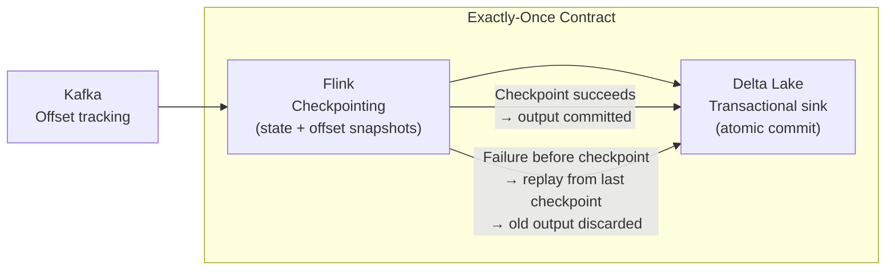

## What Fault Tolerance Actually Means

A fault-tolerant pipeline doesn't fail silently, doesn't lose data when a component crashes, and produces the same result whether it ran once or was retried five times.

Most pipeline failures aren't dramatic outages — they're subtle: a file that arrived 2 hours late, a Kafka consumer that restarted mid-batch, a Spark job that succeeded but wrote 90% of the expected rows. Fault tolerance is designing for these realities.

---

## The Three Properties of a Fault-Tolerant Pipeline

### 1. Idempotency — Same Input, Same Output, Every Time

An idempotent pipeline can be retried any number of times without producing duplicates or inconsistent state.

```
Idempotent:
  Run 1: writes 100K rows to partition order_date=2024-03-15
  Run 2 (retry): overwrites partition with 100K rows — same result

Not idempotent:
  Run 1: appends 100K rows to orders table
  Run 2 (retry): appends another 100K rows — 200K rows, all duplicates
```

**Making Spark jobs idempotent:**

```python
# ❌ mode("append") — not idempotent on retry
df.write.mode("append").parquet("s3://silver/orders/")

# ✅ Dynamic partition overwrite — idempotent
df.write \
    .mode("overwrite") \
    .option("partitionOverwriteMode", "dynamic") \
    .partitionBy("order_date") \
    .parquet("s3://silver/orders/")
# Re-run for 2024-03-15 → only that partition is replaced, others untouched
```

**Making database loads idempotent:**

```sql
-- Idempotent load pattern: delete then insert (not append)
BEGIN TRANSACTION;
    DELETE FROM daily_revenue WHERE report_date = '2024-03-15';
    INSERT INTO daily_revenue
        SELECT report_date, product_id, SUM(revenue) AS total_revenue
        FROM fact_orders
        WHERE order_date = '2024-03-15'
        GROUP BY report_date, product_id;
COMMIT;
```

### 2. Exactly-Once / At-Least-Once Semantics

**At-least-once:** Every event is processed at least once. Duplicates are possible on retry — you must deduplicate downstream.

**Exactly-once:** Every event is processed exactly once, even on failure and retry. Requires coordination between the source, processor, and sink.



**Implementing at-least-once with deduplication (more practical for most pipelines):**

```python
# Kafka consumer: commit offset only after successful write
for batch in kafka_consumer.poll():
    records = [json.loads(msg.value) for msg in batch]
    
    # Write to destination
    load_to_bronze(records)
    
    # Only commit if write succeeded
    kafka_consumer.commit()   # if this fails, same batch is redelivered on restart

# Silver deduplication handles duplicates from retries
silver = bronze.dropDuplicates(["event_id"])
```

### 3. Observability — Know When Things Break

A pipeline that fails silently is worse than one that fails loudly. Silent failures mean stale dashboards, wrong reports, and decisions based on missing data — often discovered days later.

```python
# Every pipeline step should emit metrics
def run_silver_etl(date: str):
    input_count = bronze_df.count()
    
    silver_df = transform(bronze_df)
    
    output_count = silver_df.count()
    
    # Alert if output is less than 90% of input
    if output_count < input_count * 0.9:
        alert_team(
            f"Silver ETL for {date}: only {output_count}/{input_count} rows passed. "
            f"Possible data quality issue."
        )
    
    # Emit to monitoring
    metrics.gauge("silver_etl.input_rows", input_count, tags={"date": date})
    metrics.gauge("silver_etl.output_rows", output_count, tags={"date": date})
```

---

## Retry Logic and Backoff

Transient failures (network timeouts, S3 rate limits, temporary DB unavailability) should be retried automatically.

### Airflow Retries

```python
default_args = {
    "retries": 3,
    "retry_delay": timedelta(minutes=5),
    "retry_exponential_backoff": True,   # 5min → 10min → 20min
    "email_on_failure": True,
    "email": ["data-oncall@company.com"],
    "execution_timeout": timedelta(hours=2),  # fail if still running after 2h
}
```

**Exponential backoff:** After a failure, wait 5 minutes before retrying. After the second failure, wait 10 minutes. Third: 20 minutes. This prevents retry storms — 100 tasks all retrying simultaneously at the same second overloads the downstream system.

### Application-Level Retries with Backoff

```python
import time

def write_to_s3_with_retry(data, path, max_retries=3):
    for attempt in range(max_retries):
        try:
            write_to_s3(data, path)
            return   # success
        except S3ThrottlingError as e:
            if attempt == max_retries - 1:
                raise   # exhausted retries — propagate
            wait_time = (2 ** attempt) * 5   # 5s, 10s, 20s
            time.sleep(wait_time)
        except S3DataCorruptionError:
            raise    # don't retry on data errors — they won't self-resolve
```

**Key distinction:** Retry transient errors (network timeouts, rate limits, resource unavailability). Don't retry permanent errors (invalid data, auth failures, destination doesn't exist) — they won't self-resolve and retrying wastes time.

---

## Dead Letter Queues — Handle Bad Records Without Stopping the Pipeline

A dead letter queue (DLQ) is where records go when they can't be processed. Without a DLQ, one bad record stops the entire pipeline.

```python
class RobustTransformer:
    def __init__(self, dlq_writer):
        self.dlq_writer = dlq_writer

    def process(self, records):
        good_records = []
        bad_records = []

        for record in records:
            try:
                transformed = self.transform(record)
                good_records.append(transformed)
            except (ValueError, KeyError, TypeError) as e:
                # Don't fail the batch — route to DLQ for investigation
                bad_records.append({
                    "original_record": record,
                    "error": str(e),
                    "error_type": type(e).__name__,
                    "pipeline_step": "silver_transform",
                    "failed_at": datetime.utcnow().isoformat(),
                })

        # Write good records to destination
        if good_records:
            write_to_silver(good_records)

        # Write bad records to DLQ (S3 + alert if count exceeds threshold)
        if bad_records:
            self.dlq_writer.write(bad_records)
            if len(bad_records) > 100:
                alert_team(f"{len(bad_records)} records failed transformation — check DLQ")

        return len(good_records), len(bad_records)
```

**DLQ in Kafka:**

```python
consumer = KafkaConsumer("input-topic", ...)
dlq_producer = KafkaProducer("dlq-topic", ...)

for message in consumer:
    try:
        process(message)
        consumer.commit()
    except ProcessingError as e:
        dlq_producer.send("input-topic-dlq", key=message.key, value=message.value,
                          headers={"error": str(e).encode()})
        consumer.commit()  # advance offset — don't reprocess the bad record forever
```

---

## Checkpointing and State Recovery

For stateful streaming pipelines, checkpointing snapshots state to durable storage so recovery picks up exactly where it left off.

```python
# Spark Structured Streaming: checkpoint = offset + aggregation state
stream.writeStream \
    .format("delta") \
    .option("checkpointLocation", "s3://checkpoints/silver-orders/")
    .trigger(processingTime="1 minute") \
    .start()

# On failure and restart:
# Spark reads the checkpoint: "last committed Kafka offset = 50,000"
# Spark replays messages 50,000 → current from Kafka
# Duplicate writes are prevented by Delta Lake's transaction log
```

**Flink checkpointing:**

```python
env.enable_checkpointing(60_000)   # snapshot every 60 seconds
env.get_checkpoint_config() \
    .set_checkpointing_mode(CheckpointingMode.EXACTLY_ONCE) \
    .set_min_pause_between_checkpoints(30_000) \   # prevent back-to-back checkpoints
    .set_checkpoint_timeout(120_000)               # fail task if checkpoint takes > 2 min
```

**Checkpoint retention:** Keep the last 3 checkpoints. If the latest is corrupt, you can recover from the previous one (at the cost of reprocessing a few minutes of data).

---

## Data Freshness Monitoring — Catch Stale Data

A running pipeline that hasn't produced output is a broken pipeline. Monitor freshness:

```python
# Airflow SLA miss alert
with DAG("daily_orders",
         sla_miss_callback=notify_pagerduty,
         default_args={"sla": timedelta(hours=2)}) as dag:
    # If any task hasn't completed within 2 hours, call notify_pagerduty
    ...
```

```python
# dbt source freshness — check if source tables have been updated
# sources.yml
sources:
  - name: bronze
    tables:
      - name: raw_orders
        loaded_at_field: _extracted_at
        freshness:
          warn_after:  {count: 6,  period: hour}
          error_after: {count: 12, period: hour}

# Run: dbt source freshness
# Returns: WARN if no new data in 6 hours, ERROR after 12 hours
```

---

## Schema Change Protection

Unexpected schema changes break pipelines. Detect and handle them gracefully:

```python
def validate_schema(df, expected_schema):
    expected_cols = set(expected_schema.fieldNames())
    actual_cols = set(df.schema.fieldNames())

    missing_cols = expected_cols - actual_cols
    new_cols = actual_cols - expected_cols

    if missing_cols:
        raise SchemaError(f"Required columns missing from source: {missing_cols}")

    if new_cols:
        # New columns are OK — log and continue
        logger.warning(f"New columns detected: {new_cols}. Pipeline will pass them through.")

    # Type mismatches
    for field in expected_schema.fields:
        if field.name in actual_cols:
            actual_type = df.schema[field.name].dataType
            if actual_type != field.dataType:
                raise SchemaError(
                    f"Type mismatch on {field.name}: "
                    f"expected {field.dataType}, got {actual_type}"
                )
```

---

## Common Interview Questions

**"How do you ensure a pipeline produces accurate results after a partial failure?"**

Idempotent writes + retry. Design every write operation to be safe to re-run: use `mode("overwrite")` with dynamic partitioning, or MERGE/UPSERT instead of INSERT. Then Airflow's retry logic handles re-execution automatically. The second run produces the same result as the first — no duplicates, no gaps.

**"What's the difference between at-least-once and exactly-once processing?"**

At-least-once: events are guaranteed to be processed, but may be processed more than once on failure/retry. Requires idempotent sinks or downstream deduplication. Exactly-once: each event is processed exactly once, achieved by coordinating checkpoints (Flink) with transactional sinks (Delta Lake, Kafka transactions). At-least-once is simpler and sufficient for most pipelines; exactly-once is needed for financial transactions or systems where duplicates can't be deduplicated downstream.

**"A pipeline fails on record 10,001 out of 1,000,000. What happens?"**

With at-least-once: Airflow retries the entire task. Records 1–10,000 are written again — duplicates. Deduplication in Silver removes them. Records 10,001–1,000,000 are written for the first time. With exactly-once: Flink restores from the last checkpoint (before record 1), replays all 1M records. The transactional Delta Lake sink discards the partially written output from the failed run and replaces it with the fresh run.

---

## Key Takeaways

- Idempotency is the foundation: every pipeline step must produce the same result when retried — use `mode("overwrite")` with dynamic partitioning, MERGE, or delete-then-insert patterns
- At-least-once is the practical default: commit Kafka offsets only after writes succeed; deduplicate in Silver
- Dead letter queues prevent one bad record from stopping the pipeline — route unprocessable records to a DLQ for investigation, advance the offset, continue processing
- Exponential backoff for retries: prevent retry storms by spacing retries geometrically (5s → 10s → 20s)
- Checkpoint every 60 seconds in Flink/Spark Streaming — on failure, resume from the checkpoint rather than replaying the entire stream
- Monitor freshness, not just health: a pipeline can be "running" but producing no output — dbt source freshness and Airflow SLAs catch this
