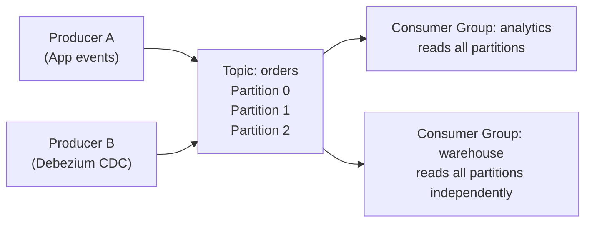
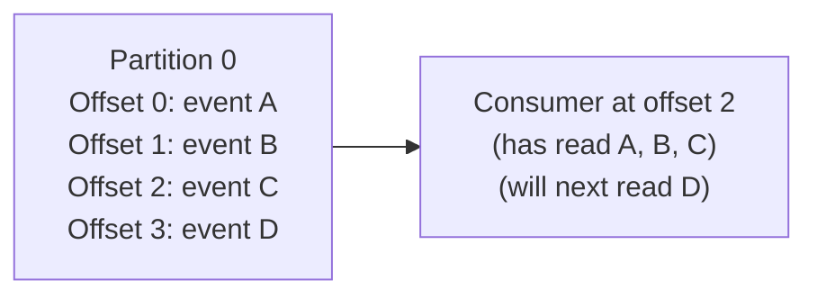
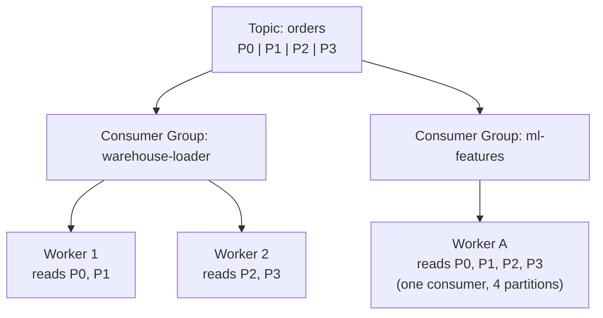
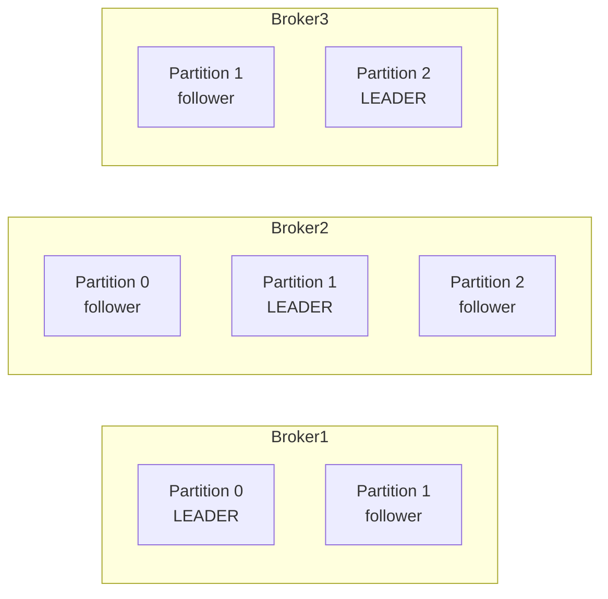
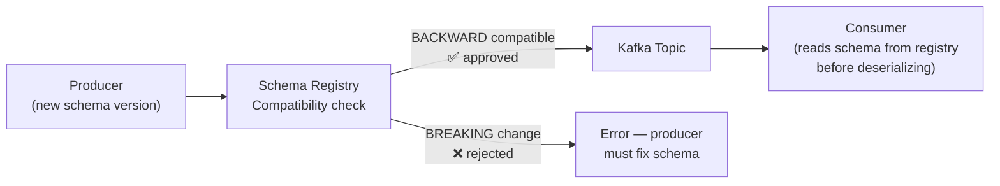

## What Kafka Is

Apache Kafka is a distributed, append-only log. Producers write records to it; consumers read from it, at their own pace, in order. The log is durable (written to disk), partitioned (split across machines for scale), and replicated (copied across brokers for fault tolerance).

Every major data engineering system design that involves high-volume events, CDC, or decoupling producers from consumers will land on Kafka. Understanding how it works — not just that it exists — is what separates strong candidates.

---

## Core Concepts



### Topics

A topic is a named, ordered, append-only log. Records are never updated or deleted mid-stream — they accumulate and expire after the configured retention period (default: 7 days, configurable to forever).

Think of a topic as a category of events: `raw-clickstream`, `order-changes`, `payment-events`.

### Partitions

Each topic is split into one or more partitions. A partition is the unit of parallelism in Kafka:

- **Ordering is guaranteed within a partition** — messages in partition 0 are read in the exact order they were written
- **Ordering is NOT guaranteed across partitions** — message 5 in partition 0 may have arrived before message 3 in partition 1
- **Each partition lives on one broker** — the partition count determines the maximum parallelism

**Choosing the partition key:**

```
# Kafka hashes the key to determine the partition
producer.send("orders", key="customer_123", value=order_event)
# All events for customer_123 always land in the same partition
# → ordering preserved per customer → session reconstruction works
```

| Partition key | When to use |
|--------------|-------------|
| `user_id` | User event streams — keeps a user's events ordered |
| `order_id` | Order status pipeline — groups all state changes for one order |
| `entity_id` | Any stateful consumer that processes one entity at a time |
| No key (round-robin) | High-volume, stateless events where order doesn't matter |

### Offsets

Each message in a partition has a monotonically increasing integer — its **offset**. Consumers track which offset they've read up to. This is what makes Kafka replayable:



Offsets are committed to a special Kafka topic (`__consumer_offsets`). If a consumer crashes and restarts, it resumes from its last committed offset — no data lost, no reprocessing from the beginning.

**Offset commit strategies:**

| Strategy | Behaviour | Risk |
|---------|-----------|------|
| Auto-commit | Kafka commits offsets periodically | Can commit before processing completes → data loss on crash |
| Manual commit (after processing) | Commit only after successful write | Re-processes on crash → at-least-once delivery |
| Manual commit (transactional) | Atomic: process + commit in one transaction | Exactly-once, but complex to implement |

### Consumer Groups

Multiple consumers can read the same topic independently via **consumer groups**. Each group maintains its own offset — different groups progress independently through the same log.

Within a group, each partition is assigned to exactly one consumer. This is how Kafka achieves parallel consumption:



**Key rule:** The maximum useful parallelism within a consumer group equals the partition count. 10 partitions → at most 10 active consumers in a group. The 11th consumer sits idle.

---

## Producers

### Producer Configuration

```python
from confluent_kafka import Producer

producer = Producer({
    'bootstrap.servers': 'kafka-broker-1:9092,kafka-broker-2:9092',
    'acks': 'all',               # Wait for all in-sync replicas to confirm
    'retries': 5,                # Retry on transient failures
    'linger.ms': 5,              # Batch messages for up to 5ms before sending
    'batch.size': 65536,         # Max batch size in bytes (64 KB)
    'compression.type': 'snappy' # Compress batches
})

producer.produce(
    topic='order-events',
    key='order_1001',
    value=json.dumps(order_event).encode('utf-8'),
    callback=delivery_report
)
producer.flush()
```

**`acks` setting — the reliability lever:**

| acks | Behaviour | Risk |
|------|-----------|------|
| `0` | Fire and forget — no confirmation | Data loss if broker crashes before write |
| `1` | Wait for leader to acknowledge | Data loss if leader crashes before replication |
| `all` (-1) | Wait for all in-sync replicas | No data loss — strongest guarantee |

**`linger.ms` and `batch.size`** — Kafka batches messages to improve throughput. `linger.ms=5` waits up to 5 milliseconds to accumulate a batch before sending. Higher values → better throughput, higher latency.

---

## Brokers and Replication

A Kafka **broker** is a server in the cluster. Each partition has:
- One **leader** — handles all reads and writes
- N **followers** (replicas) — replicate from the leader, ready to take over if the leader fails

**Replication factor:** How many copies of each partition exist. A replication factor of 3 means each partition has a leader on one broker and copies on two others. The cluster can survive the loss of 2 brokers before losing data.



---

## Retention and Log Compaction

**Time-based retention** (default): messages are deleted after a configured period (`retention.ms`). 7 days is common for streaming pipelines; indefinite retention is used when Kafka serves as the system of record.

**Log compaction**: an alternative to time-based retention. Kafka keeps only the *latest* record for each key, compacting older duplicates away. Used for changelog topics (Kafka Streams, database replication) where you only need the current state per key, not the full history.

```
Time-based retention:    [A1][A2][A3][B1][B2][C1] → after 7 days → [] (all deleted)
Log compaction:          [A1][A2][A3][B1][B2][C1] → after compaction → [A3][B2][C1]
                         (latest A, latest B, latest C — history deleted)
```

---

## Delivery Guarantees

| Guarantee | What it means | How to achieve |
|-----------|--------------|----------------|
| **At-most-once** | Messages may be lost, never duplicated | `acks=0`, auto-commit offsets before processing |
| **At-least-once** | No data loss, but duplicates possible | `acks=all`, commit offsets after processing, idempotent consumers |
| **Exactly-once** | No loss, no duplicates | Kafka transactions + idempotent producer + transactional consumer |

In practice: **at-least-once with idempotent consumers** is the standard for data pipelines. Exactly-once semantics add significant complexity and are worth it only for financial or billing-critical pipelines.

**Making a consumer idempotent:**

```python
# Idempotency via natural key — safe to process the same message twice
def process_order_event(event):
    order_id = event['order_id']
    # UPSERT by order_id — duplicate events just overwrite with same data
    db.execute("""
        INSERT INTO orders (order_id, status, updated_at)
        VALUES (%s, %s, %s)
        ON CONFLICT (order_id) DO UPDATE
        SET status = EXCLUDED.status,
            updated_at = EXCLUDED.updated_at
    """, (order_id, event['status'], event['updated_at']))
```

---

## Schema Registry

Kafka messages are opaque bytes — the broker doesn't validate schema. Without governance, producers can change field names or types silently, breaking every consumer.

**Confluent Schema Registry** stores Avro (or Protobuf/JSON Schema) schemas and enforces compatibility rules:



**Compatibility modes:**

| Mode | Rule | Safe for |
|------|------|---------|
| `BACKWARD` | New schema can read data written with old schema | Rolling consumer upgrades |
| `FORWARD` | Old schema can read data written with new schema | Rolling producer upgrades |
| `FULL` | Both backward and forward | Maximum safety |
| `NONE` | No compatibility checking | Dangerous — avoid in production |

---

## Sizing Kafka for System Design

When asked to include Kafka in a design, justify it with numbers:

**Partition count formula:**

```
Target throughput:  200 MB/sec
Per-partition max:  ~50 MB/sec (conservative for commodity hardware)
Partitions needed:  200 / 50 = 4 → round up to next power of 2 = 8 partitions

Or:
Events per second:  200,000
Desired consumer parallelism:  20 workers
Partitions needed:  20 (one per worker)
```

**Retention sizing:**

```
Daily volume:  5 TB/day
Retention:     7 days
Raw storage:   35 TB
With replication factor 3:  105 TB
With compression (5:1):     ~21 TB
```

---

## Common Interview Questions

**"Why would you use Kafka instead of writing directly to a database or S3?"**

Kafka decouples producers from consumers. The producer doesn't know or care how many consumers exist or how fast they read. It provides a durable buffer — if a consumer is down for hours, it catches up from its last offset without data loss. Writing directly to a destination creates tight coupling and no replay capability. At high throughput, Kafka's sequential disk writes are also far faster than random database writes.

**"What happens when a Kafka consumer crashes?"**

The consumer group coordinator detects the failure (via missed heartbeats) and triggers a **rebalance** — redistributing that consumer's partitions among the remaining active consumers. The new consumer starts reading from the last committed offset for those partitions. Uncommitted messages since the last commit are reprocessed — at-least-once delivery.

**"How do you prevent a slow consumer from causing the cluster to run out of disk?"**

Monitor consumer lag. Set a `max.lag.before.pause` alert threshold. Increase consumer parallelism (add more consumers up to the partition count). Increase partition count if all consumers are already saturated. In extreme cases, increase retention storage or temporarily drop the retention period on less critical topics.

**"What is the difference between a partition key and a consumer group?"**

The partition key determines which partition a message is routed to — it controls ordering and co-location (all events for the same key land together). A consumer group is a set of consumers that collectively read a topic — each partition is assigned to exactly one consumer in the group. They're independent concepts: the key affects where messages go; the group affects who reads them.

---

## Key Takeaways

- Kafka is a distributed, durable, append-only log — not a queue, not a database
- Ordering is guaranteed within a partition, not across partitions — choose your partition key to match your ordering requirement
- Consumer groups provide independent, parallel consumption — maximum parallelism = partition count
- Offsets are the consumer's bookmark — commit after processing for at-least-once; use transactions for exactly-once
- `acks=all` on producers prevents data loss; `linger.ms` and batching improve throughput
- Schema Registry enforces compatibility — prevents silent breaking changes from producers reaching consumers
- In system design: use Kafka when you need buffering for high-throughput ingest, multiple independent consumers, or replay capability
