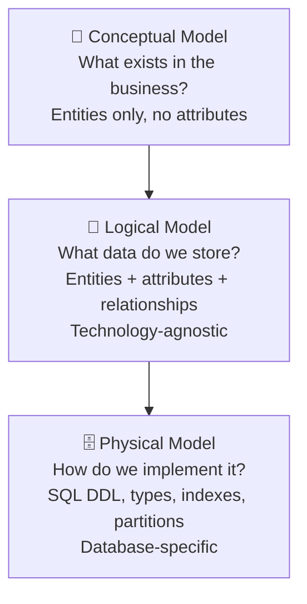
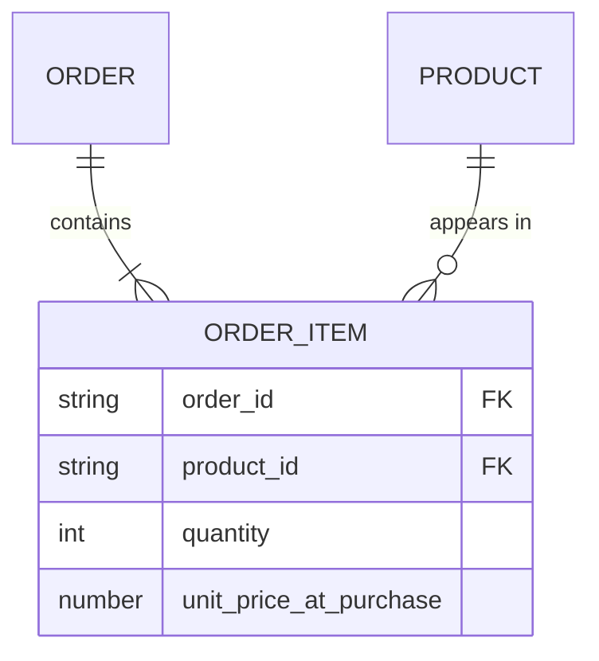
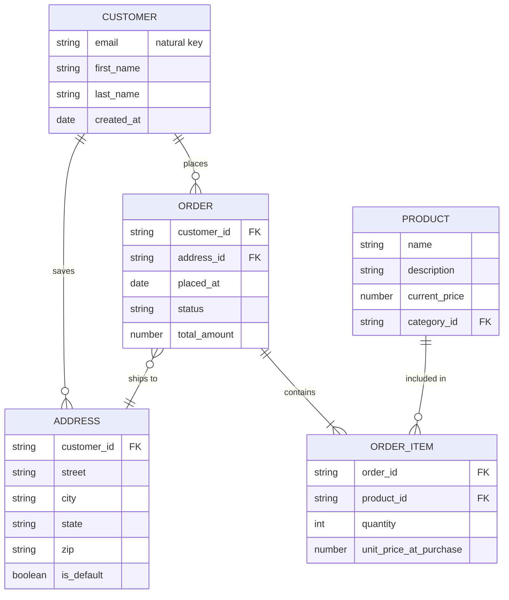
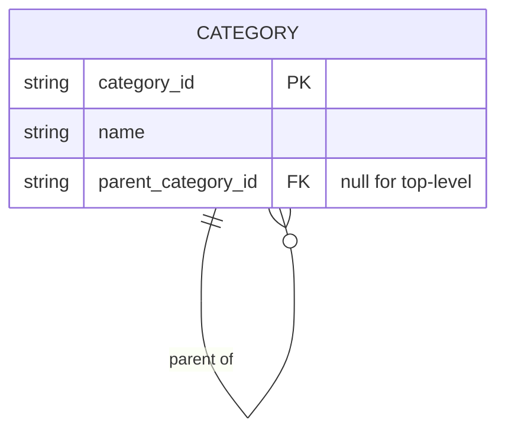

## Where Logical Modeling Fits

Every data model passes through three levels of abstraction. Understanding where the logical model sits is essential — most interview candidates skip straight to physical DDL and miss the point entirely.



When an interviewer says **"design the data model"**, they want the **logical model**. They are testing whether you can translate business requirements into a clear structure before worrying about Postgres vs Snowflake, VARCHAR lengths, or partition keys.

---

## The Three Core Concepts

### 1. Entities

An entity is a distinct thing your business needs to track. The test: *can this thing exist independently, and does the business care about multiple instances of it?*

A useful heuristic — **nouns in the requirements become entities**:

> *"Customers place orders. Each order contains products from our catalogue. Products belong to categories."*

Entities: **Customer, Order, Product, Category**. Simple.

Watch out for things that sound like entities but are really attributes. "Status" is not an entity — it's an attribute of an Order. "Shipping address" might be an entity (if customers have multiple) or just an attribute on Order (if they don't). **Clarify before modelling.**

> **Interview tip:** Always ask 2–3 clarifying questions before drawing anything. "Can a customer have multiple shipping addresses?" fundamentally changes the model.

### 2. Attributes

Attributes are the properties of an entity. Two rules:

**Keep them atomic.** Store `first_name` and `last_name` separately, not `full_name`. Store `street`, `city`, `state`, `zip` separately, not a single `address` string. You can always concatenate — you can't reliably split.

**Use business-level types at this stage.** In the logical model you say *string*, *number*, *date*, *boolean* — not `VARCHAR(255)`, `BIGINT`, `TIMESTAMPTZ`. Type specifics belong in the physical model.

| Entity | Attributes |
|--------|-----------|
| Customer | customer_id, first_name, last_name, email, created_at |
| Order | order_id, customer_id, placed_at, status, total_amount |
| Product | product_id, name, description, price, category_id |
| Category | category_id, name, parent_category_id |

### 3. Relationships and Cardinality

Cardinality answers: *how many instances of A can relate to how many instances of B?*

The three types — with a way to remember each:

**One-to-One (1:1)** — rare. One passport per person. One company per tax ID.

**One-to-Many (1:N)** — the most common. One customer places many orders. One order contains many items. The FK lives on the "many" side.

**Many-to-Many (M:N)** — always resolved by introducing a **junction table** that holds two FKs. Never store an array of IDs in a column — that violates first normal form and makes every query painful.



The junction table `ORDER_ITEM` resolves the M:N between `ORDER` and `PRODUCT`. It also carries its own meaningful attributes — `quantity` and `unit_price_at_purchase`.

---

## Keys at the Logical Level

A common gap in candidate answers is confusing **natural keys** with **surrogate keys**. Here's where each belongs:

**Natural key** — a real-world identifier that already exists in the business: email address, order number, ISBN. At the logical level, use natural keys to express business identity.

**Surrogate key** — a system-generated meaningless ID (integer sequence, UUID). You introduce these at the **physical** level, not the logical level, for performance and stability reasons.

> In the logical model, `Customer` is uniquely identified by `email`. In the physical model, you might add `customer_id` as a BIGSERIAL surrogate key because joins on integers are faster and emails can change.

Interviewers who ask *"how would you handle a customer changing their email?"* are probing whether you understand this distinction.

---

## Worked Example — Deriving the Model Step by Step

**Requirements given in the interview:**

> "We sell products online. Customers register, place orders, and can save multiple shipping addresses. Each order ships to one address. An order can contain multiple products and we need to track how many of each."

**Step 1 — Extract entities from the nouns:**

- Customers → **Customer**
- Products → **Product**
- Orders → **Order**
- Shipping addresses → **Address** *(multiple per customer, so it's an entity not just an attribute)*

**Step 2 — Determine relationships and cardinality:**

- Customer places Orders → 1:N (one customer, many orders)
- Customer saves Addresses → 1:N (one customer, many addresses)
- Order ships to Address → N:1 (many orders can ship to the same saved address)
- Order contains Products → M:N → resolve with **OrderItem**

**Step 3 — Spot attributes that need special treatment:**

What price should `OrderItem` store? The product's current price changes over time. For accurate revenue reporting you need the price **at the moment of purchase** — so `OrderItem` carries `unit_price_at_purchase` as a snapshot, not a pointer to the current product price.

**Step 4 — Draw the ERD:**



---

## Self-Referential Relationships

The `Category` entity deserves its own explanation because it trips people up. Categories can be hierarchical:

```
Electronics
  └── Computers
        └── Laptops
  └── Phones
Books
  └── Fiction
```

Modelling this doesn't require separate tables for each level. A single `Category` table with a `parent_category_id` that points back to itself handles any depth:



This is called a **self-referential** (or recursive) relationship. Top-level categories have `parent_category_id = NULL`. Query the full tree with a recursive CTE.

---

## Logical vs Physical — The Key Differences

| Aspect | Logical Model | Physical Model |
|--------|--------------|----------------|
| Focus | Business rules and relationships | Database implementation |
| Data types | Generic: string, number, date, boolean | Specific: VARCHAR(255), BIGINT, TIMESTAMPTZ |
| Keys | Natural / business keys | Surrogate keys (BIGSERIAL, UUID) introduced here |
| Indexes | Not defined | Defined and tuned for query patterns |
| Partitioning | Not defined | Defined based on access patterns |
| Constraints | Conceptual (e.g. "email must be unique") | Explicit DDL constraints |
| Technology | Database-agnostic | Postgres, Snowflake, BigQuery, etc. |

---

## Common Interview Questions

**"How do you model a many-to-many relationship?"**

Introduce a junction table that holds a FK to each side. The junction table often carries its own attributes — `OrderItem` has `quantity` and `unit_price_at_purchase`. Never store arrays of IDs in a column.

**"A customer changes their email. How does your model handle that?"**

If `email` is the natural key everywhere, every child record needs updating — risky. This is exactly why the physical model introduces a surrogate key (`customer_id`). The email change becomes a single-row update on `Customer`. Everything else joins on the stable surrogate key.

**"What's the difference between a logical and physical data model?"**

Logical expresses *what* data exists and how it relates, using business language and generic types — technology-agnostic. Physical is *how* that model is implemented in a specific database: concrete types, surrogate keys, indexes, partitions, and constraints.

**"Why put `unit_price_at_purchase` on the line item instead of looking it up from the product?"**

Product prices change. If you only store a FK to the product, historical revenue reports show wrong numbers the moment the price is updated. Snapshotting the price at purchase time is intentional denormalization — and the right call.

---

## Key Takeaways

- The logical model sits between conceptual (entities only) and physical (DDL) — always build it before writing SQL
- Natural keys express business identity in the logical model; surrogate keys are a physical-layer performance decision introduced later
- Resolve every M:N relationship with a junction table — never store arrays of IDs in a column
- Keep attributes atomic and use generic types (string, number, date) at this stage
- Snapshot facts that change over time (prices, rates) — don't rely on a pointer to the current value
- Self-referential relationships model hierarchies in a single table using a nullable FK back to the same table
- Ask clarifying questions before drawing anything — one ambiguous requirement changes the entire model
