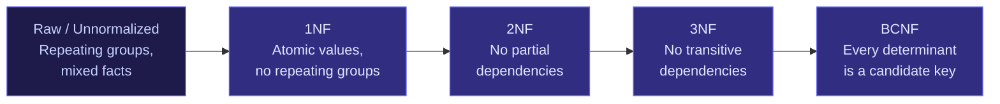
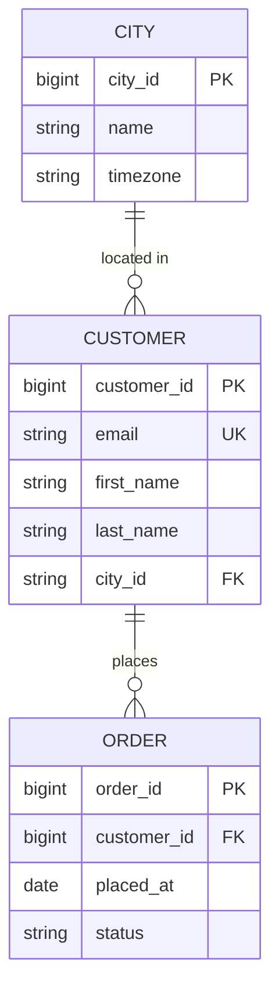
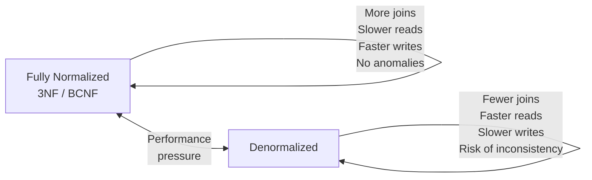

## What Normalization Is and Why It Matters

Normalization is the process of structuring a relational database to reduce data redundancy and prevent update anomalies. It works by decomposing tables into smaller, more focused ones and defining precise relationships between them.

The result is a model where every piece of data lives in exactly one place. When a customer's email changes, you update one row in one table — not twenty rows scattered across five tables.

**The three anomalies normalization prevents:**

| Anomaly | What goes wrong |
|---------|----------------|
| **Update anomaly** | The same fact is stored in multiple rows. Update one, miss the others. Data becomes inconsistent. |
| **Insert anomaly** | You can't record a fact without inventing fake data to satisfy NOT NULL constraints on unrelated columns. |
| **Deletion anomaly** | Deleting a row wipes out a fact that should be preserved independently. |

These anomalies all come from the same root cause: putting facts about different things in the same table.

---

## The Normal Forms

Normal forms are a progression. Each level fixes a specific class of problem. In interviews, you need 1NF through 3NF fluently — BCNF is a bonus.

Each level is cumulative: a table in 3NF is also in 2NF and 1NF.

---

## First Normal Form (1NF)

**Rule:** Every cell contains a single, atomic value. No repeating groups, no arrays, no comma-separated lists.

**Unnormalized — violates 1NF:**

| order_id | customer_name | products |
|----------|--------------|---------|
| 1001 | Alice | "Laptop, Mouse, Keyboard" |
| 1002 | Bob | "Monitor" |

Problems: you can't query "all orders containing a Laptop" without a `LIKE '%Laptop%'` hack. You can't count products per order. You can't join to the product table.

**After 1NF — one product per row:**

| order_id | customer_name | product |
|----------|--------------|---------|
| 1001 | Alice | Laptop |
| 1001 | Alice | Mouse |
| 1001 | Alice | Keyboard |
| 1002 | Bob | Monitor |

Now each cell is atomic. But notice `customer_name` repeats with every product — that's a different problem, handled in 2NF.

> **Interview tip:** Storing arrays or JSON blobs in a column to avoid creating a join table is one of the most common schema mistakes. It always comes back to bite you at query time.

---

## Second Normal Form (2NF)

**Rule:** The table must be in 1NF, and every non-key column must depend on the *whole* primary key — not just part of it.

2NF only applies to tables with **composite primary keys**. If a table has a single-column PK, it's automatically in 2NF.

**After 1NF — still violates 2NF:**

| order_id | product_id | customer_name | customer_email | quantity |
|----------|-----------|--------------|---------------|---------|
| 1001 | P01 | Alice | alice@x.com | 1 |
| 1001 | P02 | Alice | alice@x.com | 2 |
| 1002 | P03 | Bob | bob@x.com | 1 |

The composite PK is `(order_id, product_id)`. But `customer_name` and `customer_email` depend only on `order_id` — not on `product_id`. That's a **partial dependency**.

If Alice changes her email, every row for every product in her orders needs updating. Miss one — inconsistency.

**After 2NF — split on the partial dependency:**

`order_item` table:

| order_id | product_id | quantity |
|----------|-----------|---------|
| 1001 | P01 | 1 |
| 1001 | P02 | 2 |
| 1002 | P03 | 1 |

`order` table:

| order_id | customer_name | customer_email |
|----------|--------------|---------------|
| 1001 | Alice | alice@x.com |
| 1002 | Bob | bob@x.com |

Now `customer_email` lives in exactly one place. But `customer_name` and `customer_email` are still both in the `order` table, and one depends on the other — that's handled in 3NF.

---

## Third Normal Form (3NF)

**Rule:** The table must be in 2NF, and no non-key column may depend on another non-key column. All non-key columns must depend *only* on the primary key.

A dependency between two non-key columns is called a **transitive dependency**.

**After 2NF — `order` still violates 3NF:**

| order_id | customer_id | customer_name | customer_email | customer_city | city_timezone |
|----------|------------|--------------|---------------|--------------|--------------|
| 1001 | C01 | Alice | alice@x.com | New York | America/New_York |
| 1002 | C02 | Bob | bob@x.com | London | Europe/London |

The PK is `order_id`. The transitive chain: `order_id → customer_id → customer_name, customer_email, customer_city → city_timezone`.

`city_timezone` depends on `customer_city`, not directly on `order_id`. That's a transitive dependency.

**After 3NF — each table holds facts about one thing:**

Now `timezone` lives in `CITY`. Add a city once, and every customer in that city automatically gets the right timezone. No update anomaly possible.

---

## Boyce-Codd Normal Form (BCNF)

**Rule:** For every functional dependency `X → Y`, X must be a candidate key.

BCNF is stricter than 3NF. A table can be in 3NF but violate BCNF when there are multiple overlapping candidate keys.

**Example — course scheduling:**

| student_id | course | instructor |
|------------|--------|-----------|
| S1 | Database | Prof. Chen |
| S1 | Algorithms | Prof. Kim |
| S2 | Database | Prof. Chen |

Assume: each course has exactly one instructor, but each instructor teaches only one course.

Candidate keys: `(student_id, course)` and `(student_id, instructor)`.

`course → instructor` is a functional dependency where `course` is not a candidate key — BCNF violation.

BCNF fix — split into two tables:

| student_id | course |
|------------|--------|
| S1 | Database |
| S1 | Algorithms |

| course | instructor |
|--------|-----------|
| Database | Prof. Chen |
| Algorithms | Prof. Kim |

> **Interview guidance:** In practice, if you reach 3NF you've eliminated all the anomalies that matter for most systems. BCNF comes up in interviews as a concept question — know the definition and the "multiple candidate keys" scenario.

---

## Functional Dependencies — The Underlying Theory

Behind every normal form is the concept of a **functional dependency**: column A *determines* column B (written `A → B`) if knowing A's value always tells you B's value.

| Dependency | Example |
|-----------|---------|
| `customer_id → email` | Each customer has one email |
| `(order_id, product_id) → quantity` | Quantity is specific to an order-product pair |
| `zip_code → city` | A zip uniquely maps to a city |
| `city → zip_code` | Does NOT hold — a city has many zips |

Normalization is the process of reorganising tables so that all dependencies go through candidate keys, never through non-key columns.

---

## When to Denormalize

A fully normalized schema is the correct starting point. Denormalization is a deliberate, performance-driven deviation from it — done *after* you identify a bottleneck, not preemptively.

**Reasons to denormalize:**

| Scenario | Technique |
|---------|-----------|
| A join across 5 tables is too slow for a dashboard | Add a derived summary column or a pre-joined reporting table |
| Counting total order items per order on every page load | Add `item_count` column to `order`, updated via trigger |
| Analytical queries always join `order` + `customer` | Build a wide denormalized fact table in the warehouse |
| Price history is queried alongside order items constantly | Snapshot `unit_price_at_purchase` on `order_item` (intentional redundancy) |

**The tradeoff:**

Denormalization trades write complexity and consistency risk for read speed. In OLTP systems, normalize first. In analytical / warehouse systems, controlled denormalization is standard practice.

> **Interview tip:** The correct answer to "would you denormalize this?" is never a flat yes or no. It's: "I'd normalize the OLTP layer and build a denormalized read model for analytical queries — keeping the source of truth clean and the query layer fast."

---

## Normalization in Practice — The E-Commerce Schema

The e-commerce schema from the previous articles is already in 3NF. Here's why each table passes:

| Table | 1NF | 2NF | 3NF | Why |
|-------|-----|-----|-----|-----|
| `customer` | ✅ | ✅ | ✅ | Single PK; all columns depend only on `customer_id` |
| `order` | ✅ | ✅ | ✅ | Single PK; status/total depend on `order_id` only |
| `order_item` | ✅ | ✅ | ✅ | Composite PK `(order_id, product_id)`; `quantity` and `unit_price_at_purchase` depend on both |
| `product` | ✅ | ✅ | ✅ | Single PK; all attributes describe the product |
| `address` | ✅ | ✅ | ✅ | Single PK; all address fields describe the address |
| `category` | ✅ | ✅ | ✅ | Self-referential with nullable FK — no transitive deps |

A common mistake would be adding `customer_name` to the `order` table for "convenience." That would introduce a transitive dependency: `order_id → customer_id → customer_name`. If the customer updates their name, you'd have to update every order row.

---

## Common Interview Questions

**"What is normalization and why do we do it?"**

Normalization organizes a schema to eliminate redundancy and prevent update, insert, and deletion anomalies. The goal is that every fact is stored in exactly one place — so any update touches one row, not many.

**"Explain 1NF, 2NF, and 3NF with an example."**

1NF: atomic values, no repeating groups. 2NF: no partial dependencies on a composite key — split columns that depend on only part of the key into a separate table. 3NF: no transitive dependencies — if column C depends on column B which depends on the PK, move C and B into their own table.

**"What is a transitive dependency?"**

A non-key column that depends on another non-key column rather than directly on the primary key. Example: `order` table with `customer_city` and `city_timezone` — `timezone` depends on `city`, not directly on `order_id`. Fix: extract `city` into its own table.

**"When would you intentionally denormalize?"**

When you have measured, not assumed, a performance problem caused by joins. Common cases: pre-aggregating counts, snapshotting values that change over time (like price at purchase), or building a wide denormalized fact table in a data warehouse for analytical query performance.

**"Is the `unit_price_at_purchase` column on `order_item` a normalization violation?"**

Technically it's a form of intentional denormalization — the current price lives in `product`, and `unit_price_at_purchase` duplicates that data point. But it's the right design decision: product prices change, and you need the price as it was at purchase time for accurate revenue reporting. This is a deliberate snapshot, not an oversight.

---

## Key Takeaways

- Normalization eliminates redundancy by ensuring every fact lives in exactly one place
- The three anomalies it prevents: update (stale copies), insert (forced fake data), deletion (accidental fact loss)
- 1NF: atomic values, no arrays — 2NF: no partial dependencies on composite keys — 3NF: no transitive dependencies between non-key columns
- BCNF is 3NF's stricter sibling — every determinant must be a candidate key
- Normalize OLTP schemas to 3NF by default; denormalize deliberately when queries are measurably slow
- Snapshotting a value (like price at purchase) is intentional denormalization — not a mistake
- In warehouses, wide denormalized fact tables are standard and correct — the source system should remain normalized
