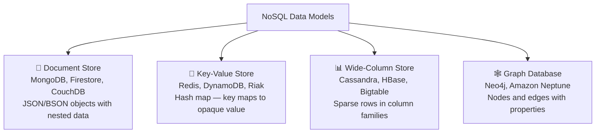
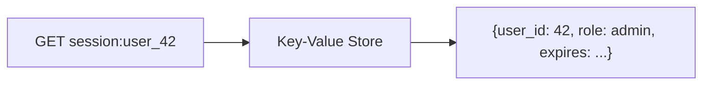
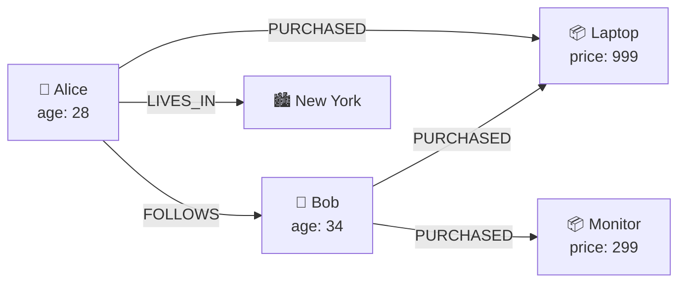

## Why NoSQL Exists

Relational databases solved most data problems exceptionally well for decades. NoSQL emerged not to replace them, but to handle the cases where the relational model creates friction:

| Pressure | Relational weakness | NoSQL response |
|---------|-------------------|---------------|
| Massive horizontal scale | Sharding a normalized schema across nodes is complex; joins across shards are expensive | Design for a single partition — no cross-node joins needed |
| Flexible, evolving schemas | ALTER TABLE on a billion-row table is painful; all rows must share the same structure | Schema-less or schema-per-document — add fields freely |
| High-speed writes | ACID transactions + B-tree index maintenance add write overhead | Eventual consistency, simpler storage structures |
| Hierarchical or graph data | Recursive CTEs and many self-joins to model trees or networks | Native document nesting or graph traversal |

The key principle: **NoSQL databases trade generality for specialization**. Each type is optimized for a specific access pattern — and performs poorly outside it.

---

## The Four NoSQL Data Model Types



---

## Document Stores

**Best for:** Content management, user profiles, product catalogs, any entity with variable attributes.

A document is a self-contained JSON or BSON object. The key design decision is **embed vs reference** — the document equivalent of normalization vs denormalization.

### Embedding (denormalized)

Store related data inside the parent document:

```json
{
  "_id": "order_1001",
  "customer": {
    "id": "C01",
    "name": "Alice",
    "email": "alice@example.com"
  },
  "items": [
    { "product_id": "P01", "name": "Laptop", "qty": 1, "price": 999.00 },
    { "product_id": "P02", "name": "Mouse",  "qty": 2, "price": 29.99 }
  ],
  "placed_at": "2024-01-15T10:30:00Z",
  "status": "shipped"
}
```

**Pros:** Single read returns everything needed to display an order. No joins. Fast.

**Cons:** If Alice's email changes, you must update every order document. The embedded items array grows unboundedly if unconstrained.

### Referencing (normalized)

Store a foreign key and look up the related document separately:

```json
{
  "_id": "order_1001",
  "customer_id": "C01",
  "item_ids": ["OI_01", "OI_02"],
  "placed_at": "2024-01-15T10:30:00Z",
  "status": "shipped"
}
```

**Pros:** No duplication — updating a customer is a single write.

**Cons:** Loading an order requires multiple round-trips (application-side joins).

### The embed-vs-reference decision

| Embed when | Reference when |
|-----------|---------------|
| Data is always read together | Data is read independently |
| The sub-document has a bounded size | The array can grow without limit |
| The sub-document is owned exclusively by the parent | The sub-document is shared across many parents |
| Updates to sub-documents are infrequent | Updates to sub-documents are frequent |

> **Interview tip:** A common document store mistake is embedding everything because "NoSQL means no joins." The right answer is: embed what you always read together, reference what you read independently or update frequently. The access pattern drives the decision.

---

## Key-Value Stores

**Best for:** Session storage, caches, rate limiting, leaderboards, feature flags. Any lookup where you know the exact key.

The model is a distributed hash map: you write `key → value` and retrieve by exact key. The value is opaque — the database doesn't parse or index it.



**Redis** extends this with typed values (lists, sorted sets, hashes) that enable patterns like:

| Redis type | Use case |
|-----------|---------|
| String | Simple cache, counters (`INCR page_views`) |
| Hash | User session (field per attribute) |
| Sorted Set | Leaderboard (score + member, range queries) |
| List | Message queue, recent activity feed |
| Set | Unique visitors, tag intersection |

**DynamoDB** is technically a key-value store that also supports document-style access. Its design philosophy is the foundation of single-table design — covered below.

---

## Wide-Column Stores

**Best for:** Time-series data, IoT sensor readings, event logs, anything with massive write throughput and time-range queries.

The model: rows are identified by a **partition key** (row key). Each row can have different columns. Columns are grouped into **column families** and physically co-located on disk.

**Cassandra's data model:**

```
Partition Key → determines which node holds the data
Clustering Key → determines sort order within a partition
```

The table definition encodes the access pattern. Design for reads, not for normalization.

**Example — IoT sensor readings:**

```sql
CREATE TABLE sensor_readings (
  sensor_id   UUID,
  recorded_at TIMESTAMP,
  temperature FLOAT,
  humidity    FLOAT,
  PRIMARY KEY (sensor_id, recorded_at)
) WITH CLUSTERING ORDER BY (recorded_at DESC);
```

`sensor_id` is the partition key — all readings for one sensor are on the same node.
`recorded_at` is the clustering key — readings are sorted newest-first within that partition.

**Query this table efficiently:**
```sql
-- All readings for sensor X in the last hour
SELECT * FROM sensor_readings
WHERE sensor_id = ? AND recorded_at >= ?;
```

**You cannot efficiently run:**
```sql
-- All sensors with temperature above 30 — full table scan, not possible at scale
SELECT * FROM sensor_readings WHERE temperature > 30;
```

This is the core tradeoff: Cassandra is extremely fast for the queries it was designed for, and completely unable to handle ad-hoc queries outside that design.

> **Interview tip:** When asked to design a Cassandra schema, always ask "what are the query patterns?" first. The answer determines the partition key. A table designed for the wrong access pattern will never perform.

---

## Graph Databases

**Best for:** Social networks, recommendation engines, fraud detection, knowledge graphs — anything where the *relationships* are as important as the data itself.

The model: **nodes** (entities) and **edges** (relationships), both carrying properties.



A SQL query to find "products purchased by people Alice follows" requires multiple joins across large tables. In a graph database, this is a traversal:

```
MATCH (alice:User {name: 'Alice'})-[:FOLLOWS]->(friend)-[:PURCHASED]->(product)
RETURN product.name, COUNT(*) as purchase_count
ORDER BY purchase_count DESC
```

---

## DynamoDB and Single-Table Design

DynamoDB is the dominant managed NoSQL service and a frequent interview topic. Its design philosophy is the most alien to developers coming from SQL.

**Core concepts:**

| Concept | What it means |
|---------|--------------|
| Partition Key (PK) | Routes the item to a node. All items with the same PK live together. |
| Sort Key (SK) | Orders items within a partition. Enables range queries within one partition. |
| GSI (Global Secondary Index) | A copy of the table with a different PK/SK — enables different query patterns |

**Single-table design** puts multiple entity types in one table. The PK and SK use prefixes to differentiate entities and model relationships.

**Example — e-commerce in a single DynamoDB table:**

| PK | SK | Attributes |
|----|-----|-----------|
| `CUSTOMER#C01` | `METADATA` | `{name: "Alice", email: "..."}` |
| `CUSTOMER#C01` | `ORDER#2024-01-15#1001` | `{status: "shipped", total: 1058.98}` |
| `CUSTOMER#C01` | `ORDER#2024-01-20#1002` | `{status: "pending", total: 299.00}` |
| `ORDER#1001` | `ITEM#P01` | `{product: "Laptop", qty: 1, price: 999.00}` |
| `ORDER#1001` | `ITEM#P02` | `{product: "Mouse", qty: 2, price: 29.99}` |

**Access patterns this enables:**

```
# Get customer profile
PK = CUSTOMER#C01, SK = METADATA

# Get all orders for customer, newest first
PK = CUSTOMER#C01, SK begins_with ORDER#

# Get all items in order 1001
PK = ORDER#1001, SK begins_with ITEM#
```

All three are single-partition reads — no cross-node operations, sub-millisecond latency at any scale.

> **Interview tip:** DynamoDB single-table design feels backwards coming from SQL. You design the table *around* your access patterns, not around your entities. Write down every query you need to support before choosing PK/SK — there's no fixing it later without a rewrite.

---

## Choosing the Right Database

The right question isn't "SQL or NoSQL?" — it's "what are my access patterns, consistency requirements, and scale constraints?"

| Requirement | Reach for |
|------------|---------|
| Complex queries, ad-hoc analysis, strong consistency, transactions | PostgreSQL / MySQL |
| Flexible schema, hierarchical documents, moderate scale | MongoDB / Firestore |
| Ultra-low latency lookups, caching, session storage | Redis |
| Massive write throughput, time-series, wide rows | Cassandra / HBase |
| Highly connected data, relationship traversal | Neo4j / Neptune |
| Managed key-value at cloud scale, predictable latency | DynamoDB |
| Analytical queries over billions of rows | BigQuery / Snowflake / Redshift |

**Don't use NoSQL to avoid learning SQL.** Most systems need both: a relational OLTP source of truth plus a specialized store for a specific use case (cache, search index, event log).

---

## Common Interview Questions

**"When would you choose NoSQL over a relational database?"**

When you have one of the specific pressures NoSQL addresses: horizontal scale that makes sharding a relational schema impractical, a flexible schema where entities have wildly variable attributes, high-velocity writes where relational overhead is the bottleneck, or data that's naturally a graph or document. Not because "NoSQL is faster" — it depends entirely on the access pattern.

**"What is the embed-vs-reference decision in document stores?"**

Embed data that is always read together, has bounded size, and is owned exclusively by the parent document. Reference data that is updated frequently, shared across many documents, or read independently. Embedding everything leads to stale duplicated data; referencing everything leads to expensive application-side joins.

**"How does Cassandra's data model differ from a relational model?"**

In Cassandra, the schema is designed for a specific set of queries, not for normalized correctness. The partition key determines data placement (and must be in every query's WHERE clause). Joins don't exist. Denormalization is expected — you maintain multiple tables to support multiple query patterns. The trade: extreme write throughput and linear horizontal scale in exchange for query flexibility.

**"Explain DynamoDB's partition key and sort key."**

The partition key routes an item to a storage node — all items sharing a PK are on the same node. The sort key orders items within a partition and enables range queries (`begins_with`, `between`, `>`). Together they define the primary key and the two query dimensions available without a secondary index. Secondary indexes let you project the data with a different PK/SK to support additional access patterns.

**"What is an access pattern, and why does it matter for NoSQL design?"**

An access pattern is a specific query your application runs: "get all orders for a customer, newest first" or "get all items in an order." In relational databases you can write arbitrary queries after the fact. In NoSQL, the schema must be designed for the queries upfront — there's no optimizer to bail you out. Listing access patterns before designing is not optional; it's the design process.

---

## Key Takeaways

- NoSQL trades query generality for specialization — each type is optimized for specific access patterns
- The four types: document (hierarchical data), key-value (exact lookups), wide-column (high-volume time-series), graph (connected data)
- In document stores, embed what you always read together; reference what you update frequently or share across documents
- Cassandra schemas encode the query pattern — the partition key must appear in every query's WHERE clause
- DynamoDB single-table design co-locates related entities using PK/SK prefixes — designed around access patterns, not entities
- Use NoSQL alongside SQL, not instead of it — relational remains the right default for most transactional systems
- The design process: write down every access pattern first, then choose the data model and keys
