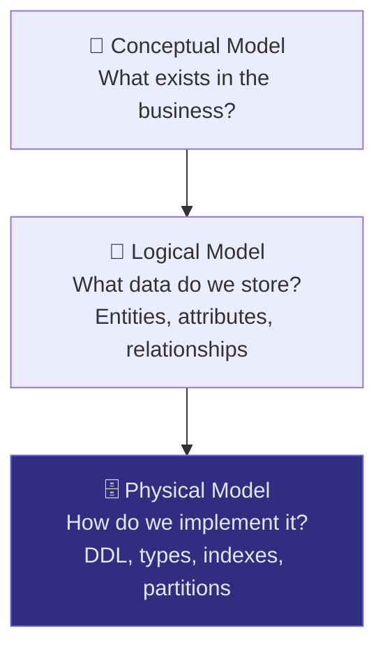
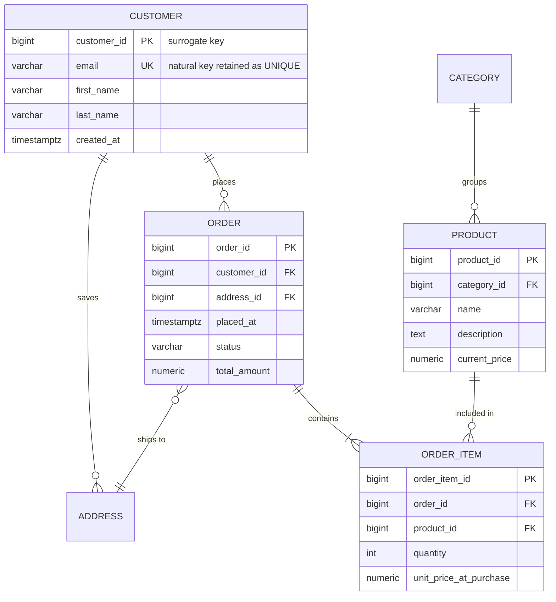

## Where Physical Modeling Fits

The physical model is the last step in the three-tier process. You take the technology-agnostic logical model and translate it into a concrete implementation for a specific database system.



The physical model is where you make decisions that directly affect **query performance, storage cost, and maintainability**. The same logical model produces a very different physical model depending on whether you're targeting Postgres, Snowflake, or BigQuery.

---

## What Changes From Logical to Physical

These are the five decisions you make at the physical layer that don't exist in the logical model:

| Decision | Logical | Physical |
|----------|---------|---------|
| Key type | Natural key (email, order_number) | Surrogate key (BIGSERIAL, UUID) |
| Data types | Generic (string, number, date) | Specific (VARCHAR(255), BIGINT, TIMESTAMPTZ) |
| Indexes | Not defined | B-tree, composite, partial |
| Partitioning | Not defined | By date, range, hash |
| Constraints | Conceptual | DDL: NOT NULL, UNIQUE, CHECK, FK |

---

## Surrogate Keys

The first physical decision: replace natural keys with surrogate keys.

**Why not just use the natural key?**

- Natural keys change. Email addresses change. Order numbers get reformatted when you migrate systems. A customer's national ID might be reassigned.
- Natural keys are often strings — joining on a `VARCHAR(255)` across millions of rows is slower than joining on a `BIGINT`.
- Natural keys from external systems can be null, duplicated, or inconsistent.

**BIGSERIAL vs UUID — which to choose?**

| | BIGSERIAL (auto-increment) | UUID (v4) |
|---|---|---|
| Storage | 8 bytes | 16 bytes |
| Join performance | Faster (integer comparison) | Slower |
| Insert performance | Sequential — great for B-tree indexes | Random — can fragment indexes |
| Globally unique | No (only within table) | Yes (safe to merge datasets) |
| Best for | Single-database OLTP systems | Distributed systems, microservices, merging data across sources |

> **Interview guidance:** Default to BIGSERIAL for most cases. Choose UUID when you need global uniqueness — merging records from multiple source systems, or when IDs are exposed externally and you don't want them guessable.

---

## Choosing Data Types

Every column needs a concrete type. The rules of thumb:

**Strings**
- Use `VARCHAR(n)` when you know the upper bound (email → `VARCHAR(255)`, country code → `CHAR(2)`)
- Use `TEXT` for unbounded text (product description, notes)
- Never use `VARCHAR` without a length in systems where it matters (Snowflake ignores it, but Postgres enforces it)

**Numbers**
- `BIGINT` for IDs and counts (safe up to ~9.2 quadrillion)
- `INT` for small counts where you're confident of the range
- `DECIMAL(p, s)` / `NUMERIC` for money — **never use FLOAT for currency** (floating point rounding errors will corrupt your financial data)
- `FLOAT` only for scientific measurements where small rounding errors are acceptable

**Dates and Times**
- `TIMESTAMPTZ` (timestamp with timezone) as the default — always store timestamps in UTC
- `DATE` for calendar dates with no time component (birth date, report date)
- `INTERVAL` for durations

**Booleans**
- `BOOLEAN` directly — don't model true/false as `CHAR(1)` ('Y'/'N') or `INT` (1/0)

---

## Translating the E-Commerce Logical Model

Taking the logical model from Article 1 and producing the physical DDL:



And the actual DDL:

```sql
CREATE TABLE customer (
  customer_id   BIGSERIAL     PRIMARY KEY,
  email         VARCHAR(255)  NOT NULL UNIQUE,   -- natural key retained as unique constraint
  first_name    VARCHAR(100)  NOT NULL,
  last_name     VARCHAR(100)  NOT NULL,
  created_at    TIMESTAMPTZ   NOT NULL DEFAULT now()
);

CREATE TABLE address (
  address_id    BIGSERIAL     PRIMARY KEY,
  customer_id   BIGINT        NOT NULL REFERENCES customer(customer_id),
  street        VARCHAR(255)  NOT NULL,
  city          VARCHAR(100)  NOT NULL,
  state         VARCHAR(100),
  zip           VARCHAR(20),
  country       CHAR(2)       NOT NULL DEFAULT 'US',
  is_default    BOOLEAN       NOT NULL DEFAULT false
);

CREATE TABLE product (
  product_id    BIGSERIAL     PRIMARY KEY,
  category_id   BIGINT        NOT NULL REFERENCES category(category_id),
  name          VARCHAR(255)  NOT NULL,
  description   TEXT,
  current_price NUMERIC(10,2) NOT NULL CHECK (current_price >= 0)
);

CREATE TABLE "order" (
  order_id      BIGSERIAL     PRIMARY KEY,
  customer_id   BIGINT        NOT NULL REFERENCES customer(customer_id),
  address_id    BIGINT        NOT NULL REFERENCES address(address_id),
  placed_at     TIMESTAMPTZ   NOT NULL DEFAULT now(),
  status        VARCHAR(20)   NOT NULL DEFAULT 'pending'
                              CHECK (status IN ('pending','processing','shipped','delivered','cancelled')),
  total_amount  NUMERIC(12,2) NOT NULL CHECK (total_amount >= 0)
);

CREATE TABLE order_item (
  order_item_id         BIGSERIAL     PRIMARY KEY,
  order_id              BIGINT        NOT NULL REFERENCES "order"(order_id),
  product_id            BIGINT        NOT NULL REFERENCES product(product_id),
  quantity              INT           NOT NULL CHECK (quantity > 0),
  unit_price_at_purchase NUMERIC(10,2) NOT NULL CHECK (unit_price_at_purchase >= 0)
);
```

---

## Indexes

Indexes are the single biggest lever for query performance. The rule: **index columns you filter on, join on, or sort by frequently**.

**B-tree (default)** — works for equality, range, `ORDER BY`, `LIKE 'prefix%'`. The right choice 90% of the time.

**Composite index** — index multiple columns together. Column order matters: put the highest-cardinality or most-frequently-filtered column first.

```sql
-- Retrieve all orders for a customer, newest first
-- Query: WHERE customer_id = ? ORDER BY placed_at DESC
CREATE INDEX idx_order_customer_placed ON "order" (customer_id, placed_at DESC);

-- Look up a customer by email (login flow)
-- Already covered by the UNIQUE constraint, which creates an index automatically

-- Find all order items for a given order
CREATE INDEX idx_order_item_order ON order_item (order_id);

-- Find all products in a category
CREATE INDEX idx_product_category ON product (category_id);
```

**Partial index** — index only a subset of rows. Much smaller and faster when you query a specific subset constantly:

```sql
-- Only index active/in-flight orders — completed orders rarely queried by status
CREATE INDEX idx_order_active ON "order" (customer_id, placed_at)
WHERE status IN ('pending', 'processing', 'shipped');
```

**What NOT to index:**
- Low-cardinality columns like `status` or `country` on their own — the query planner often ignores them
- Every column — indexes slow down INSERT, UPDATE, and DELETE
- Columns in `SELECT` but not `WHERE` or `JOIN`

---

## Constraints

Constraints enforce business rules at the database level — not in application code where they can be bypassed.

```sql
-- NOT NULL: columns that must always have a value
-- UNIQUE: enforces business-key uniqueness (and creates an index)
-- CHECK: validates a condition at insert/update time
-- FOREIGN KEY: enforces referential integrity

-- These were already shown in the DDL above — key callouts:
CHECK (quantity > 0)               -- can't have zero or negative items in an order
CHECK (current_price >= 0)         -- prices can't be negative
CHECK (status IN ('pending', ...)) -- only valid statuses allowed
```

> **Interview tip:** When asked "where would you enforce business rules?", the answer is *both* — constraints at the DB layer as a safety net, and validation in the application layer for user-friendly error messages. Never rely on application code alone; it can be bypassed.

---

## Partitioning

Partitioning splits a large table into smaller physical pieces while keeping it logically one table. The query planner can skip irrelevant partitions entirely — called **partition pruning**.

**When to partition:** tables with hundreds of millions of rows where queries almost always filter on a specific column (usually a date).

**Range partitioning by date** (most common for data engineering):

```sql
-- Partition the order table by month
CREATE TABLE "order" (
  order_id     BIGSERIAL,
  placed_at    TIMESTAMPTZ NOT NULL,
  ...
) PARTITION BY RANGE (placed_at);

CREATE TABLE order_2024_01 PARTITION OF "order"
  FOR VALUES FROM ('2024-01-01') TO ('2024-02-01');

CREATE TABLE order_2024_02 PARTITION OF "order"
  FOR VALUES FROM ('2024-02-01') TO ('2024-03-01');
```

A query `WHERE placed_at >= '2024-01-01' AND placed_at < '2024-02-01'` only scans `order_2024_01` — the planner skips every other partition.

**In column-store warehouses** (Snowflake, BigQuery, Redshift):

| Platform | Concept | How it works |
|----------|---------|-------------|
| Snowflake | Micro-partitioning | Automatic; use **clustering keys** to co-locate related rows |
| BigQuery | Partitioning + Clustering | Partition on a DATE/TIMESTAMP column; cluster on 1–4 additional columns |
| Redshift | Distribution key + Sort key | Controls which node data lives on and how it's sorted on disk |

---

## Common Interview Questions

**"Why use a surrogate key instead of the natural key?"**

Natural keys change (emails get updated, order numbers get reformatted on system migration). String natural keys are slower to join than integers. Surrogate keys decouple your schema from upstream changes and provide a stable, fast join target.

**"When would you use UUID over BIGSERIAL?"**

When IDs need to be globally unique across multiple databases or services — for example, when merging records from separate systems, building event streams where multiple producers generate IDs independently, or when IDs are exposed in URLs and you don't want sequential IDs to be guessable.

**"Why is FLOAT a bad choice for storing money?"**

Floating-point numbers can't represent all decimal fractions exactly in binary. `0.1 + 0.2` in a float might give `0.30000000000000004`. Over millions of transactions, these rounding errors accumulate. Always use `NUMERIC`/`DECIMAL` for currency.

**"How do you decide what to index?"**

Index columns you filter on in `WHERE` clauses, join on, or sort by frequently. Avoid low-cardinality standalone indexes. Use composite indexes when queries filter on multiple columns — column order matters (most selective first). Use partial indexes when you consistently query only a subset of rows.

**"What's the difference between partitioning and indexing?"**

An index is a separate data structure that speeds up lookups without changing how data is stored. Partitioning physically divides the table into separate storage segments — the planner can skip entire partitions. For time-series data at scale, partitioning is more effective than indexing because it eliminates the overhead of traversing a large index entirely.

---

## Key Takeaways

- The physical model translates the logical model into database-specific DDL — same business rules, different layer of decisions
- Introduce surrogate keys (BIGSERIAL or UUID) at this stage — not in the logical model
- Use `NUMERIC`/`DECIMAL` for money, `TIMESTAMPTZ` for timestamps, `TEXT` for unbounded strings
- Index columns you filter on, join on, or sort by — not every column
- Composite index column order matters: most selective filter first
- Constraints enforce business rules at the DB layer — don't rely on application code alone
- Partition large time-series tables by date; in warehouses use clustering/sort keys to colocate related rows
