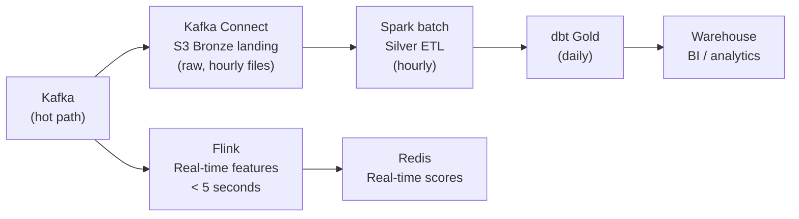

## Scaling Is a Design Problem, Not a Tuning Problem

Most scaling problems aren't solved by adding more machines. They're solved by changing the architecture — partitioning the work so it can be distributed, or eliminating work so there's less to distribute.

Interviewers ask "how would you scale this?" to see if you understand the root cause. Answering "add more Spark executors" without explaining *why* the job needs more executors misses the point.

---

## The Three Scaling Dimensions

Every pipeline has three variables you can increase:

| Dimension | Meaning | Mechanism |
|-----------|---------|-----------|
| **Volume** | More data per time period | Larger data files, more events, more tables |
| **Velocity** | Data arrives faster | Higher event rate, tighter SLAs |
| **Variety** | More sources, more schemas | New data sources, schema changes |

Each dimension requires a different scaling strategy.

---

## Scaling for Volume — Partition Everything

The fundamental principle: **divide the data so each worker handles an independent chunk**. The job completes in 1/N of the time when N workers process N chunks in parallel.

### Horizontal Scaling in Spark

```python
# Repartition data to match available CPU cores
# Rule: 2-4 partitions per executor core
# 50-node cluster, 16 cores/node = 800 cores → 1600-3200 partitions

df.repartition(2000).write.parquet("s3://silver/orders/")

# Or repartition by a key column — co-locates same-key rows for downstream joins
df.repartition("customer_id").groupBy("customer_id").agg(F.sum("revenue_usd"))
```

**Adding executors:** Spark on Kubernetes or EMR auto-scales — add executor pods/instances when job queue grows. Each executor handles additional partition tasks in parallel. This works as long as: (1) data is well-partitioned (no skew), (2) the driver has enough memory to coordinate, (3) the shuffle data doesn't exceed network capacity.

### Partitioning Kafka Topics for Parallelism

For streaming pipelines, Kafka partitions are the unit of parallelism. You can't process a topic faster than you have partitions:

```
10-partition topic + 10 Flink tasks = 1 task per partition (fully parallel)
10-partition topic + 20 Flink tasks = 10 tasks working, 10 idle
10-partition topic + 5 Flink tasks  = 5 tasks working, each reading 2 partitions (slower)

To scale beyond 10x: increase topic to 20 partitions, then scale to 20 tasks
```

**Pre-planning partition counts:** Kafka partitions can only be increased, never decreased. Start with more than you need today — adding partitions later requires a manual rebalance that disrupts consumer group offsets.

### Parallel Database Extraction

For large OLTP tables, parallel reads spread load across the source:

```python
# Spark JDBC parallel extraction — 50 parallel range queries
df = spark.read.jdbc(
    url=jdbc_url,
    table="orders",
    column="order_id",         # numeric partition column
    lowerBound=1,
    upperBound=10_000_000,
    numPartitions=50,          # 50 parallel reads, each covers 200K rows
    properties={"user": "...", "password": "..."}
)
```

**Caution:** 50 parallel queries on a production database can impact application performance. Use a read replica, not the primary.

---

## Scaling for Velocity — Reduce Processing Latency

When data arrives faster than the pipeline can process it, the consumer falls behind. The Kafka consumer lag grows. Eventually, you're hours behind.

### Diagnose the Bottleneck First

```
Consumer lag growing → pipeline is slower than ingestion rate

Possible causes:
  1. Not enough consumer tasks (add parallelism)
  2. One task is slow (skew — one partition has more data than others)
  3. Downstream write is the bottleneck (S3, Redis, warehouse can't keep up)
  4. Transformation is CPU-intensive (complex regex, UDFs, ML inference)
```

### Increase Consumer Parallelism

```python
# Flink: increase operator parallelism
env.set_parallelism(50)  # was 10; now 50 tasks process 50 partitions in parallel

# Spark Structured Streaming: more executor cores = more tasks
# spark.executor.cores=4 on 50 executors = 200 max parallel tasks
```

### Rate-Limit Ingestion to Match Processing Capacity

If the source sends faster than you can process, apply backpressure:

```python
# Spark Streaming: limit Kafka records per micro-batch
spark.readStream \
    .format("kafka") \
    .option("maxOffsetsPerTrigger", 1_000_000)  # cap at 1M records per micro-batch
    .load()
```

**Backpressure in Flink:** Flink automatically applies backpressure — a slow downstream operator slows upstream operators by blocking, preventing unbounded in-memory buffering. Monitor the backpressure indicator in the Flink UI.

### Lambda Architecture for Mixed Latency Requirements

When some consumers need real-time and others need batch:



The same event stream feeds both paths. Real-time consumers get low latency; batch consumers get full accuracy and history.

---

## Scaling for Variety — Handle Schema Changes Without Breaking Pipelines

The most underrated scaling challenge: new data sources and schema changes break pipelines.

### Schema-on-Read at Bronze

Never enforce schema at the Bronze layer:

```python
# ❌ Bad: schema enforced at ingest — new field added to source breaks the pipeline
df = spark.read.schema(fixed_schema).json("s3://bronze/events/")

# ✅ Good: infer schema at read — new fields are captured automatically
df = spark.read.json("s3://bronze/events/")
# Or even better: read as raw strings, parse in Silver
df = spark.read.text("s3://bronze/events/")
events = df.select(F.from_json(F.col("value"), schema).alias("data")).select("data.*")
```

### Schema Evolution in Delta Lake

Delta Lake handles additive schema changes automatically:

```python
# Write new data with an extra column
new_data.write \
    .format("delta") \
    .mode("append") \
    .option("mergeSchema", "true")  # adds the new column to the table schema
    .save("s3://delta/events/")

# Old data reads the new column as NULL — no pipeline failure
```

**What mergeSchema handles:** Adding nullable columns, widening types (INT → BIGINT). **What it doesn't handle:** Renaming columns, removing columns, narrowing types — these require explicit DDL migrations.

### Multi-Source Fan-In Scaling

When 10 sources become 50 sources, scaling the ingestion layer:

```python
# Instead of one Airflow task per source (50 tasks, brittle)
# Use a dynamic DAG that reads source config from a table
sources = db.query("SELECT * FROM pipeline_sources WHERE is_active = TRUE")

for source in sources:
    PythonOperator(
        task_id=f"extract_{source['name']}",
        python_callable=extract_source,
        op_kwargs={"source_config": source},
    )
```

Add new sources by inserting a row into `pipeline_sources` — no code change, no DAG modification.

---

## Auto-Scaling — Elastic Compute for Variable Workloads

Production pipelines have peak and off-peak periods. Don't pay for peak capacity 24/7.

### Spark on Kubernetes

```yaml
# spark-application.yaml
spec:
  dynamicAllocation:
    enabled: true
    minExecutors: 2
    maxExecutors: 50
    initialExecutors: 5
    # Spark requests more executors when task queue grows
    # Returns executors after 60 seconds of idleness
    executorIdleTimeout: 60s
```

### Airflow Task-Level Scaling

Use pools to control concurrency of resource-intensive tasks:

```python
# Define a pool with 10 slots (max 10 Spark jobs at once)
# airflow pools set spark_pool 10 "Spark job pool"

SparkSubmitOperator(
    task_id="heavy_etl",
    pool="spark_pool",   # will wait if 10 other Spark jobs are already running
    pool_slots=1,
)
```

---

## Common Interview Questions

**"Your daily batch job that used to take 1 hour now takes 8 hours. What happened?"**

Data volume grew 8x. Diagnose: (1) which stage is slow? (Spark UI shows stage durations) (2) is one task much slower? (skew) (3) is the shuffle too large? (check shuffle read/write bytes per stage). Fix in order: add partition pruning if missing, broadcast small dimension tables, fix skew with salting, increase shuffle partitions and executor count.

**"How would you scale a pipeline from 1 GB/day to 1 TB/day?"**

1,000x increase. Strategy: (1) Switch from full extract to incremental/CDC — process only deltas. (2) Partition storage by date — queries and jobs operate on daily slices. (3) Increase Kafka partitions and Spark parallelism proportionally. (4) Use Delta Lake with Z-ordering for query performance at scale. (5) Move to auto-scaling compute (EMR autoscaling or Databricks auto-scaling clusters).

**"How do you handle a new data source being added every week?"**

Configuration-driven pipelines: source metadata in a database table, not hardcoded in DAG files. A generic extraction framework reads source configs at runtime. New source = new DB row, not new code. Schema Registry enforces contracts at the source so new sources can't break existing consumers.

---

## Key Takeaways

- Scaling requires partitioning: divide data so each worker handles an independent chunk — this is the only way to achieve linear scale-out
- Kafka partitions are the ceiling for streaming parallelism — plan partition counts before you need to scale
- When consumer lag grows, diagnose the bottleneck first: not enough tasks, skew, downstream write bottleneck, or expensive transform
- Lambda architecture: one Kafka topic feeds both a real-time path (Flink/Redis) and a batch path (S3 + Spark + dbt) — different consumers with different latency requirements
- Schema-on-read at Bronze + `mergeSchema` in Delta Lake = schema changes don't break pipelines
- Configuration-driven pipelines (sources in a database table, not hardcoded) scale to 50+ sources without code changes
