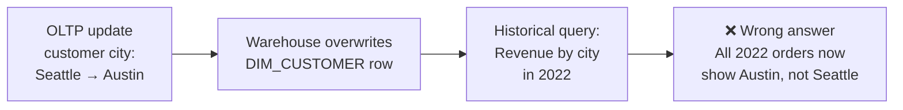

## The Problem SCDs Solve

In a data warehouse, dimension attributes change over time. A customer moves cities. A product gets re-categorised. A sales rep is promoted to a different region. An employee transfers to a new department.

In an OLTP system this is simple: update the row. But in a warehouse, that update destroys history. If you overwrite a customer's city, every historical order that customer placed now appears to come from their new city — even orders placed years before they moved.

This is the core tension:



**Slowly Changing Dimensions (SCDs)** are the set of techniques that manage this problem. The word "slowly" is relative — it means the attribute doesn't change on every transaction (unlike price, which can change constantly). It changes occasionally: annually, on promotion, on address update.

The choice of SCD strategy determines whether your historical reports are accurate, how much storage you use, and how complex your ETL pipeline becomes.

---

## Why This Matters for Interviews

SCD questions appear constantly in data engineering interviews because they test three things simultaneously:

1. **Warehouse modeling knowledge** — do you understand dimensional design beyond the basics?
2. **Business awareness** — do you know that overwriting history silently corrupts analytics?
3. **Practical trade-off thinking** — the right SCD type depends on the business question, not a universal rule

An interviewer who asks "how would you handle a customer changing their address?" is not asking about SQL. They're asking whether you understand that overwriting the address retroactively changes all historical revenue attribution — and whether you have a principled way to handle it.

---

## The Classic Example

Consider this `DIM_CUSTOMER` table:

| customer_key | customer_id | name | city | segment |
|-------------|------------|------|------|---------|
| 101 | C001 | Alice | Seattle | Standard |

Alice moves from Seattle to Austin on March 1, 2024. Three historical queries now have different correct answers depending on what you care about:

| Question | Correct answer |
|---------|---------------|
| "What city does Alice live in today?" | Austin |
| "What city was Alice in when she placed her 2023 orders?" | Seattle |
| "Has Alice ever lived in Seattle?" | Yes |

These three questions require three different SCD strategies. There is no single "right" approach — only the right approach for the specific analytical need.

---

## The SCD Types at a Glance

Kimball defined the original types (0, 1, 2, 3). Industry practice has added Types 4 and 6 for specific scenarios.

| Type | Strategy | History preserved? | Complexity |
|------|---------|-------------------|-----------|
| **Type 0** | Never update — keep the original value | N/A (value frozen) | None |
| **Type 1** | Overwrite — no history kept | ❌ | Low |
| **Type 2** | New row per change — full history | ✅ Full | Medium |
| **Type 3** | Add a "previous value" column | ✅ One version back | Low |
| **Type 4** | Separate history table | ✅ Full, in a separate table | Medium |
| **Type 6** | Hybrid (1+2+3) — current value on all rows + history rows | ✅ Full + current on every row | High |

The following articles cover each type in depth — how it works, when to use it, DDL patterns, and the trade-offs.

---

## Setting Up the Example

All three SCD articles use the same base scenario: a retail company's customer dimension, loaded into a warehouse from a source CRM system.

**Source table in the CRM (OLTP):**

```sql
CREATE TABLE customer (
  customer_id   VARCHAR(20) PRIMARY KEY,  -- natural key from CRM
  full_name     VARCHAR(200) NOT NULL,
  email         VARCHAR(255) NOT NULL UNIQUE,
  city          VARCHAR(100),
  state         VARCHAR(50),
  segment       VARCHAR(50),              -- Standard, Premium, VIP
  updated_at    TIMESTAMPTZ NOT NULL
);
```

**Starting state — three customers:**

| customer_id | full_name | email | city | state | segment |
|------------|----------|-------|------|-------|---------|
| C001 | Alice Nguyen | alice@example.com | Seattle | WA | Standard |
| C002 | Bob Torres | bob@example.com | Austin | TX | Premium |
| C003 | Carol Smith | carol@example.com | Boston | MA | Standard |

**Changes that occur over time:**
- Alice is upgraded from Standard → Premium (March 1, 2024)
- Bob moves from Austin → Denver (May 15, 2024)
- Carol is upgraded from Standard → VIP and moves from Boston → Chicago (July 1, 2024)

How each SCD type handles these changes — and what that means for your historical queries — is the subject of the next two articles.

---

## Key Takeaways

- SCDs solve the problem of dimension attributes changing over time without corrupting historical fact data
- Overwriting a dimension row retroactively changes the meaning of every historical fact joined to it — always intentional, never accidental
- The right SCD type depends on which historical questions the business needs to answer — there is no universal correct choice
- The five types in common use: Type 0 (freeze), Type 1 (overwrite), Type 2 (new row), Type 3 (previous column), Type 6 (hybrid)
- SCD questions in interviews test warehouse modeling depth, business reasoning, and trade-off analysis simultaneously
