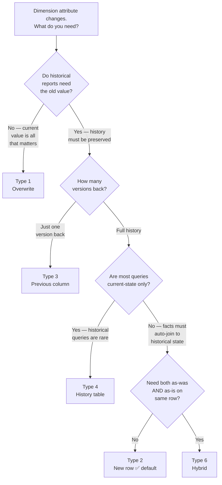

## The Running Example

This article works through each SCD type using the customer dimension introduced in the previous article. The source CRM has three customers, and three changes occur over time:

- **March 1, 2024** — Alice upgraded: Standard → Premium
- **May 15, 2024** — Bob moves: Austin, TX → Denver, CO
- **July 1, 2024** — Carol upgraded Standard → VIP, moves Boston, MA → Chicago, IL

---

## Type 0 — Retain Original

**Strategy:** Never update the dimension row. The value at the time of first load is permanent.

**When to use:** Attributes that *should* be fixed for analytical purposes — a customer's original acquisition channel, the date they first signed up, the city where an account was opened. The business decision is that history should be measured against the original value, not the current one.

**After all changes:**

| customer_key | customer_id | name | city | state | segment |
|-------------|------------|------|------|-------|---------|
| 101 | C001 | Alice Nguyen | Seattle | WA | **Standard** |
| 102 | C002 | Bob Torres | Austin | TX | Premium |
| 103 | C003 | Carol Smith | Boston | MA | **Standard** |

Alice and Carol's segments never change in the dimension — intentionally. A cohort analysis measuring "revenue from customers who were Standard at acquisition" is accurate because the acquisition segment is frozen.

**Trade-off:** If you use Type 0 for the wrong attribute, your reports are just wrong — the value silently diverges from reality and there's no warning.

---

## Type 1 — Overwrite

**Strategy:** Update the row in place. No history is preserved. The dimension always reflects the current state.

**When to use:** Corrections to data entry errors (a misspelled name should be fixed everywhere). Attributes where historical accuracy is irrelevant — email addresses for marketing campaigns only need the current email.

**After all changes — the table simply reflects the latest values:**

| customer_key | customer_id | name | city | state | segment |
|-------------|------------|------|------|-------|---------|
| 101 | C001 | Alice Nguyen | Seattle | WA | **Premium** |
| 102 | C002 | Bob Torres | **Denver** | **CO** | Premium |
| 103 | C003 | Carol Smith | **Chicago** | **IL** | **VIP** |

**What breaks:** A query for "revenue by city in 2023" will attribute Alice's 2023 orders to Seattle (still correct), Bob's 2023 Austin orders to Denver (wrong), and Carol's 2023 Boston orders to Chicago (wrong). History is silently corrupted.

```sql
-- Type 1 update
UPDATE dim_customer
SET city    = 'Denver',
    state   = 'CO',
    updated_at = now()
WHERE customer_id = 'C002';
```

**Trade-off:** Simple ETL, no extra rows. But any historical query that cares about the dimension attribute at the time of the event is now wrong. Use it only when that's an acceptable outcome.

---

## Type 2 — Add New Row

**Strategy:** When an attribute changes, insert a new row with a new surrogate key. Mark the old row as expired. Both rows remain in the table — historical facts continue to join to the old row via the surrogate key they recorded at insert time.

**This is the most important SCD type.** It's the default answer when someone asks "how do you preserve history in a dimension?"

**The dimension needs three extra columns:**

| Column | Purpose |
|--------|---------|
| `effective_from` | When this row became the current version |
| `effective_to` | When this row was superseded (NULL = currently active) |
| `is_current` | Boolean flag for quick filtering of current rows |

**After all changes:**

| customer_key | customer_id | name | city | state | segment | effective_from | effective_to | is_current |
|-------------|------------|------|------|-------|---------|---------------|-------------|-----------|
| 101 | C001 | Alice Nguyen | Seattle | WA | Standard | 2023-01-01 | 2024-02-29 | false |
| **104** | C001 | Alice Nguyen | Seattle | WA | **Premium** | **2024-03-01** | **NULL** | **true** |
| 102 | C002 | Bob Torres | Austin | TX | Premium | 2023-01-01 | 2024-05-14 | false |
| **105** | C002 | Bob Torres | **Denver** | **CO** | Premium | **2024-05-15** | **NULL** | **true** |
| 103 | C003 | Carol Smith | Boston | MA | Standard | 2023-01-01 | 2024-06-30 | false |
| **106** | C003 | Carol Smith | **Chicago** | **IL** | **VIP** | **2024-07-01** | **NULL** | **true** |

**Why historical facts are correct:** An order placed by Bob in March 2024 has `customer_key = 102` (the Austin row) stamped on it. When you join to `dim_customer`, you get Austin — because the fact table recorded the surrogate key that was current *at the time of the order*. Bob's post-move orders have `customer_key = 105` and correctly show Denver.

```sql
-- Type 2 update: expire old row, insert new row
UPDATE dim_customer
SET effective_to = '2024-05-14',
    is_current   = false
WHERE customer_id = 'C002' AND is_current = true;

INSERT INTO dim_customer
  (customer_id, full_name, email, city, state, segment,
   effective_from, effective_to, is_current)
VALUES
  ('C002', 'Bob Torres', 'bob@example.com', 'Denver', 'CO', 'Premium',
   '2024-05-15', NULL, true);
```

**Query current state:**

```sql
SELECT * FROM dim_customer WHERE is_current = true;
```

**Query historical state (what was Bob's city on April 1, 2024?):**

```sql
SELECT city FROM dim_customer
WHERE customer_id = 'C002'
  AND effective_from <= '2024-04-01'
  AND (effective_to IS NULL OR effective_to >= '2024-04-01');
-- Returns: Austin
```

**Trade-off:** Row count grows with each change. ETL is more complex (expire + insert instead of update). But historical accuracy is complete and automatic — no manual date filtering needed in fact queries.

> **Interview tip:** When asked "how do you handle a slowly changing dimension?", Type 2 is the answer unless you have a specific reason to deviate. Know how to explain the `effective_from / effective_to / is_current` pattern, how facts preserve history via surrogate key, and how to query both current and historical state.

---

## Type 3 — Add Previous Value Column

**Strategy:** Add a column for the previous value of the changing attribute. Keep both current and previous value in the same row.

**When to use:** When the business only ever needs to compare "current" vs "one version ago" — for example, tracking a sales rep's current territory and previous territory to measure performance before and after reassignment.

**The dimension gets `previous_*` columns:**

| customer_key | customer_id | name | city | state | segment | prev_segment | segment_changed_on |
|-------------|------------|------|------|-------|---------|-------------|------------------|
| 101 | C001 | Alice Nguyen | Seattle | WA | **Premium** | **Standard** | **2024-03-01** |
| 102 | C002 | Bob Torres | **Denver** | **CO** | Premium | NULL | NULL |
| 103 | C003 | Carol Smith | **Chicago** | **IL** | **VIP** | **Standard** | **2024-07-01** |

```sql
-- Type 3 update
UPDATE dim_customer
SET prev_segment       = segment,
    segment            = 'Premium',
    segment_changed_on = '2024-03-01'
WHERE customer_id = 'C001';
```

**What works:** "Revenue from customers before and after their segment upgrade" — straightforward with `segment` and `prev_segment` in one row.

**What breaks:** A third change to Alice's segment overwrites `prev_segment` again, losing the Standard → Premium transition. Only one level of history is preserved.

**Trade-off:** Simple schema, simple ETL. Fundamentally limited — only one change back, and you can't join historical facts to the dimension by surrogate key (all orders point to the same row regardless of when they were placed).

---

## Type 4 — Separate History Table

**Strategy:** Keep the main dimension as a Type 1 (always current). Maintain a separate history table that logs every change with timestamps.

**When to use:** When most queries only need current state, but auditing or infrequent historical queries still need the full change log. Keeps the main dimension lean and fast to query.

**Main dimension (always current):**

| customer_key | customer_id | name | city | state | segment |
|-------------|------------|------|------|-------|---------|
| 101 | C001 | Alice Nguyen | Seattle | WA | Premium |
| 102 | C002 | Bob Torres | Denver | CO | Premium |
| 103 | C003 | Carol Smith | Chicago | IL | VIP |

**History table:**

```sql
CREATE TABLE dim_customer_history (
  history_key   BIGSERIAL PRIMARY KEY,
  customer_key  BIGINT NOT NULL REFERENCES dim_customer(customer_key),
  city          VARCHAR(100),
  state         VARCHAR(50),
  segment       VARCHAR(50),
  valid_from    TIMESTAMPTZ NOT NULL,
  valid_to      TIMESTAMPTZ   -- NULL = current
);
```

| history_key | customer_key | city | segment | valid_from | valid_to |
|------------|-------------|------|---------|-----------|---------|
| 1 | 101 | Seattle | Standard | 2023-01-01 | 2024-02-29 |
| 2 | 101 | Seattle | Premium | 2024-03-01 | NULL |
| 3 | 102 | Austin | Premium | 2023-01-01 | 2024-05-14 |
| 4 | 102 | Denver | Premium | 2024-05-15 | NULL |

**Trade-off:** Faster for current-state queries (no `WHERE is_current = true` needed). Historical queries require joining to the history table. Facts can't automatically join to history — you need the history join explicitly.

---

## Type 6 — Hybrid (1 + 2 + 3)

**Strategy:** Combines Types 1, 2, and 3. Uses Type 2's new-row-per-change approach, but *also* keeps the current value on every row (including historical rows). Named "6" because 1 + 2 + 3 = 6.

**The dimension after all changes:**

| customer_key | customer_id | name | city | segment | original_segment | current_segment | effective_from | effective_to | is_current |
|-------------|------------|------|------|---------|-----------------|----------------|---------------|-------------|-----------|
| 101 | C001 | Alice | Seattle | Standard | Standard | **Premium** | 2023-01-01 | 2024-02-29 | false |
| 104 | C001 | Alice | Seattle | **Premium** | Standard | **Premium** | 2024-03-01 | NULL | true |
| 102 | C002 | Bob | Austin | Premium | Premium | Premium | 2023-01-01 | 2024-05-14 | false |
| 105 | C002 | Bob | **Denver** | Premium | Premium | Premium | 2024-05-15 | NULL | true |

`current_segment` is the same on both Alice's rows — it always reflects today's value. `segment` on the historical row reflects what it was during that period.

**What this enables:** A single query can ask "revenue by segment the customer was in at purchase time" (use `segment`) AND "revenue by the customer's current segment" (use `current_segment`) — no join to a second table needed.

**Trade-off:** Most complex to implement and maintain. ETL must update `current_*` columns on all historical rows whenever the current value changes. Justified when both "as-was" and "as-is" segmentation are heavily used in reporting.

---

## Choosing the Right Type



In practice, Type 2 covers the vast majority of cases. Types 1 and 3 cover specific edge cases. Types 4 and 6 appear in large-scale warehouses with specific performance or reporting requirements.

---

## Common Interview Questions

**"What is a Type 2 SCD and how does it work?"**

Type 2 inserts a new row into the dimension table whenever an attribute changes. Each row carries `effective_from`, `effective_to`, and `is_current` columns. Historical facts preserve history automatically because they recorded the surrogate key that was current at insert time — that key still points to the historical row with the correct attribute values. Current state is queried with `WHERE is_current = true`.

**"When would you choose Type 1 over Type 2?"**

When historical accuracy for that attribute is not required — data entry corrections, email addresses used only for current marketing, low-cardinality flags that don't affect analytical groupings. Or when the storage and ETL complexity of Type 2 isn't justified by the analytical value.

**"What's the difference between Type 2 and Type 4?"**

Both preserve full history. In Type 2, historical and current rows live in the same dimension table — facts automatically join to the right historical row via surrogate key. In Type 4, the main dimension is always current (Type 1 behaviour) and a separate history table stores the change log — facts join to the current dimension, historical queries require an explicit join to the history table.

**"How does Type 2 handle a customer who changes city twice?"**

Each change produces a new row. Alice's dimension table would have three rows (original, post-first-change, post-second-change), each with non-overlapping `effective_from` / `effective_to` ranges. Facts recorded during each period join to the correct row.

---

## Key Takeaways

- Type 1 overwrites — use it for corrections or attributes where history is irrelevant; it silently corrupts historical queries if misapplied
- Type 2 adds a new row per change — the default for history preservation; historical facts auto-join to the correct row via surrogate key
- Type 3 adds a previous-value column — only one change back; appropriate for before/after comparisons with a clear single transition
- Type 4 keeps a lean current dimension + a separate history table — best when historical queries are infrequent
- Type 6 (hybrid) carries both as-was and as-is values on every row — highest complexity, justified when both views are heavily queried
- The right choice depends on which historical questions the business needs to answer, not a universal rule
