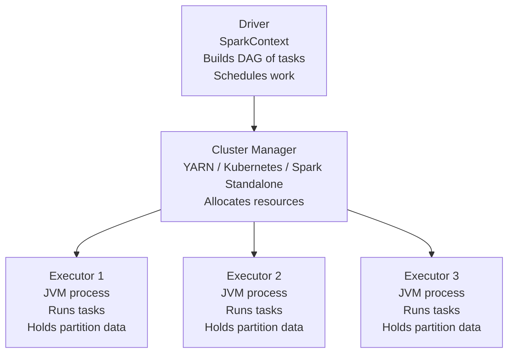

## What Spark Is

Apache Spark is a distributed in-memory processing engine. It takes a computation — a series of transformations on data — and executes it in parallel across a cluster of machines. Where Hadoop MapReduce wrote intermediate results to disk between every step, Spark keeps data in memory across a chain of operations, making it dramatically faster for iterative and multi-step workloads.

Spark is the most commonly used engine for batch processing in the data lake era. It appears in system design answers for ETL, large-scale transformation, historical backfills, and Structured Streaming for near-real-time processing.

---

## Architecture



**Driver:** The process that runs your Spark application. It parses your code into a logical plan (a DAG of operations), optimizes it, splits it into tasks, and distributes those tasks to executors.

**Executor:** A JVM process on a worker node. Each executor runs multiple tasks in parallel (one per CPU core). Executors hold the data partitions in memory or spill to disk if memory is exhausted.

**Cluster Manager:** Allocates resources (CPU, memory) to the Spark application. In production this is usually YARN (on Hadoop clusters), Kubernetes (cloud-native), or Databricks' managed runtime.

---

## The DataFrame API

The primary Spark interface for data engineers. DataFrames are distributed tables — collections of rows with a schema, processed in parallel across partitions.

```python
from pyspark.sql import SparkSession
from pyspark.sql import functions as F

spark = SparkSession.builder \
    .appName("daily-orders-etl") \
    .config("spark.sql.shuffle.partitions", "200") \
    .getOrCreate()

# Read from S3 (Parquet)
orders = spark.read.parquet("s3://datalake/bronze/orders/order_date=2024-03-15/")

# Transformations — lazy, not executed yet
silver = (
    orders
    .dropDuplicates(["order_id"])                             # dedup
    .filter(F.col("order_status").isNotNull())                # validate
    .withColumn("order_date", F.to_date("created_at"))        # type cast
    .withColumn("revenue_usd",
                F.when(F.col("currency") == "USD", F.col("total"))
                 .otherwise(F.col("total") * F.col("exchange_rate")))
    .select("order_id", "customer_id", "order_date",
            "order_status", "revenue_usd")
)

# Action — triggers execution
silver.write \
    .mode("overwrite") \
    .partitionBy("order_date") \
    .parquet("s3://datalake/silver/orders/")
```

**Transformations vs Actions:**

| Category | Examples | When executed |
|---------|---------|--------------|
| **Transformations** (lazy) | `filter`, `select`, `join`, `groupBy`, `withColumn` | Not yet — builds a plan |
| **Actions** (eager) | `count`, `show`, `write`, `collect`, `take` | Triggers actual execution |

Spark builds a DAG of all the transformations, optimizes the plan (via the Catalyst optimizer), then executes it only when an action is called. This is why you can chain many transformations with no performance cost — they're just plan-building.

---

## Partitions — The Unit of Parallelism

A Spark DataFrame is physically divided into **partitions** — chunks of data processed by individual tasks in parallel. Understanding partitions is essential for writing efficient Spark code.

**Default partitions on read:**

```python
# Reading Parquet from S3: one partition per file (by default)
df = spark.read.parquet("s3://bucket/path/")
print(df.rdd.getNumPartitions())  # e.g., 200 files → 200 partitions
```

**Controlling partition count:**

```python
# Reduce partitions before writing (avoid many small files)
df.coalesce(10).write.parquet("s3://output/")

# Increase partitions after a filter that reduced data significantly
df.repartition(50).write.parquet("s3://output/")

# Repartition by a column (co-locates same-key rows in same partition)
df.repartition("customer_id").groupBy("customer_id").agg(...)
```

**`coalesce` vs `repartition`:**

| Operation | What it does | Shuffle? | Use when |
|----------|-------------|---------|---------|
| `coalesce(n)` | Reduces partitions by merging | No | Reducing before write |
| `repartition(n)` | Redistributes evenly across n partitions | Yes | Increasing count or balancing skew |
| `repartition(n, col)` | Partitions by column value | Yes | Preparing for a groupBy on that column |

---

## The Shuffle — Spark's Performance Bottleneck

A **shuffle** happens when Spark needs to move data across executors — typically during `groupBy`, `join`, `distinct`, and `orderBy`. It's the most expensive operation in Spark.

```mermaid
flowchart LR
    subgraph Before Shuffle
        E1["Executor 1\nOrders: A, C, B"]
        E2["Executor 2\nOrders: B, A, D"]
        E3["Executor 3\nOrders: C, D, A"]
    end
    S["Shuffle\n(network transfer)"]
    subgraph After Shuffle — grouped by customer
        F1["Executor 1\nAll A orders"]
        F2["Executor 2\nAll B orders"]
        F3["Executor 3\nAll C, D orders"]
    end
    E1 & E2 & E3 --> S --> F1 & F2 & F3
```

**Shuffle configuration:**

```python
# spark.sql.shuffle.partitions controls output partitions after a shuffle
# Default is 200 — too high for small datasets, too low for large ones
spark.conf.set("spark.sql.shuffle.partitions", "400")  # tune to ~2-4x CPU cores in cluster
```

**Strategies to minimize shuffles:**

| Strategy | How |
|---------|-----|
| Filter early | Reduce data volume before joins |
| Partition by join key | `repartition("customer_id")` before joining on `customer_id` |
| Broadcast small tables | `F.broadcast(small_df)` sends a copy to every executor — eliminates shuffle |
| Avoid `distinct()` on large DataFrames | Use `dropDuplicates(["key_col"])` on a subset of columns |

```python
# Broadcast join — no shuffle for the small table
from pyspark.sql.functions import broadcast

large_orders = spark.read.parquet("s3://orders/")
small_products = spark.read.parquet("s3://products/")  # < 200 MB

result = large_orders.join(broadcast(small_products), "product_id")
```

---

## Caching and Persistence

When a DataFrame is used multiple times in a job, cache it to avoid recomputing from scratch:

```python
# Cache in memory (default)
silver_orders.cache()

# Or persist with a storage level
from pyspark import StorageLevel
silver_orders.persist(StorageLevel.MEMORY_AND_DISK)

# Trigger materialization (cache is lazy — not populated until an action runs)
silver_orders.count()

# Release when done
silver_orders.unpersist()
```

Cache when the same DataFrame feeds two or more downstream computations (e.g., a revenue aggregation AND a customer LTV update both read from `silver_orders`).

---

## Spark Structured Streaming

Spark Structured Streaming extends the DataFrame API to streaming data. The engine treats a stream as an unbounded table — new records append continuously, and queries run incrementally.

```python
# Read from Kafka as a streaming DataFrame
stream = spark.readStream \
    .format("kafka") \
    .option("kafka.bootstrap.servers", "broker:9092") \
    .option("subscribe", "order-events") \
    .option("startingOffsets", "latest") \
    .load()

# Parse JSON value
orders = stream.select(
    F.from_json(F.col("value").cast("string"), order_schema).alias("data"),
    F.col("timestamp")
).select("data.*", "timestamp")

# Aggregate in a 5-minute tumbling window
windowed = orders \
    .withWatermark("timestamp", "2 minutes") \
    .groupBy(
        F.window("timestamp", "5 minutes"),
        "product_category"
    ) \
    .agg(F.sum("revenue").alias("total_revenue"), F.count("*").alias("order_count"))

# Write output — checkpoint tracks progress
windowed.writeStream \
    .format("delta") \
    .option("checkpointLocation", "s3://checkpoints/order-stream/") \
    .outputMode("append") \
    .trigger(processingTime="1 minute") \
    .start()
```

**Output modes:**

| Mode | Behaviour | Use when |
|------|-----------|---------|
| `append` | Only new rows since last trigger | Immutable event streams |
| `complete` | Full result table on every trigger | Small aggregation results |
| `update` | Only rows that changed since last trigger | Stateful aggregations with watermark |

**Checkpointing** saves the stream state (Kafka offsets + any aggregation state) to durable storage. On restart, the stream resumes from exactly where it stopped — no reprocessing, no data loss.

---

## Spark Optimization Checklist

Before submitting a Spark job in production:

| Check | Why it matters |
|-------|---------------|
| Filter as early as possible | Reduces data volume carried through the entire plan |
| Broadcast small dimension tables | Eliminates expensive shuffle joins |
| Tune `shuffle.partitions` | Default 200 is too high for small data, too low for 10+ TB |
| Check for data skew | One partition with 90% of the data causes stragglers — repartition or salt the key |
| Avoid `collect()` on large DataFrames | Brings all data to the driver — OOM risk |
| Use `coalesce` before writing | Prevents hundreds of tiny output files |
| Cache DataFrames used multiple times | Avoids recomputing from S3 on every downstream action |

---

## Common Interview Questions

**"What is a Spark shuffle and why is it expensive?"**

A shuffle redistributes data across executors — typically triggered by `groupBy`, `join`, `distinct`, or `orderBy`. It involves serializing data, transferring it over the network, and deserializing on the receiving executor. It's the dominant performance bottleneck in Spark jobs because it saturates network bandwidth and requires writing intermediate data to disk. Minimize shuffles by filtering early, broadcasting small tables, and repartitioning by join keys before joining.

**"What is the difference between `coalesce` and `repartition`?"**

`coalesce(n)` reduces partitions without a shuffle — it merges existing partitions on the same executor. Fast, but can only reduce, and produces uneven partition sizes if data is imbalanced. `repartition(n)` triggers a full shuffle — distributes data evenly into exactly n partitions. Use `coalesce` for reducing before a write; use `repartition` when you need to increase partition count or balance skewed data.

**"How does Spark Structured Streaming handle failure?"**

Checkpointing saves the consumer offset (e.g., Kafka offset) and any stateful aggregation state to durable storage (S3 or HDFS) at every trigger interval. On restart, Spark reads the checkpoint and resumes from exactly that point — replaying any Kafka messages since the last checkpoint. Combined with idempotent sinks (Delta Lake, Kafka transactions), this achieves exactly-once or at-least-once semantics.

**"What causes data skew in Spark and how do you fix it?"**

Skew happens when one partition holds a disproportionate amount of data — usually caused by a highly frequent key value (e.g., a `NULL` customer_id or a single large customer). Fix strategies: (1) salt the join key — add a random suffix to spread the hot key across multiple partitions; (2) broadcast the small side of the join to eliminate the shuffle entirely; (3) filter the skewed key out, process it separately, and union the results.

---

## Key Takeaways

- Spark is a distributed in-memory engine: Driver orchestrates, Executors compute, Cluster Manager allocates resources
- DataFrames are lazy — transformations build a plan, actions trigger execution
- Partitions are the unit of parallelism — one task per partition, processed in parallel across executors
- The shuffle is Spark's biggest cost — minimize it with early filters, broadcast joins, and key-aligned repartitioning
- Structured Streaming extends the DataFrame API to unbounded streams — checkpointing enables fault-tolerant, resumable stream processing
- Tune `spark.sql.shuffle.partitions` to match your data volume and cluster size — the default of 200 is rarely correct
