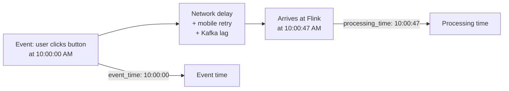
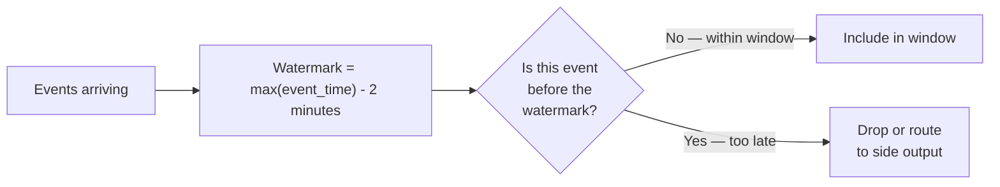
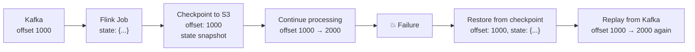

## Why a Dedicated Stream Processor?

Spark Structured Streaming handles many streaming use cases well. Apache Flink is the choice when you need:

- **True record-at-a-time processing** — not micro-batch; lower latency
- **Complex stateful operations** — large state that persists across millions of keys
- **Sophisticated event-time semantics** — precise watermarks, late-data policies per window
- **Exactly-once guarantees** end-to-end, not just at the engine level

Flink is the engine behind Meta's real-time data platform, LinkedIn's stream processing, and Uber's fraud detection. In interviews, understanding stream processing concepts — windows, event time, watermarks, state, checkpointing — matters more than knowing Flink's API. These concepts apply equally to Spark Streaming, Kafka Streams, and Dataflow.

---

## Event Time vs Processing Time

This is the most important concept in stream processing. Every event has two timestamps:

**Event time** — when the event actually occurred, according to the source (embedded in the event payload)

**Processing time** — when the event arrives at the stream processor



**Why it matters:** If you're counting "clicks in the 10:00 AM minute," you want to use event time — not processing time. A click at 10:00:58 AM that arrives at 10:01:03 AM due to network delay should count in the 10 AM window, not the 10:01 AM window.

Processing time is simpler but wrong for most analytics. Event time is correct but requires handling late data — events that arrive after their window would have closed.

---

## Windows

Windows define how to group events into finite sets for aggregation. There are three types:

### Tumbling Window

Non-overlapping, fixed-size windows. Each event belongs to exactly one window.

```mermaid
gantt
    dateFormat HH:mm
    axisFormat %H:%M
    section Events
    Event A :a1, 10:00, 1m
    Event B :a2, 10:02, 1m
    Event C :a3, 10:04, 1m
    Event D :a4, 10:05, 1m
    Event E :a5, 10:07, 1m
    section Windows
    Window 1 (10:00-10:05) :crit, w1, 10:00, 5m
    Window 2 (10:05-10:10) :crit, w2, 10:05, 5m
```

Events A, B, C → Window 1. Events D, E → Window 2.

**Use case:** "Revenue per 5-minute interval," "active users per hour."

```python
# Flink Python API
orders \
    .window_all(TumblingEventTimeWindows.of(Time.minutes(5))) \
    .aggregate(RevenueAggregator())
```

### Sliding Window

Fixed-size windows that overlap. An event can belong to multiple windows.

```
Window size: 10 minutes, slide: 5 minutes
10:00–10:10, 10:05–10:15, 10:10–10:20 ...
An event at 10:07 belongs to both the 10:00 and 10:05 windows.
```

**Use case:** "Rolling 10-minute active user count, updated every 5 minutes."

### Session Window

Variable-size windows defined by a gap of inactivity. A session ends when no events arrive for a specified gap duration.

```
Gap: 30 minutes
Events: 10:00, 10:05, 10:12, [gap], 11:00, 11:03
→ Session 1: 10:00–10:12. Session 2: 11:00–11:03
```

**Use case:** "User sessions on a website," "idle period detection in IoT sensors."

---

## Watermarks — Handling Late Data

A **watermark** is the stream processor's estimate of how far behind in event time the input might be. It's a threshold: "by the time processing time reaches T + watermark, we assume all events with event_time ≤ T have arrived."



**Watermark in practice:**

```python
# Spark Structured Streaming
orders \
    .withWatermark("event_timestamp", "2 minutes") \
    .groupBy(
        F.window("event_timestamp", "5 minutes"),
        "product_id"
    ) \
    .agg(F.sum("revenue"))

# The watermark says: "events up to 2 minutes late are included in their window.
# Events more than 2 minutes late are considered too late and dropped."
```

**Setting the watermark is a trade-off:**

| Watermark | Late data handled | Output latency | State size |
|-----------|------------------|----------------|-----------|
| 0 seconds | None — any late event dropped | Low | Small |
| 2 minutes | Events up to 2 min late included | +2 min | Medium |
| 1 hour | Events up to 1 hour late included | +1 hour | Large |
| Unbounded | All late events handled | Infinite delay | Unbounded |

A watermark of 2 minutes means: a 5-minute window from 10:00–10:05 won't be finalized and emitted until 10:07 (processing time advances past 10:05 + 2 min watermark). This is the latency cost of handling late data.

---

## Stateful Operations

State is data that persists across events in a stream. Without state, each event is processed independently. With state, you can compute sessions, detect patterns, and join across streams.

**Examples of stateful operations:**

| Operation | State maintained |
|-----------|----------------|
| Windowed aggregation | Running sum/count per window per key |
| Deduplication | Set of seen `event_id`s (with TTL) |
| Stream-stream join | Buffered events from both streams within join window |
| Session detection | Last event timestamp per user |
| Pattern detection | Partial match state per key |

**State in Flink is partitioned by key** — all events with the same key are processed by the same task, so state is local and fast:

```python
# Keyed state — each user has their own counter
class SessionEventCounter(KeyedProcessFunction):
    def open(self, runtime_context):
        # Each unique user_id has its own count stored in the state backend
        self.count_state = runtime_context.get_state(
            ValueStateDescriptor("event_count", Types.INT())
        )

    def process_element(self, event, ctx):
        current = self.count_state.value() or 0
        self.count_state.update(current + 1)
        # Emit if session crosses threshold
        if current + 1 >= 10:
            yield (event['user_id'], current + 1)
```

### State Backends

Where state is stored:

| Backend | State lives in | Best for |
|---------|---------------|---------|
| `HashMapStateBackend` | JVM heap memory | Small state, low-latency |
| `EmbeddedRocksDBStateBackend` | RocksDB (local disk, off-heap) | Large state (GB–TB per task) |

RocksDB is the production default for stateful Flink jobs — it handles state that doesn't fit in memory by spilling to disk, with a memory cache for hot keys.

---

## Checkpointing and Fault Tolerance

Checkpointing is Flink's mechanism for making stream processing fault-tolerant. At regular intervals, Flink snapshots all operator state to durable storage (S3, HDFS). On failure, Flink restores from the last checkpoint and replays Kafka messages from the corresponding offset.



**Checkpoint configuration:**

```python
env = StreamExecutionEnvironment.get_execution_environment()
env.enable_checkpointing(60_000)  # checkpoint every 60 seconds
env.get_checkpoint_config().set_checkpointing_mode(CheckpointingMode.EXACTLY_ONCE)
env.get_checkpoint_config().set_min_pause_between_checkpoints(30_000)
env.get_checkpoint_config().set_checkpoint_timeout(120_000)  # fail if checkpoint takes > 2 min
```

### Exactly-Once End-to-End

For true exactly-once semantics, the sink must also participate in the transaction. Flink's **two-phase commit (2PC)** sink holds output in a pre-commit buffer until the checkpoint completes, then atomically commits:

- **Kafka sink** with transactions: messages are written in a transaction, committed only when the checkpoint succeeds
- **Delta Lake sink**: writes to staging files, promoted atomically when checkpoint completes

This guarantees: even if the job fails mid-checkpoint, uncommitted output is rolled back and reprocessed from the checkpoint.

---

## Flink vs Spark Streaming — When to Choose Which

| Dimension | Apache Flink | Spark Structured Streaming |
|-----------|-------------|--------------------------|
| Processing model | True record-at-a-time | Micro-batch (default) or continuous |
| Latency | Milliseconds | Seconds (micro-batch) |
| State management | First-class, RocksDB | Stateful operations available, simpler API |
| Exactly-once | Native 2PC end-to-end | With Delta Lake or Kafka transactions |
| Learning curve | Steeper | Lower (DataFrame API familiar) |
| Ecosystem | Standalone | Integrates with full Spark ecosystem |
| Best for | Low-latency, complex stateful, fraud detection | Near-real-time ETL, streaming SQL, teams already on Spark |

> **Interview tip:** You don't need to advocate for one over the other. The right answer is: "Spark Streaming is the default choice for most near-real-time pipelines because teams already know Spark. Flink is worth the complexity when you need sub-second latency, very large state, or complex event-time semantics that micro-batch doesn't handle cleanly."

---

## Common Interview Questions

**"What is the difference between event time and processing time?"**

Event time is when the event occurred at the source — embedded in the event payload. Processing time is when it arrives at the stream processor. For accurate windowed analytics (revenue per minute, active users per hour), you must use event time — processing time produces wrong results whenever there's network latency or mobile retry delays. The cost of event time is that you must handle late events explicitly with watermarks.

**"What is a watermark and why do you need it?"**

A watermark tells the stream processor how late events can arrive before they're considered too late. Without a watermark, the processor would never know when to close and emit a time window — it would wait forever for potentially late events. A 2-minute watermark means: once processing time passes 10:07, the 10:00–10:05 window is closed and emitted, accepting any events that arrived up to 2 minutes late. Events arriving later than that are dropped (or routed to a side output for separate handling).

**"How does Flink achieve fault tolerance?"**

Through checkpointing: periodic snapshots of all operator state (keyed state, window state) to durable storage. When a failure occurs, the job restarts from the last successful checkpoint and replays source records (Kafka messages) from the corresponding offset. For exactly-once end-to-end, Flink uses two-phase commit — output is held in a pre-commit buffer until the checkpoint completes, then atomically flushed to the sink.

**"When would you use a session window vs a tumbling window?"**

Tumbling windows for fixed-interval aggregations: revenue per 5-minute interval, active users per hour — events are grouped by calendar time. Session windows for activity-based groupings: a user session ends when they're inactive for 30 minutes, regardless of clock time. Session windows produce variable-length windows per key and require state to track the last event time per entity.

---

## Key Takeaways

- Always use event time for analytics — processing time produces wrong answers when there's any network delay or retry
- Watermarks define the late-data tolerance: wider watermark = more late events handled = higher output latency and more state
- Three window types: tumbling (non-overlapping), sliding (overlapping), session (gap-based)
- State in stream processing is partitioned by key — all events for the same key go to the same task, making state access local and fast
- Checkpointing snapshots all state to durable storage — on failure, the job restores state and replays Kafka from the checkpoint offset
- Exactly-once end-to-end requires both checkpointing (for state) and a transactional sink (for output)
- Flink for millisecond latency and complex stateful ops; Spark Streaming for near-real-time ETL with a lower operational barrier
