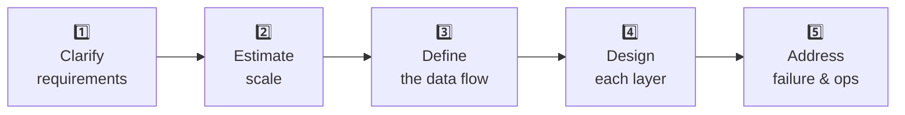
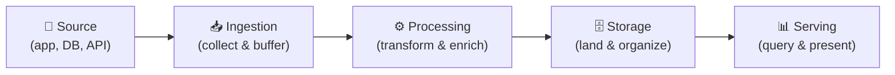
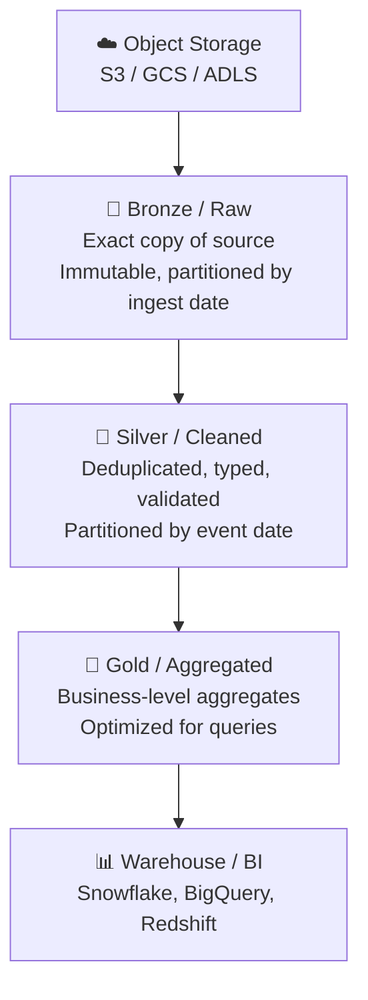

## What a Data Engineering System Design Interview Tests

Data engineering system design interviews are different from software engineering system design interviews. You're not designing Twitter's backend — you're designing pipelines, storage layers, and processing systems. The interviewer is testing:

1. **Requirements gathering** — do you ask the right questions before drawing boxes?
2. **Component knowledge** — do you know what Kafka, Spark, dbt, and object storage actually do?
3. **Trade-off reasoning** — can you argue for and against specific choices?
4. **Failure thinking** — what happens when a component goes down, a schema changes, or data arrives late?
5. **Scale intuition** — does your design hold at 10K events/sec? At 10M?

The biggest mistake candidates make is jumping to a diagram before asking a single question. This signals that you design by pattern-matching ("every pipeline has Kafka") rather than by reasoning from requirements.

---

## The Framework — Five Steps



Work through these steps out loud. Interviewers follow your reasoning — a great answer with no explanation scores lower than a good answer explained well.

---

## Step 1 — Clarify Requirements

Before touching the whiteboard, ask questions across four dimensions:

**Data characteristics:**
- What is the source? (App events, database changes, third-party API, files?)
- What volume? (Events per second, records per day, GB per day?)
- What schema? Is it fixed or does it evolve?
- What format? (JSON, Avro, CSV, Parquet?)

**Latency requirements:**
- How fresh does the data need to be in the destination? (Real-time < 1 min? Near-real-time 5–15 min? Daily batch?)
- Are there SLA commitments downstream (dashboards, ML features, operational systems)?

**Downstream consumers:**
- Who reads this data? (BI tools, ML models, other pipelines, APIs?)
- What queries do they run? (Aggregations? Point lookups? Full scans?)
- What consistency guarantees do they need? (Eventual? Exactly-once?)

**Operational constraints:**
- What's the existing stack? (Cloud provider, existing tools, team expertise)
- What are the budget constraints?
- Who maintains this pipeline?

> **Interview tip:** You won't get answers to all of these — that's fine. The act of asking demonstrates that you know what decisions depend on what inputs. When the interviewer says "assume whatever you want," state your assumptions out loud before proceeding.

---

## Step 2 — Estimate Scale

Back-of-envelope calculations anchor your architecture choices. A pipeline for 1,000 events/day and a pipeline for 1,000,000 events/second are designed completely differently.

**Example estimation for a clickstream system:**

```
Daily active users:     10 million
Events per user/day:    50 (page views, clicks, searches)
Total events/day:       500 million
Average event size:     500 bytes (JSON)
Daily data volume:      250 GB / day
Peak throughput:        ~6,000 events/sec (flat)
                        ~30,000 events/sec (peak, 5× factor)
Storage (90-day raw):   ~22 TB
```

These numbers tell you:
- 30K events/sec → Kafka is appropriate, a single PostgreSQL table is not
- 250 GB/day → Parquet on object storage, not a transactional database
- 22 TB raw → columnar compression (Parquet) brings this to ~4–5 TB

Scale estimates also reveal when you *don't* need complex infrastructure. 10K events/day fits in a Postgres table with a cron job.

---

## Step 3 — Define the Data Flow

Sketch the high-level path data takes from source to destination before adding any components:



Every data pipeline, regardless of complexity, maps to these five stages. Name the technology at each stage *after* establishing the data flow, not before.

---

## Step 4 — Design Each Layer

### Ingestion Layer

Choose based on source type and volume:

| Source | Pattern | Technology |
|--------|---------|-----------|
| Application events (high volume) | Event streaming | Kafka, Kinesis, Pub/Sub |
| Database changes | CDC | Debezium + Kafka |
| Third-party API | Scheduled pull | Airflow + Python, Fivetran |
| File drops (S3, SFTP) | File trigger / scheduled scan | S3 event notifications, Airflow |
| Batch database exports | Full or incremental extract | Spark JDBC, `COPY` command |

**Key design decisions at ingestion:**
- **Buffering:** Can the source handle backpressure, or do you need a buffer (Kafka) to absorb spikes?
- **Delivery guarantee:** At-least-once (acceptable with idempotent consumers) vs exactly-once (more complex, needed for financial data)
- **Schema enforcement:** Validate at ingestion or accept raw and validate downstream?

### Processing Layer

Choose based on latency requirement:

| Latency target | Pattern | Technology |
|---------------|---------|-----------|
| < 1 minute | Stream processing | Flink, Spark Structured Streaming, Dataflow |
| 5–15 minutes | Micro-batch | Spark Structured Streaming, Kafka Streams |
| Hours / daily | Batch | Spark, dbt, BigQuery scheduled queries |

**Key design decisions at processing:**
- **Stateless vs stateful:** Simple transforms (rename, cast, filter) are stateless. Session windows, deduplication, and joins across streams require state — which means managing state stores and recovery.
- **Late data:** In streaming, events arrive late. Define a watermark — the threshold after which late events are dropped or handled separately.
- **Idempotency:** Can you re-run this processing step on the same input and get the same output without double-counting?

### Storage Layer

The lakehouse pattern is the current standard:



**Key design decisions at storage:**
- **File format:** Parquet for analytics (columnar, compressed). Avro for streaming with schema evolution. JSON only for raw landing.
- **Partitioning:** Partition by the column most frequently used in WHERE clauses — almost always a date column.
- **Table format:** Delta Lake, Apache Iceberg, or Apache Hudi for ACID transactions, schema evolution, and time travel on the lake.

### Serving Layer

Design based on consumer access patterns:

| Consumer | Access pattern | Serving layer |
|---------|---------------|--------------|
| BI dashboards | Aggregate queries, low concurrency | Warehouse (Snowflake, BigQuery) |
| Data scientists | Ad-hoc, large scans | Lakehouse (Databricks, Athena) |
| Operational dashboards | Low-latency aggregates | Pre-aggregated tables, Druid, ClickHouse |
| ML feature store | Point lookups by entity ID | Redis, DynamoDB, Feature Store |

---

## Step 5 — Address Failure and Operations

This is where strong candidates separate themselves. Most candidates design the happy path and stop. Interviewers want to know what happens when things break.

**Failure scenarios to address for every design:**

| Failure | How your design handles it |
|--------|--------------------------|
| A source system goes down | Kafka buffers events — no data loss if consumer restarts within retention window |
| A processing job fails mid-run | Idempotent writes + checkpointing — re-run from last checkpoint, no double-counts |
| A schema change in the source | Schema registry (Avro/Protobuf) or flexible landing (JSON Bronze) + explicit schema validation in Silver |
| Late-arriving data | Watermarks in streaming; reprocessing windows in batch (rerun last N days) |
| Duplicate events | Deduplication on a natural key at the Silver layer |
| A bad deploy corrupts a table | Table format time travel (Delta/Iceberg) — restore previous snapshot |

**Operational questions to cover:**
- **Monitoring:** What metrics do you track? (Lag, throughput, error rate, data freshness SLA)
- **Alerting:** What triggers a page? (Pipeline not completing, lag growing, null rate spike)
- **Backfill:** Can you reprocess 90 days of historical data if a bug is discovered?
- **Cost:** Streaming infrastructure costs significantly more than batch — is the latency worth it?

---

## The Architecture Decision Map

Use this to justify every tool choice in your design:

| Requirement | Leading to | Tool choice |
|------------|-----------|------------|
| > 10K events/sec | Need a buffer + partitioned log | Kafka / Kinesis |
| < 5 min latency | Stream processing required | Flink / Spark Streaming |
| Exactly-once semantics | Idempotent consumer + transactional writes | Kafka + Delta Lake |
| Schema evolution | Schema registry | Confluent Schema Registry / Glue |
| Multi-hop transforms | Orchestration | Airflow / Prefect / Dagster |
| 100s of GB/day | Columnar storage | Parquet on S3 + warehouse |
| ACID on data lake | Table format | Delta Lake / Iceberg / Hudi |
| BI at low latency | Pre-aggregated layer | ClickHouse / Druid / Redshift |

---

## Common Interview Questions

**"Walk me through how you'd design a data pipeline for [X]."**

Start with Step 1 — ask clarifying questions about volume, latency, source type, and consumers. Estimate scale. Sketch the five-layer data flow. Choose a technology at each layer and justify it against the requirements. Conclude with failure handling and operational considerations. Time-box yourself: 5 minutes on requirements, 15 minutes on design, 5 minutes on failure/ops.

**"How do you choose between batch and streaming?"**

Start with the latency requirement. If the downstream consumer needs data in under 5 minutes, streaming is justified. If daily or hourly is fine, batch is simpler, cheaper, and easier to operate. Most systems that say they need streaming actually need near-real-time — micro-batch (5–15 min) satisfies the requirement at a fraction of the operational cost.

**"How do you handle schema changes in a pipeline?"**

Three strategies: (1) land raw JSON/Avro in Bronze — schema changes don't break ingestion, only downstream parsing; (2) use a schema registry with compatibility rules (backward/forward) that reject breaking changes at publish time; (3) detect schema drift in the Silver layer and alert rather than failing silently. The right choice depends on how much control you have over the source.

**"What's the difference between at-least-once and exactly-once delivery?"**

At-least-once: every event is delivered but may be delivered multiple times on failure/retry. Consumers must be idempotent (duplicate writes produce the same result). Exactly-once: each event is processed exactly one time, even under failure. Requires distributed transactions or idempotent producers + transactional writes. At-least-once with idempotent consumers is the practical choice for most pipelines — true exactly-once adds significant complexity.

---

## Key Takeaways

- Ask requirements questions before drawing anything — volume, latency, source type, and consumers determine every architectural choice
- Scale estimates (events/sec, GB/day) tell you which technology class is appropriate — don't over-engineer for 10K events/day
- Every pipeline maps to five layers: ingestion, processing, storage, serving, and operations
- Choose streaming only when the latency requirement genuinely demands it; batch and micro-batch cover most real-world needs at lower cost and complexity
- Failure handling is not optional — idempotency, checkpointing, schema evolution, and backfill are the marks of a production-ready design
- Justify every technology choice with a specific requirement — "I used Kafka because we need to buffer 30K events/sec and decouple ingestion from processing"
